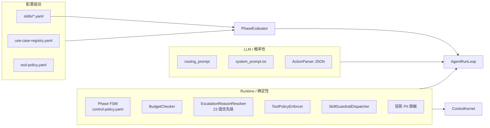

# Gumtree Customer Service Agent (csagent)

面向分类信息平台的 **LLM-first 客服 Agent**：在可控的运行时骨架内完成 FAQ 自动解答、Intake 信息采集与人工转接，并用双层评估体系验证行为质量。

> **源码即真相**：运行时行为以 `server/src/main/java/com/gumtree/csagent/service/runtime/` 与 `server/src/main/resources/config/`、`skills/` 为准。契约摘要见 [`docs/current/runtime_contract.md`](docs/current/runtime_contract.md)。

---

## 目录

1. [产品边界](#1-产品边界)
2. [仓库结构](#2-仓库结构)
3. [架构总览](#3-架构总览)
4. [运行时：双环 Agent 设计](#4-运行时双环-agent-设计)
5. [Harness：LLM 与 Runtime 分工](#5-harnessllm-与-runtime-分工)
6. [上下文工程](#6-上下文工程)
7. [工具与知识库](#7-工具与知识库)
8. [评估体系](#8-评估体系)
9. [Autoloop：Skill 驱动的自动进化](#9-autoloopskill-驱动的自动进化)
10. [本地开发与运行](#10-本地开发与运行)
11. [可靠性与控制](#11-可靠性与控制)
12. [设计取舍与可借鉴点](#12-设计取舍与可借鉴点)
13. [与 2025 中后期行业方案对比](#13-与-2025-中后期行业方案对比)
14. [延伸阅读](#14-延伸阅读)

---

## 1. 产品边界

### 解决什么问题

在 Gumtree 客服场景中，Agent 位于**客户与人工坐席之间**：

- **FAQ 路径**（UC-A～UC-FP）：检索帮助中心 → 引用文章 → 记录解决结果
- **Intake 路径**（UC-G～UC-K）：收集必填字段 → 创建 Case → 结构化转人工
- **安全与合规**：预算、升级原因优先级、PII 脱敏、禁止虚假承诺

### In scope

| 能力 | 说明 |
|------|------|
| 12 个 Use Case + 4 类 Out-of-scope 直转 | 见 `use-case-registry.yaml` |
| 阶段状态机 | INIT → DISCOVER → RESOLVE → CONFIRM → CLOSE / ESCALATE |
| 11 个工具（6 Agent 可见 + 5 Runtime-only） | 见 [§7](#7-工具与知识库) |
| pgvector 知识检索 + LLM Rerank | `KnowledgeSearchService` |
| 交互式 + 回放式评估 | `eval_interactive/` + `eval/` |
| Demo UI + Admin 追踪 | `ui/` + `/v1/demo/*`（仅 `local` profile） |

### Out of scope（当前仓库）

- 执行业务副作用（退款、删帖、改账户）— Agent 只**解释流程**并转人工
- 生产级 Gumtree / Salesforce 集成（本地为 Mock）
- Streaming / 多模态 / 跨会话长期记忆
- 容器化部署与 CI（需自行补齐）

---

## 2. 仓库结构

```
csagent-latest/
├── server/              # Spring Boot 3 运行时（Java 17）
├── ui/                  # React 19 + Vite 演示与管理台
├── eval/                # Java 批量回放评估（CSV 数据集）
├── eval_interactive/    # Python 交互评估（LLM 用户模拟器 + CaseSpec）
├── autoloop/            # Skill YAML 自动进化子系统（元 Agent）
├── data/knowledge/      # KB 源数据
├── docs/                # 治理、契约、Sprint 归档
├── compact/             # Dev / Deliver / Review Agent 提示词包
└── case_specs/          # 位于 eval_interactive/case_specs/
```

| 模块 | 入口 | 端口 |
|------|------|------|
| Server | `CsAgentApplication.java` / `make backend` | `:8080` |
| UI | `ui/src/main.tsx` / `make frontend` | `:5173` |
| Eval CLI | `eval-interactive`（`eval_interactive/cli.py`） | — |
| Autoloop | `python -m autoloop` | — |

---

## 3. 架构总览

### 3.1 系统架构图

```mermaid
flowchart TB
  subgraph Client["客户端"]
    CW[ChatWidget]
    ADM[AdminPage]
  end

  subgraph API["Spring Boot API :8080"]
    CC[ChatController<br/>30s deadline]
    SM[SessionManager]
    CK[ControlKernel<br/>外层环]
    ARL[AgentRunLoopImpl<br/>内层环]
    PE[PhaseEvaluator]
    CPB[ContextProjectionBuilder]
    TD[ToolDispatcher]
    SR[SkillRegistry<br/>skills/*.yaml]
  end

  subgraph LLM["LLM 层"]
    DS[DeepSeek 主]
    KM[Kimi 备]
    FB[FallbackLlmClient]
  end

  subgraph Data["数据层"]
    PG[(PostgreSQL + pgvector)]
    RD[(Redis 健康检查)]
    KB[kb_articles / kb_chunks]
  end

  subgraph Eval["评估层"]
    EI[eval_interactive<br/>LLM 用户模拟]
    EJ[eval<br/>CSV 回放]
  end

  subgraph Meta["元进化（可选）"]
    AL[autoloop<br/>仅改 6 个 Skill YAML]
  end

  CW --> CC
  ADM --> Demo[/v1/demo/*]
  CC --> SM --> CK
  CK --> PE --> SR
  CK --> ARL
  ARL --> CPB
  ARL --> FB
  FB --> DS
  FB --> KM
  ARL --> TD
  TD --> PG
  CPB --> KB
  EI --> CC
  EJ --> CC
  AL -.->|提议 Skill diff| SR
  AL --> EI
```

### 3.2 主调用路径（单条用户消息）

```
POST /v1/chat/sessions/{id}/messages
  → ChatController 设置 LlmCallContext 30s 墙钟
  → SessionManager.processMessage
    → ControlKernel.processMessage          # 外层：每用户消息一次
      → 确定性：distress / 显式要人工 / 预算 / 漂移 / 重路由
      → PhaseEvaluator.plan → SkillRegistry.select → PhasePlan
      → AgentRunLoopImpl.run                  # 内层：0..maxToolSteps
      → [可选] USE_CASE_IDENTIFIED 后同轮 RESOLVE replan（剩余 ≥8s）
      → PhaseEvaluator.interpretRunResult → 阶段转换
      → recordRunResult → bot_turns + bot_events
  → 若 shouldEndChat：recordOutcome / recordHandover
```

**关键类**（均在 `server/src/main/java/com/gumtree/csagent/service/runtime/`）：

| 类 | 职责 |
|----|------|
| `ControlKernel` | 唯一编排入口：`processMessage` |
| `AgentRunLoopImpl` | LLM↔工具有界循环 |
| `PhaseEvaluator` | `plan()` / `interpretRunResult()` / legacy `evaluate()` |
| `ContextProjectionBuilder` | 构建 LLM 可见 JSON 投影 |
| `SessionManager` | 会话创建、消息处理、结果持久化 |

---

## 4. 运行时：双环 Agent 设计

> **说明**：分支名 `auto-loop-branch` 指 **D16 Agent Run Loop 全相位启用** + **Autoloop 元进化里程碑**；Python `autoloop/` **不接入** Java 请求路径。

### 4.1 Harness 组件图



### 4.2 Agent 循环时序图

```mermaid
sequenceDiagram
  participant U as Customer
  participant CK as ControlKernel
  participant PE as PhaseEvaluator
  participant ARL as AgentRunLoopImpl
  participant CPB as ContextProjectionBuilder
  participant LLM as LlmInvocationService
  participant TD as ToolDispatcher

  U->>CK: user message
  CK->>CK: distress / budget / drift / reroute
  CK->>PE: plan(session)
  PE-->>CK: PhasePlan (from Skill YAML)
  CK->>ARL: run(plan, ...)

  loop step 0 .. maxToolSteps-1
    ARL->>CPB: build(projection)
    ARL->>LLM: invokeChat(system + projection, userMsg)
    LLM-->>ARL: JSON {user_message, reasoning, tool_calls}
    alt no tool_calls
      ARL-->>CK: FINAL_ANSWER / CLARIFICATION
    else has tool_calls
      ARL->>TD: validate + guardrail + dispatch
      TD-->>ARL: ToolResult → accumulated_tool_results
      opt request_handover success
        ARL-->>CK: ESCALATE
      opt classify_use_case + DISCOVER
        ARL-->>CK: USE_CASE_IDENTIFIED
      end
    end
  end

  opt USE_CASE_IDENTIFIED and budget ≥ 8s
    CK->>PE: replan(RESOLVE)
    CK->>ARL: run(resolvePlan, ...)
  end

  CK->>PE: interpretRunResult
  PE-->>CK: PhaseTransitionDecision
  CK->>CK: persist turn trace
  CK-->>U: bot response
```

### 4.3 内层环伪代码（`AgentRunLoopImpl.run`）

```text
maxSteps = plan.maxToolSteps  // 通常 2~6（FAQ RESOLVE 为 6），来自 Skill YAML
for step in 0 .. maxSteps-1:
    projection = ContextProjectionBuilder.build(
        session, history, plan, userMessage,
        accumulatedToolResults, toolEvents)

    response = LlmInvocationService.invokeChat(projection, userMessage)
    action = ActionParser.parse(response)  // {user_message, reasoning, tool_calls}

    if tool_calls empty:
        return FINAL_ANSWER or CLARIFICATION_NEEDED

    for each tool_call:
        if not validateAgainstPlan(plan, tool): reject with hint
        if SkillGuardrail rejects (e.g. handover before resolve): reject with hint
        result = ToolDispatcher.dispatch(tool, session, args)
        accumulate result

        if request_handover succeeded: return ESCALATE
        if classify_use_case on DISCOVER: return USE_CASE_IDENTIFIED

return MAX_STEPS  // PhaseEvaluator 映射为具体 escalation_reason
```

### 4.4 终端结果（`TerminalOutcome`）

| 结果 | 含义 | 典型后续 |
|------|------|----------|
| `FINAL_ANSWER` | 无工具、非澄清 | 可能进入 CONFIRM |
| `CLARIFICATION_NEEDED` | 追问用户 | 保持当前 phase |
| `ESCALATE` | `request_handover` 成功 | → ESCALATE |
| `USE_CASE_IDENTIFIED` | DISCOVER 分类成功 | 同轮 RESOLVE replan |
| `MAX_STEPS` | 步数用尽 | 按 intake/FAQ/轮次映射升级原因 |
| `DEADLINE_EXCEEDED` | 30s 超时 | **诚实重试文案，不伪造升级** |
| `LLM_UNAVAILABLE` | 基础设施失败 | 同上 |

### 4.5 阶段与 Skill

**阶段**（`SessionPhase`）：`INIT → DISCOVER → RESOLVE → CONFIRM → CLOSE`，分支 `ESCALATE`。

**6 个 Skill 文件**（`server/src/main/resources/skills/`）：

| Skill | Phase | UC |
|-------|-------|-----|
| `discover_triage.yaml` | DISCOVER | `*` |
| `resolve_faq_grounded_answer.yaml` | RESOLVE | UC-A～FP |
| `resolve_intake_collect_and_handover.yaml` | RESOLVE | UC-G～K |
| `confirm.yaml` | CONFIRM | `*` |
| `escalate.yaml` | ESCALATE | `*` |
| `terminal.yaml` | CLOSE | `*` |

`SkillRegistry.select(phase, useCase)`：精确匹配 → 通配符 `*`。

---

## 5. Harness：LLM 与 Runtime 分工

宪法原则见 [`docs/current/iteration_governance.md`](docs/current/iteration_governance.md) §1。

| 维度 | **LLM 拥有** | **Runtime 拥有** |
|------|-------------|-----------------|
| 语义 | 意图、措辞、是否引用知识、工具调用选择 | — |
| 机械 | — | 阶段 FSM、预算、工具白名单、guardrail、canonical `escalation_reason` |
| 安全 | — | 显式要人工、distress 检测（LLM **不能**自行设为 `user_distress`） |
| 失败 | — | 超时/不可用 → 诚实消息，非假 handover |

**教学式护栏**：`SkillGuardrailDispatcher` 拒绝时把 `{error, hint, missing_fields}` 写入 `accumulated_tool_results`，下一轮 LLM 可自我修正（见 `AgentRunLoopImpl` + `resolve_faq_grounded_answer.yaml` 的 `faq_miss_handover_requires_resolve_attempt`）。

**回滚开关**：`application.yml` 中 `agent.run-loop.enabled-phases` 清空 → 回退 `PhaseEvaluator.evaluate()` 遗留路径。

---

## 6. 上下文工程

### 6.1 每次 LLM 调用的消息形状

```text
messages = [
  { role: "system", content: system_prompt.txt + "\n\nCurrent context:\n" + projection_json },
  { role: "user",   content: 当前轮用户原文 }
]
```

- **无 SSE streaming**；`response_format: json_object`
- **多轮历史**嵌在 projection 的 `conversation_history`（最近 10 轮，邮箱脱敏），而非多条 chat messages

### 6.2 Projection 主要字段（`ContextProjectionBuilder`）

| 字段 | 作用 |
|------|------|
| `session` | phase、active_use_case、计数器 |
| `phase_plan` | objective、procedure、allowed_tools、grounding、escalation_policy、`critical_steps` |
| `tool_schemas` | 按 plan 过滤后的工具定义 |
| `accumulated_tool_results` | 当轮工具输出 |
| `already_called` | `{tool, arguments_hash, at_step}` 去重提示 |
| `intake_state` | Intake UC 必填/已收集字段 |
| `customer_context` / `listing_context` | Runtime-only 工具预填结果 |
| `candidate_use_cases` 等 | **软信号**：供 LLM 读，Runtime 不因它们分支 |

### 6.3 优势与局限

| 优势 | 局限 |
|------|------|
| Runtime 精确控制「模型看到什么」 | 固定 10 轮窗口，无语义检索历史 |
| Skill 按阶段注入 procedure，避免巨型 prompt | 每 tool step 重建完整 projection，token 开销大 |
| `already_called` 减少重复工具调用 | 无对话级 KV cache 优化 |

---

## 7. 工具与知识库

### 7.1 工具矩阵

策略源：`server/src/main/resources/config/tool-policy.yaml`。

| 工具 | 可见性 | 允许 UC（摘要） |
|------|--------|----------------|
| `search_knowledge` | Agent | FAQ UCs |
| `resolve_article` | Agent | FAQ UCs |
| `classify_use_case` | Agent | ALL（plan 限 DISCOVER） |
| `get_customer_context` | Agent | 子集 |
| `request_handover` | Agent | ALL |
| `record_outcome` | Agent | ALL |
| `lookup_*` / `get_moderation_*` | Runtime-only | 按 UC |
| `create_case_controlled` | Runtime-only | UC-H, J, K |

分发管线：`ToolDispatcher.dispatch` → 注册表查找 → `ToolPolicyEnforcer` → `execute()`。

### 7.2 知识检索管线

`KnowledgeSearchService.search()`：

1. `DashScopeEmbeddingClient` → 768 维向量
2. pgvector HNSW 余弦 ANN（`KbChunkRepository`）
3. Retrieval gate：相似度 < 0.3 → `retrieval_miss`
4. `RerankService`：并行 LLM 1–5 分（8 线程）
5. Answer gate：top < 3.5 → `answer_miss`
6. 返回 top 3 `KnowledgeHit`

入库：`make ingest` → `KnowledgeIngestionRunner` 读 `data/knowledge/`。

---

## 8. 评估体系

### 8.1 两套 Harness

| | **eval_interactive/**（主） | **eval/**（CI 回放） |
|--|---------------------------|---------------------|
| 用户 | LLM `UserSimulator` 自适应 | CSV 固定 visitor turns |
| 案例 | YAML CaseSpec（~488+） | 7 数据集 601 sessions |
| 评分 | L1 硬检查 + L2 结果 + L3 Judge + Tier-2 Skill steps | 7 code + 4 model graders |
| 用途 | Sprint 验收、锚定回归、人工审 bad case | PR 快速门控 |

### 8.2 评分金字塔（M3-Eval）

| Tier | 角色 | 是否挡 `case_passed` |
|------|------|---------------------|
| **Tier-0** | 安全底（PII、禁工具暴露、升级合规） | 是 |
| **Tier-1** | 结果（`bad_cases` 人工 + `anchor_outcome`） | **人工主门**（§5.6） |
| **Tier-2** | Skill `critical_steps` 流程 | 是（mandatory 步骤） |
| **Tier-3** | 润色（效率、工具序列等） | 否（仅观察） |

程序化通过（交互评估）：`case_passed AND composite >= 0.7`（`composite = 0.5×L2 + 0.5×L3`，仅当 case_passed）。

**重要**：`case_specs/smoke/`（14 条）的 composite **已降级为观察指标**，不能单独证明 sprint close。

### 8.3 CaseSpec 目录

| 目录 | 角色 |
|------|------|
| `anchor/` | 广度回归（~159） |
| `anchor_outcome/` | 每 UC 一条，人工审第二面 |
| `bad_cases/` | **主验收**（人工读 trace） |
| `smoke/` | 快速冒烟（观察 only） |
| `case_specs_shadow/` | 里程碑 shadow 回归（dev 开发期不可读） |

运行示例：

```bash
cd eval_interactive
uv run eval-interactive run --path case_specs/smoke/
uv run eval-interactive run --path case_specs/bad_cases/
```

配置：`eval_interactive/eval_interactive.yaml`（`CSAGENT_BACKEND_URL`、模拟器 LLM 等）。

---

## 9. Autoloop：Skill 驱动的自动进化

**独立子系统**（`autoloop/`），通过元 Agent 提议修改 **仅 6 个 Skill YAML** 的 LLM-soft 字段；`server/` Java、`case_specs/`、prompt 等为硬围栏。

| 概念 | 说明 |
|------|------|
| 可变面 | 6 Skill × procedure / grounding / escalation 等 |
| Fitness | 五层词典序（Tier-0 安全 → Tier-1 结果 → Tier-2 流程 → 改进 → shadow） |
| v1 数据集 | 47 cases = bad_cases×12 + anchor_outcome×12 + shadow×23 |
| 入口 | [`autoloop/README.md`](autoloop/README.md)、`program.md` |

当前里程碑（`docs/milestone_objective.md`）：**M-Auto-1B** 校准 autoloop 基底。**不影响**在线客服请求路径。

---

## 10. 本地开发与运行

### 10.1 前置条件

- Java 17+、Maven、Node.js、PostgreSQL 17（pgvector）、Redis
- Python 3.11+、`uv`（评估与 autoloop）
- `.env.local`（**不提交**；Makefile `include`）

### 10.2 环境变量（摘录）

| 变量 | 用途 |
|------|------|
| `DEEPSEEK_API_KEY` | 主 Chat LLM（必需） |
| `KIMI_API_KEY` | 备用 Chat（强烈建议） |
| `DASHSCOPE_API_KEY` | Embedding（ingest/检索必需） |
| `DB_*` / `REDIS_*` | 数据库与 Redis |
| `CSAGENT_BACKEND_URL` | eval 指向后端（默认 `http://localhost:8080`） |

### 10.3 快速启动

```bash
make setup      # 启动 PostgreSQL + Redis
make build      # mvn clean install -DskipTests
make ingest     # 知识库入库

# 终端 1
set -a && source .env.local && set +a
make backend    # :8080, profile=local

# 终端 2
make frontend   # :5173

# 可选：冒烟评估
cd eval_interactive && uv run eval-interactive run --path case_specs/smoke/
```

- 聊天：`http://localhost:5173`
- 管理台：`http://localhost:5173/admin`（trace、handover、漏斗指标）

### 10.4 测试

```bash
cd server && mvn test                    # ~121 单元/集成（含 20 个 ControlKernel 集成）
cd eval_interactive && uv run pytest -q  # Python 评估管线
cd autoloop && uv run --extra dev pytest -q
```

集成测试模式：**Mockito 组装真实 `ControlKernel` + `AgentRunLoopImpl`**，stub `LlmInvocationService`（非全栈 E2E）。

---

## 11. 可靠性与控制

| 机制 | 实现 |
|------|------|
| 请求 deadline | `ChatController` 30s → `LlmCallContext` |
| LLM 容错 | `FallbackLlmClient`：DeepSeek → Kimi；单提供商 1 次重试 |
| 预算 | `control-policy.yaml`：澄清 2 轮、FAQ miss 2、FAQ 15 轮、Intake 10 轮、总计 25 轮 |
| 升级优先级 | `EscalationReasonResolver`：23 值，如 `user_requested`(1) > `faq_miss`(41) |
| 强制升级 | `ControlKernel.forceEscalate`：无 LLM，合成 handover trace |
| Trace | `bot_turns`：projection、tool_calls、per-step `bot_turn_llm_calls`（V15） |
| PII | 投影 email 脱敏；`ToolCallTraceSanitizer` 持久化脱敏 |

**生产缺口**：`MockGumtreeApiService`、`MockSalesforceService`、`DemoInspectionController` 均为 `@Profile("local")`；无真实 CRM/业务 API 实现类。

---

## 12. 设计取舍与可借鉴点

### 优化了什么

- **可控性 > 创造性**：YAML Skill + Runtime guardrail + 评估金字塔
- **Grounding > 自由发挥**：FAQ 必须先 `search_knowledge` 再回答
- **可观测 > 黑盒**：每轮完整 trace，支撑 Tier-2 与人工审
- **评估驱动迭代**：bad_cases 人工主门，而非单一自动化分数

### 牺牲了什么

- 无 streaming、无多模态
- 同步 REST，长 FAQ 路径延迟较高
- 重型治理文档与 CaseSpec 维护成本
- Java + 双评估栈的学习曲线

### 建议学习 vs 谨慎复制

| 应学习 | 勿盲目复制 |
|--------|-------------|
| LLM-Runtime 所有权边界 | 无 streaming 的交互模式 |
| Skill 信封 + 教学式护栏拒绝 | 单 user message + 巨型 projection |
| 投影式上下文控制 | 仅 mock 的业务集成 |
| 确定性预算与升级优先级表 | 大量 YAML 无生成管线时的手工维护 |
| 双层评估 + 人工主门 | 完整治理文档链（小团队可裁剪） |

---

## 13. 与 2025 中后期行业方案对比

| 维度 | 本项目 | 2025 中后期常见实践 | 差距 |
|------|--------|---------------------|------|
| 响应 | 同步 JSON，阻塞 | SSE / WebSocket streaming | 体验 |
| 模型路由 | 固定 DeepSeek+Kimi fallback | 按意图/阶段路由大小模型 | 成本与延迟 |
| 记忆 | 单会话 DB | 向量 memory + 实体图 | 跨会话连续性 |
| 工具 | 串行 dispatch | 无依赖工具并行 | 吞吐 |
| 自验 | 无 reflection loop | CoVe / self-critique 再答 | 质量上限 |
| 人机协作 | 转接结束 | 坐席中 Agent 辅助 | 协作深度 |
| Online eval | 无 | 生产 CSAT → 案例库闭环 | 持续改进 |
| 自动进化 | **autoloop（Skill-only）** | 多数仍为人工 prompt 迭代 | 本项目在元进化上有探索 |

**优先改进路线（若产品化）**：P0 Streaming + 模型路由；P1 语义历史压缩 + 工具并行；P2 轻量 self-check 层 + Online eval 采样。

---

## 14. 延伸阅读

| 读者 | 文档 |
|------|------|
| 采用者 / 集成方 | [`docs/current/runtime_contract.md`](docs/current/runtime_contract.md)、[`docs/current/faq_grounding_contract.md`](docs/current/faq_grounding_contract.md)、[`docs/runbooks/admin-guide.md`](docs/runbooks/admin-guide.md) |
| 贡献者 / Agent | [`AGENTS.md`](AGENTS.md) → `docs/current/iteration_governance.md`、`docs/sprint_objective.md` |
| Autoloop | [`autoloop/README.md`](autoloop/README.md)、[`autoloop/program.md`](autoloop/program.md) |
| 架构历史 | [`docs/foundational/`](docs/foundational/) Phase 0–5 规格 |

**当前活跃工作**（2026-05-29）：分支 `auto-loop-branch`，里程碑 **M-Auto-1B**（autoloop 校准）；运行时 **六 phase 全走 AgentRunLoop**。详见 [`docs/10-handoff.md`](docs/10-handoff.md)。

---

## 附录：对比表（Harness vs 典型 Chatbot vs 2025 Agent 框架）

| 能力 | Gumtree csagent | 传统规则 Chatbot | 通用 Agent 框架（LangGraph 等） |
|------|-----------------|------------------|--------------------------------|
| 意图路由 | LLM + 确定性 prior | 关键词/决策树 | 自由 LLM 路由 |
| 工具约束 | 三重白名单 + guardrail | 固定 API | 开发者自定 |
| 阶段机 | 显式 FSM + Skill | 有限状态 | 图/节点自由组合 |
| 评估 | 四层金字塔 + 人工主门 | 脚本断言 | 多为可选 tracing |
| 元进化 | autoloop（Skill YAML only） | 无 | 少见、通常全 prompt |
