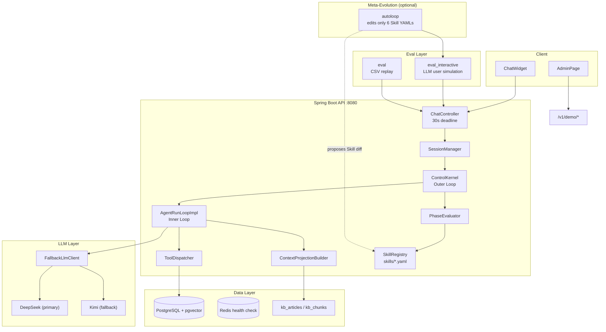
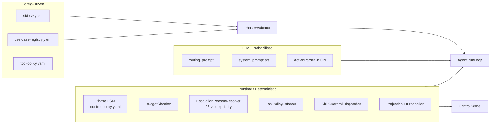
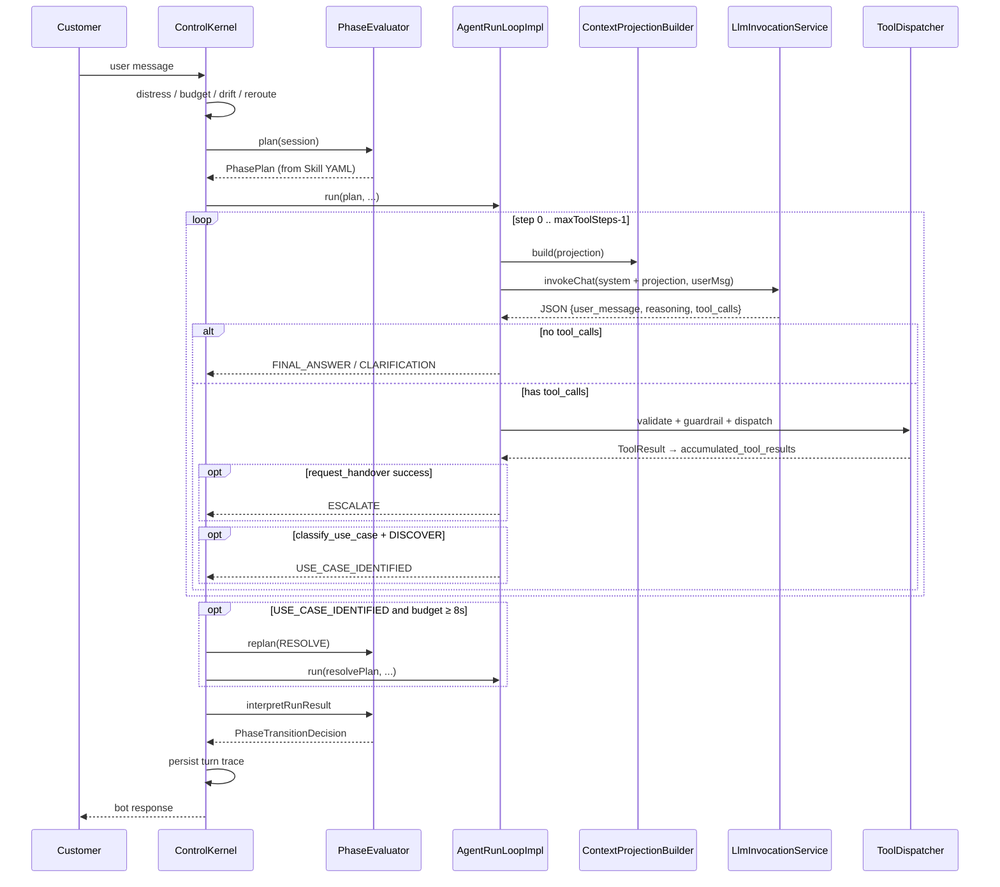

# Customer Service Agent (csagent)

**English** · [简体中文](README-CN.md)

This is not a keyword chatbot but the product of an **engineering methodology**: using **LLM-first semantic freedom** to genuinely solve customer-service problems for a classifieds marketplace (automated FAQ answering, intake collection, structured human handover), while nailing mechanical constraints — safety, budget, tool permissions, evaluation — firmly into a deterministic runtime skeleton. The four cornerstones that support it — the **LLM-vs-Runtime ownership boundary**, the **four-tier evaluation pyramid (human as the primary gate)**, **anti-hardcode governance discipline**, and **autoloop meta-evolution** — were *forced into existence* through round after round of bad-case retrospectives and research-driven experiments, rather than being fully designed up front. The "Evolution Trajectory" below is this system's discovery process.

> **Source code is the truth**: runtime behavior is governed by `server/src/main/java/com/gumtree/csagent/service/runtime/`, `server/src/main/resources/config/`, and `skills/`. For a contract summary see [`docs/current/runtime_contract.md`](docs/current/runtime_contract.md); for the governance constitution see [`AGENTS.md`](AGENTS.md) → [`docs/current/iteration_governance.md`](docs/current/iteration_governance.md).

---

## Evolution Trajectory (Iteration-Driven Evolution)

Each milestone corresponds to one cycle of "**discover a class of problems → distill a capability**", rather than linearly stacking features. The system is driven by two iteration inputs: **Path 1, research-driven** (form hypothesis → design experiment → validate) and **Path 2, bad-case-driven** (human reads the trace → uses the [nine-layer Fix-Layer classification](docs/current/iteration_governance.md) to locate the failing layer → minimal fix). Before any work begins, every semantic failure must first pass the [nine-question anti-hardcode kernel](docs/current/anti-hardcode-review-kernel.md) — **by default, papering over a semantic problem with keywords / regex / if-else is forbidden**, or review rejects it outright. This discipline, together with the pitfalls repeatedly hit in the table below, is the real moat of this system.

| Stage | Milestone | Problem discovered → capability distilled |
|-------|-----------|--------------------------------------------|
| Skeleton | **M1** | DISCOVER classification + Intake: model-first intent classification, phase state machine, cross-turn durability of intake fields |
| Abstraction | **M2** | Push "how to do it" down from Java into a **Skill Registry**: behavior externalized into YAML envelopes (LLM-led / Policy-bounded) |
| Evaluation | **M3-Eval** | **Coarse-to-fine four-tier evaluation pyramid** (Tier-0 safety → Tier-3 polish), solving "the score went up but it didn't actually get better" |
| Governance | **M4 / M5** | Evaluation-harness cleanup + governance-gap closure; **observability consistency** (trace aligned with real behavior) |
| Meta-evolution · foundation | **M-Auto-1–3** | **autoloop**: a meta-agent edits only 6 Skill YAMLs for hill-climbing self-evolution (infrastructure → calibration → signal hygiene) |
| Signal purity | **M-Auto-4 / 5** | Discovered that **evaluation measurement artifacts hard-"kill" correct behavior**; achieved reliable fitness and honest scoring / trace contracts |
| Substrate hardening | **M-Auto-6** | runtime substrate hygiene + admin observability + intake/clarification contract + corpus governance |
| Meta-evolution · landing | **M-Auto-7** (in progress) | **CS4 entity-context autoloop pilot** (CORE GATE): autoloop genuinely produces Skill candidates → human §4.1 review → merge |

> Full milestone archive at [`docs/milestones/`](docs/milestones/); current progress at [`docs/10-handoff.md`](docs/10-handoff.md). As of **2026-06-09**: branch `auto-loop-branch`, **M-Auto-7** in progress (S-Y2 / Sprint 088, CS4 entity-context autoloop pilot = CORE GATE, Part C pending human approval).

---

## Table of Contents

0. [Evolution Trajectory (Iteration-Driven Evolution)](#evolution-trajectory-iteration-driven-evolution)
1. [Product Boundaries](#1-product-boundaries)
2. [Repository Structure](#2-repository-structure)
3. [Architecture Overview](#3-architecture-overview)
4. [Runtime: Dual-Loop Agent Design](#4-runtime-dual-loop-agent-design)
5. [Harness: LLM and Runtime Division of Labor](#5-harness-llm-and-runtime-division-of-labor)
6. [Context Engineering](#6-context-engineering)
7. [Tools and Knowledge Base](#7-tools-and-knowledge-base)
8. [Evaluation System](#8-evaluation-system)
9. [Autoloop: Skill-Driven Auto-Evolution](#9-autoloop-skill-driven-auto-evolution)
10. [Local Development and Running](#10-local-development-and-running)
11. [Reliability and Control](#11-reliability-and-control)
12. [Design Trade-offs and Takeaways](#12-design-trade-offs-and-takeaways)
13. [Comparison with Late-2025 Industry Approaches](#13-comparison-with-late-2025-industry-approaches)
14. [Further Reading](#14-further-reading)

---

## 1. Product Boundaries

### What problem it solves

In a customer-service scenario, the Agent sits **between the customer and the human agent**:

- **FAQ path** (UC-A–UC-FP): search the help center → cite articles → record the resolution outcome
- **Intake path** (UC-G–UC-K): collect required fields → create a Case → structured handover to a human
- **Safety and compliance**: budget, escalation-reason priority, PII redaction, no false promises

### In scope

| Capability | Notes |
|------------|-------|
| 12 Use Cases + 4 out-of-scope direct-handover classes | see `use-case-registry.yaml` |
| Phase state machine | INIT → DISCOVER → RESOLVE → CONFIRM → CLOSE / ESCALATE |
| 11 tools (6 Agent-visible + 5 Runtime-only) | see [§7](#7-tools-and-knowledge-base) |
| pgvector knowledge retrieval + LLM rerank | `KnowledgeSearchService` |
| Interactive + replay evaluation | `eval_interactive/` + `eval/` |
| Demo UI + Admin tracing | `ui/` + `/v1/demo/*` (`local` profile only) |

### Out of scope (current repo)

- Executing business side effects (refunds, delisting, account changes) — the Agent only **explains the process** and hands over to a human
- Production-grade Salesforce integration (Mock locally)
- Streaming / multimodal / cross-session long-term memory
- Containerized deployment and CI (to be added yourself)

---

## 2. Repository Structure

```
csagent-latest/
├── server/              # Spring Boot 3 runtime (Java 17)
├── ui/                  # React 19 + Vite demo and admin console
├── eval/                # Java batch replay evaluation (CSV datasets)
├── eval_interactive/    # Python interactive evaluation (LLM user simulator + CaseSpec)
├── autoloop/            # Skill YAML auto-evolution subsystem (meta-agent)
├── data/knowledge/      # KB source data
├── docs/                # governance, contracts, sprint archives
├── compact/             # Dev / Deliver / Review Agent prompt packs
└── case_specs/          # located under eval_interactive/case_specs/
```

| Module | Entry point | Port |
|--------|-------------|------|
| Server | `CsAgentApplication.java` / `make backend` | `:8080` |
| UI | `ui/src/main.tsx` / `make frontend` | `:5173` |
| Eval CLI | `eval-interactive` (`eval_interactive/cli.py`) | — |
| Autoloop | `python -m autoloop` | — |

---

## 3. Architecture Overview

### 3.1 System Architecture Diagram



### 3.2 Main Call Path (a single user message)

```
POST /v1/chat/sessions/{id}/messages
  → ChatController sets a 30s LlmCallContext wall clock
  → SessionManager.processMessage
    → ControlKernel.processMessage          # outer loop: once per user message
      → deterministic: distress / explicit handover request / budget / drift / reroute
      → PhaseEvaluator.plan → SkillRegistry.select → PhasePlan
      → AgentRunLoopImpl.run                  # inner loop: 0..maxToolSteps
      → [optional] same-turn RESOLVE replan after USE_CASE_IDENTIFIED (≥8s remaining)
      → PhaseEvaluator.interpretRunResult → phase transition
      → recordRunResult → bot_turns + bot_events
  → if shouldEndChat: recordOutcome / recordHandover
```

**Key classes** (all under `server/src/main/java/com/gumtree/csagent/service/runtime/`):

| Class | Responsibility |
|-------|----------------|
| `ControlKernel` | sole orchestration entry: `processMessage` |
| `AgentRunLoopImpl` | bounded LLM↔tool loop |
| `PhaseEvaluator` | `plan()` / `interpretRunResult()` / legacy `evaluate()` |
| `ContextProjectionBuilder` | builds the LLM-visible JSON projection |
| `SessionManager` | session creation, message processing, result persistence |

---

## 4. Runtime: Dual-Loop Agent Design

> **Note**: the branch name `auto-loop-branch` refers to **D16 Agent Run Loop enabled across all phases** + the **Autoloop meta-evolution milestone**; the Python `autoloop/` is **not wired into** the Java request path.

### 4.1 Harness Component Diagram



### 4.2 Agent Loop Sequence Diagram



### 4.3 Inner-Loop Pseudocode (`AgentRunLoopImpl.run`)

```text
maxSteps = plan.maxToolSteps  // typically 2-6 (6 for FAQ RESOLVE), from Skill YAML
for step in 0 .. maxSteps-1:
    projection = ContextProjectionBuilder.build(
        session, history, plan, userMessage,
        accumulatedToolResults, toolEvents)

    response = LlmInvocationService.invokeChat(projection, userMessage)
    action = ActionParser.parse(response)  // {user_message, reasoning, tool_calls}

    if tool_calls empty:
        return FINAL_ANSWER or CLARIFICATION_NEEDED

    for each tool_call:
        if not validateAgainstPlan(plan, tool): reject with hint
        if SkillGuardrail rejects (e.g. handover before resolve): reject with hint
        result = ToolDispatcher.dispatch(tool, session, args)
        accumulate result

        if request_handover succeeded: return ESCALATE
        if classify_use_case on DISCOVER: return USE_CASE_IDENTIFIED

return MAX_STEPS  // PhaseEvaluator maps this to a concrete escalation_reason
```

### 4.4 Terminal Outcomes (`TerminalOutcome`)

| Outcome | Meaning | Typical follow-up |
|---------|---------|-------------------|
| `FINAL_ANSWER` | no tool, not a clarification | may enter CONFIRM |
| `CLARIFICATION_NEEDED` | ask the user | stay in the current phase |
| `ESCALATE` | `request_handover` succeeded | → ESCALATE |
| `USE_CASE_IDENTIFIED` | DISCOVER classification succeeded | same-turn RESOLVE replan |
| `MAX_STEPS` | steps exhausted | escalation reason mapped by intake/FAQ/turn count |
| `DEADLINE_EXCEEDED` | 30s timeout | **honest retry copy, does not fake an escalation** |
| `LLM_UNAVAILABLE` | infrastructure failure | same as above |

### 4.5 Phases and Skills

**Phases** (`SessionPhase`): `INIT → DISCOVER → RESOLVE → CONFIRM → CLOSE`, with branch `ESCALATE`.

**6 Skill files** (`server/src/main/resources/skills/`):

| Skill | Phase | UC |
|-------|-------|-----|
| `discover_triage.yaml` | DISCOVER | `*` |
| `resolve_faq_grounded_answer.yaml` | RESOLVE | UC-A–FP |
| `resolve_intake_collect_and_handover.yaml` | RESOLVE | UC-G–K |
| `confirm.yaml` | CONFIRM | `*` |
| `escalate.yaml` | ESCALATE | `*` |
| `terminal.yaml` | CLOSE | `*` |

`SkillRegistry.select(phase, useCase)`: exact match → wildcard `*`.

---

## 5. Harness: LLM and Runtime Division of Labor

For the constitutional principles see [`docs/current/iteration_governance.md`](docs/current/iteration_governance.md) §1.

| Dimension | **LLM owns** | **Runtime owns** |
|-----------|--------------|------------------|
| Semantic | intent, wording, whether to cite knowledge, choice of tool calls | — |
| Mechanical | — | phase FSM, budget, tool whitelist, guardrail, canonical `escalation_reason` |
| Safety | — | explicit handover request, distress detection (the LLM **cannot** set `user_distress` itself) |
| Failure | — | timeout/unavailable → honest message, not a fake handover |

**Teaching-style guardrail**: when `SkillGuardrailDispatcher` rejects, it writes `{error, hint, missing_fields}` into `accumulated_tool_results`, so the LLM can self-correct on the next turn (see `AgentRunLoopImpl` + `resolve_faq_grounded_answer.yaml`'s `faq_miss_handover_requires_resolve_attempt`).

**Rollback switch**: clearing `agent.run-loop.enabled-phases` in `application.yml` → falls back to the legacy `PhaseEvaluator.evaluate()` path.

---

## 6. Context Engineering

### 6.1 Message Shape of Each LLM Call

```text
messages = [
  { role: "system", content: system_prompt.txt + "\n\nCurrent context:\n" + projection_json },
  { role: "user",   content: raw user text of the current turn }
]
```

- **No SSE streaming**; `response_format: json_object`
- **Multi-turn history** is embedded in the projection's `conversation_history` (last 10 turns, emails redacted), not as multiple chat messages

### 6.2 Main Projection Fields (`ContextProjectionBuilder`)

| Field | Purpose |
|-------|---------|
| `session` | phase, active_use_case, counters |
| `phase_plan` | objective, procedure, allowed_tools, grounding, escalation_policy, `critical_steps` |
| `tool_schemas` | tool definitions filtered by the plan |
| `accumulated_tool_results` | tool outputs of the current turn |
| `already_called` | `{tool, arguments_hash, at_step}` dedup hint |
| `intake_state` | required/collected fields for Intake UCs |
| `customer_context` / `listing_context` | prefetched results of Runtime-only tools |
| `candidate_use_cases` etc. | **soft signals**: for the LLM to read; the Runtime does not branch on them |

### 6.3 Strengths and Limitations

| Strength | Limitation |
|----------|------------|
| Runtime precisely controls "what the model sees" | fixed 10-turn window, no semantic retrieval of history |
| Skills inject procedure per phase, avoiding a giant prompt | full projection rebuilt every tool step, high token cost |
| `already_called` reduces duplicate tool calls | no conversation-level KV-cache optimization |

---

## 7. Tools and Knowledge Base

### 7.1 Tool Matrix

Policy source: `server/src/main/resources/config/tool-policy.yaml`.

| Tool | Visibility | Allowed UCs (summary) |
|------|------------|-----------------------|
| `search_knowledge` | Agent | FAQ UCs |
| `resolve_article` | Agent | FAQ UCs |
| `classify_use_case` | Agent | ALL (plan limits it to DISCOVER) |
| `get_customer_context` | Agent | subset |
| `request_handover` | Agent | ALL |
| `record_outcome` | Agent | ALL |
| `lookup_*` / `get_moderation_*` | Runtime-only | per UC |
| `create_case_controlled` | Runtime-only | UC-H, J, K |

Dispatch pipeline: `ToolDispatcher.dispatch` → registry lookup → `ToolPolicyEnforcer` → `execute()`.

### 7.2 Knowledge Retrieval Pipeline

`KnowledgeSearchService.search()`:

1. `DashScopeEmbeddingClient` → 768-dim vector
2. pgvector HNSW cosine ANN (`KbChunkRepository`)
3. Retrieval gate: similarity < 0.3 → `retrieval_miss`
4. `RerankService`: parallel LLM 1–5 score (8 threads)
5. Answer gate: top < 3.5 → `answer_miss`
6. return top 3 `KnowledgeHit`

Ingestion: `make ingest` → `KnowledgeIngestionRunner` reads `data/knowledge/`.

---

## 8. Evaluation System

### 8.1 Two Harnesses

| | **eval_interactive/** (primary) | **eval/** (CI replay) |
|--|---------------------------------|-----------------------|
| User | LLM `UserSimulator`, adaptive | CSV fixed visitor turns |
| Cases | YAML CaseSpec (486, plus a separate shadow set) | 7 datasets, 601 sessions |
| Scoring | L1 hard checks + L2 outcome + L3 Judge + Tier-2 Skill steps | 7 code + 4 model graders |
| Purpose | sprint acceptance, anchored regression, human review of bad cases | fast PR gate |

### 8.2 Scoring Pyramid (M3-Eval)

| Tier | Role | Blocks `case_passed`? |
|------|------|-----------------------|
| **Tier-0** | safety floor (PII, no tool exposure, escalation compliance) | Yes |
| **Tier-1** | outcome (`bad_cases` human + `anchor_outcome`) | **primary human gate** (§5.6) |
| **Tier-2** | Skill `critical_steps` procedure | Yes (mandatory steps) |
| **Tier-3** | polish (efficiency, tool sequence, etc.) | No (observation only) |

Programmatic pass (interactive eval): `case_passed AND composite >= 0.7` (`composite = 0.5×L2 + 0.5×L3`, only when case_passed).

**Important**: the composite of `case_specs/smoke/` (14 cases) has been **downgraded to an observational metric** and cannot alone justify a sprint close.

### 8.3 CaseSpec Directories

| Directory | Role |
|-----------|------|
| `anchor/` (159) | breadth regression |
| `anchor_outcome/` (12) | one per UC, human reviews the second face |
| `bad_cases/` (17) | **primary acceptance** (human reads the trace) |
| `case_families/` (51) | target / neighbor / negative clustered by failure family |
| `exploration/` (107) · `probe/` (25) · `promotion/` (101) | exploration, targeted probes, promotion candidates |
| `smoke/` (14) | quick smoke (downgraded to an observational metric) |
| `eval_interactive/case_specs_shadow/` | milestone shadow regression (separate directory, not readable during dev) |

Run examples:

```bash
cd eval_interactive
uv run eval-interactive run --path case_specs/smoke/
uv run eval-interactive run --path case_specs/bad_cases/
```

Config: `eval_interactive/eval_interactive.yaml` (`CSAGENT_BACKEND_URL`, simulator LLM, etc.).

---

## 9. Autoloop: Skill-Driven Auto-Evolution

An **independent subsystem** (`autoloop/`) where a meta-agent proposes changes to the LLM-soft fields of **only 6 Skill YAMLs**; `server/` Java, `case_specs/`, prompts, etc. are hard fences.

| Concept | Notes |
|---------|-------|
| Mutable surface | 6 Skills × procedure / grounding / escalation, etc. |
| Fitness | five-tier lexicographic (Tier-0 safety → Tier-1 outcome → Tier-2 procedure → improvement → shadow) |
| Fitness baseline | `config.fitness.baseline_dir` points to `m-auto-7-prepilot-baseline-20260608` (honest baseline, gap confirmed) |
| Current pilot | CS4 entity context: Tier-1 target (`cs_uc_a_*`) + anti-false-kill (anti-误杀) negative control |
| Entry | [`autoloop/README.md`](autoloop/README.md), [`autoloop/program.md`](autoloop/program.md) |

Current milestone (`docs/milestone_objective.md`): **M-Auto-7** — autoloop readiness + CS4 entity-context pilot (CORE GATE: autoloop produces Skill candidates → human §4.1 review → merge + re-bless). It **does not affect** the online customer-service request path.

---

## 10. Local Development and Running

### 10.1 Prerequisites

- Java 17+, Maven, Node.js, PostgreSQL 17 (pgvector), Redis
- Python 3.11+, `uv` (evaluation and autoloop)
- `.env.local` (**not committed**; `include`d by the Makefile)

### 10.2 Environment Variables (excerpt)

| Variable | Purpose |
|----------|---------|
| `DEEPSEEK_API_KEY` | primary Chat LLM (required) |
| `KIMI_API_KEY` | fallback Chat (strongly recommended) |
| `DASHSCOPE_API_KEY` | Embedding (required for ingest/retrieval) |
| `DB_*` / `REDIS_*` | database and Redis |
| `CSAGENT_BACKEND_URL` | eval points at the backend (default `http://localhost:8080`) |

### 10.3 Quick Start

```bash
make setup      # start PostgreSQL + Redis
make build      # mvn clean install -DskipTests
make ingest     # ingest the knowledge base

# terminal 1
set -a && source .env.local && set +a
make backend    # :8080, profile=local

# terminal 2
make frontend   # :5173

# optional: smoke evaluation
cd eval_interactive && uv run eval-interactive run --path case_specs/smoke/
```

- Chat: `http://localhost:5173`
- Admin: `http://localhost:5173/admin` (trace, handover, funnel metrics)

### 10.4 Testing

```bash
cd server && mvn test                    # Java baseline 1383/1/0/2 (incl. ControlKernel integration; 1 inherited known failure)
cd eval_interactive && uv run pytest -q  # eval pipeline ~553 (548 + 5 inherited)
cd autoloop && uv run --extra dev pytest -q   # autoloop ~331
cd ui && npm test                        # UI vitest 10 passed
```

Integration-test pattern: **Mockito wires a real `ControlKernel` + `AgentRunLoopImpl`**, stubbing `LlmInvocationService` (not full-stack E2E).

---

## 11. Reliability and Control

| Mechanism | Implementation |
|-----------|----------------|
| Request deadline | `ChatController` 30s → `LlmCallContext` |
| LLM fault tolerance | `FallbackLlmClient`: DeepSeek → Kimi; 1 retry per single provider |
| Budget | `control-policy.yaml`: clarify 2 turns, FAQ miss 2, FAQ 15 turns, Intake 10 turns, 25 turns total |
| Escalation priority | `EscalationReasonResolver`: 23 values, e.g. `user_requested`(1) > `faq_miss`(41) |
| Forced escalation | `ControlKernel.forceEscalate`: no LLM, synthesizes a handover trace |
| Trace | `bot_turns`: projection, tool_calls, per-step `bot_turn_llm_calls` (V15) |
| PII | projection email redaction; `ToolCallTraceSanitizer` redacts at persistence |

**Production gap**: `MockGumtreeApiService`, `MockSalesforceService`, `DemoInspectionController` are all `@Profile("local")`; there is no real CRM/business-API implementation class.

---

## 12. Design Trade-offs and Takeaways

### What it optimized for

- **Controllability > creativity**: YAML Skills + Runtime guardrail + evaluation pyramid
- **Grounding > free improvisation**: FAQ must `search_knowledge` before answering
- **Observability > black box**: a full trace every turn, supporting Tier-2 and human review
- **Eval-driven iteration**: bad_cases as the primary human gate, not a single automated score

### What it sacrificed

- No streaming, no multimodal
- Synchronous REST, higher latency on long FAQ paths
- Heavy governance docs and CaseSpec maintenance cost
- Learning curve of Java + a dual evaluation stack

### Learn from vs copy with caution

| Learn from | Don't blindly copy |
|------------|--------------------|
| LLM-Runtime ownership boundary | the no-streaming interaction pattern |
| Skill envelope + teaching-style guardrail rejection | single user message + giant projection |
| projection-style context control | mock-only business integration |
| deterministic budget and escalation-priority table | hand-maintained YAML with no generation pipeline |
| two-layer eval + primary human gate | the full governance doc chain (small teams can trim it) |

---

## 13. Comparison with Late-2025 Industry Approaches

| Dimension | This project | Common late-2025 practice | Gap |
|-----------|--------------|---------------------------|-----|
| Response | synchronous JSON, blocking | SSE / WebSocket streaming | experience |
| Model routing | fixed DeepSeek+Kimi fallback | route large/small models by intent/phase | cost and latency |
| Memory | single-session DB | vector memory + entity graph | cross-session continuity |
| Tools | serial dispatch | parallel independent tools | throughput |
| Self-verification | no reflection loop | CoVe / self-critique then re-answer | quality ceiling |
| Human-agent collaboration | ends at handover | in-seat Agent assist for the human | collaboration depth |
| Online eval | none | production CSAT → case-library closed loop | continuous improvement |
| Auto-evolution | **autoloop (Skill-only)** | mostly still manual prompt iteration | this project explores meta-evolution |

**Priority improvement roadmap (if productized)**: P0 streaming + model routing; P1 semantic history compression + tool parallelism; P2 lightweight self-check layer + online-eval sampling.

---

## 14. Further Reading

| Reader | Docs |
|--------|------|
| Adopters / integrators | [`docs/current/runtime_contract.md`](docs/current/runtime_contract.md), [`docs/current/faq_grounding_contract.md`](docs/current/faq_grounding_contract.md), [`docs/runbooks/admin-guide.md`](docs/runbooks/admin-guide.md) |
| Contributors / Agents | [`AGENTS.md`](AGENTS.md) → `docs/current/iteration_governance.md`, `docs/sprint_objective.md` |
| Autoloop | [`autoloop/README.md`](autoloop/README.md), [`autoloop/program.md`](autoloop/program.md) |
| Architecture history | [`docs/foundational/`](docs/foundational/) Phase 0–5 specs |

**Current active work** (2026-06-09): branch `auto-loop-branch`, milestone **M-Auto-7** (autoloop readiness + CS4 entity-context pilot, CORE GATE); the runtime runs **all six phases through AgentRunLoop**. See [`docs/10-handoff.md`](docs/10-handoff.md).

---

## Appendix: Comparison Table (Harness vs Typical Chatbot vs 2025 Agent Frameworks)

| Capability | csagent | Traditional rule-based Chatbot | General Agent framework (LangGraph, etc.) |
|------------|---------|--------------------------------|-------------------------------------------|
| Intent routing | LLM + deterministic prior | keyword/decision tree | free LLM routing |
| Tool constraints | triple whitelist + guardrail | fixed API | developer-defined |
| Phase machine | explicit FSM + Skill | finite states | free graph/node composition |
| Evaluation | four-tier pyramid + primary human gate | scripted assertions | mostly optional tracing |
| Meta-evolution | autoloop (Skill YAML only) | none | rare, usually all-prompt |
