# CSAgent 系统方案设计

> 面向：产品技术负责人、Agent 开发顾问
> 日期：2026-05-13 | 状态：内部评审稿
> 仓库：csagent-design-v1 | 已交付 Sprint：1–17（50 commits，2026-05-05 → 2026-05-11）

---

## Part 0 — 目标、总体思路与演进路径

### 0.1 业务背景与预期目标

CSAgent 是面向 **Gumtree**（英国在线分类广告平台）的 LLM 驱动智能客服 Agent，嵌入 **Salesforce Enhanced Chat** 作为用户首触达交互层。

**核心业务指标：**

| 指标 | 目标 |
|------|------|
| AI 自助解决率 | 70%（Bot 独立解决，不转人工） |
| 转人工率 | 按意图可接受区间 |
| AI 满意度（CSAT） | 40%–70% |
| AI 参评率 | 80%–90% |

**业务现状：** 月均约 5,700 次聊天会话，消耗约 4.1 FTE 人工坐席产能。高频联系原因包括数据删除/账户问题、登录/邮箱/密码、广告可见性、交易咨询等。Salesforce Enhanced Chat 已部署为渠道底座。

### 0.2 设计哲学 — LLM-First 架构

CSAgent 与传统规则驱动 chatbot 的核心区别在于**所有权分离原则**：

| 维度 | LLM 拥有（语义层） | Runtime 拥有（确定性层） |
|------|-------------------|------------------------|
| 用户意图理解 | ✓ 目标识别、假设推理 | |
| UC 路由与分类 | ✓ 语义判断 | ✓ 强先验映射（仅 strong-prior） |
| 漂移检测态度 | ✓ 语义感知 | ✓ 关键词硬切换 |
| 升级判断 | ✓ 升级时机与理由 | ✓ 预算耗尽强制升级 |
| 回复策略与语气 | ✓ | |
| 工具选择与参数 | ✓ | ✓ 白名单 + 策略执行 |
| 工具 Schema 与分发 | | ✓ |
| PII / 安全底线 | | ✓ |
| Grounding 底线 | | ✓ |
| 预算与幂等 | | ✓ |
| 持久化与状态 | | ✓ |
| Trace 与 Eval 契约 | | ✓ |

**核心原则：** 规则定义边界，规则不替代语义判断。语义类失败不得用关键词/正则/if-else/枚举扩展来修补，除非涉及 Tier-0 不变量。

### 0.3 演进路径

项目遵循从规范到交付的分阶段方法论：

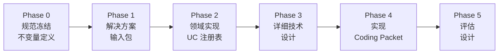

**Sprint 交付时间线（7 天 17 个 Sprint）：**

| 日期 | Sprint | 聚焦方向 |
|------|--------|----------|
| 05-05 | S5–S6 | Fix-layer 诊断；延迟 + FAQ 解决 |
| 05-06 | S7–S8 | 路由 + Intake；cs259 UC 契约 |
| 05-07 | S8.2–S9 | 工具对齐；工具契约 + Trace |
| 05-08 | S10–S12 | Reroute MVP；渐进解决；对齐加固 |
| 05-09 | S13 | 运行时冻结 + 风险策略 |
| 05-10 | S14–S15 | FAQ 证据链路；配置治理 |
| 05-11 | S16–S17 | Handover 幂等契约；迭代治理 |

Sprint 按聚焦方向分为四个阶段：

| 阶段 | Sprint | 聚焦 |
|------|--------|------|
| 基础构建 | S1–S4 | 核心运行时、升级对齐、凭证健壮性、UC 契约 |
| 诊断分析 | S5 | Fix-layer 分类法、Prompt-context 审计 |
| 运行时加固 | S6–S12 | 延迟、路由、Intake、Reroute、渐进解决、可观测性 |
| 策略与治理 | S13–S17 | 运行时冻结、FAQ 链路、配置治理、Handover 契约、迭代治理 |

---

## Part 1 — 整体架构

CSAgent 采用单 Agent + 阶段化执行的架构。Agent 不拆分为多个专用子 Agent，而是通过 `PhasePlan` 参数化同一执行循环，在不同阶段呈现不同的工具集、指令和终止条件。这一选择基于当前 UC 多样性尚可用阶段参数化覆盖的判断，避免了多 Agent 间状态同步和协调的复杂性。

### 1.1 系统上下文

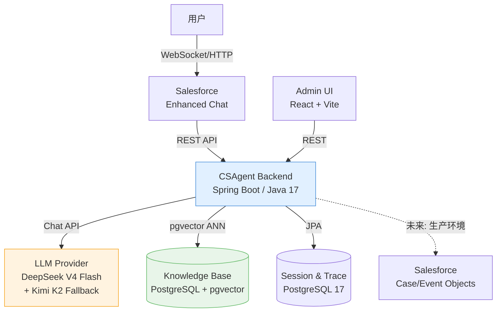

### 1.2 Agent 内部架构

Agent 内部分为三个核心层：**编排层**（ControlKernel）负责确定性前置检查和流程控制；**规划层**（PhaseEvaluator）负责生成阶段执行计划；**执行层**（AgentRunLoop）负责 LLM↔Tool 的有界循环。这一分层使得确定性守卫（预算、漂移、升级）与 LLM 语义决策解耦，各自独立演进。

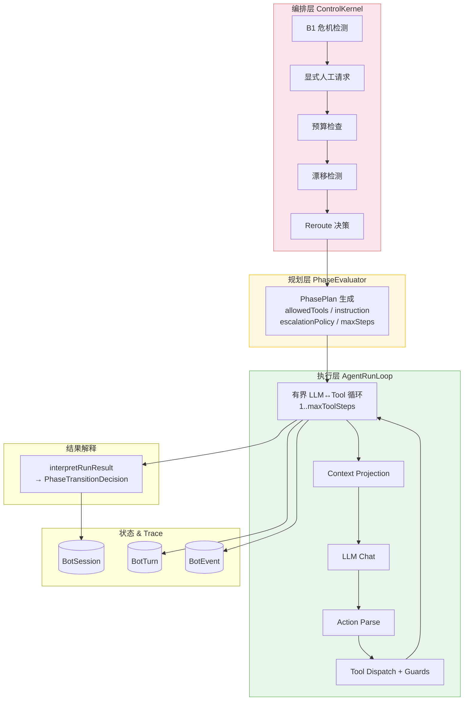

---

## Part 2 — 核心模块详解

### 2.1 编排与阶段机 — ControlKernel

ControlKernel 是每条用户消息的唯一入口。它的设计考量是：将所有确定性判断（危机、预算、漂移、路由切换）前置于 LLM 调用之前，确保即使 LLM 不可用或行为异常，系统仍能做出安全的兜底决策（如强制升级）。

#### 消息处理流程

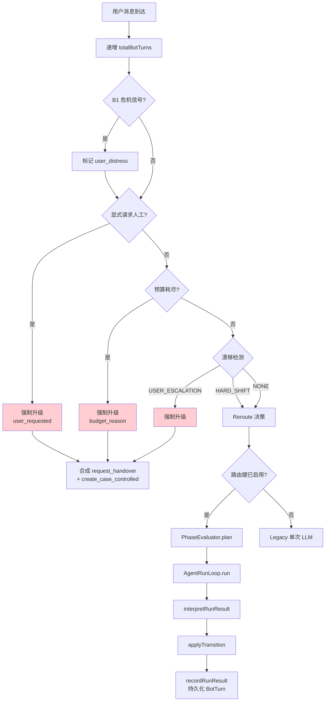

**特殊机制 — DISCOVER→RESOLVE 同轮 Replan：** 当 AgentRunLoop 在 DISCOVER 阶段产出 `USE_CASE_IDENTIFIED` 结果时，ControlKernel 检查剩余墙钟预算（`MIN_RESOLVE_REPLAN_BUDGET_MS`），若充足则立即重新规划并进入 RESOLVE 阶段执行——避免一次无意义的往返。

#### 阶段机

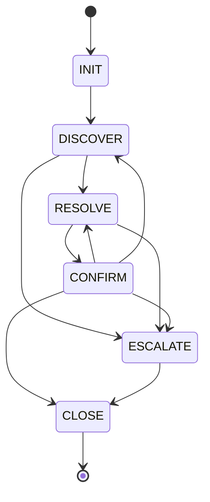

#### 预算体系

| 预算类型 | 上限 | 耗尽效果 |
|---------|------|---------|
| 澄清轮次 (`max-clarification-rounds`) | 2 | 强制升级 `clarification_budget_exhausted` |
| FAQ 未命中 (`max-faq-miss`) | 2 | 强制升级 `faq_miss_threshold_exceeded` |
| Bot 轮次 - FAQ 路径 (`max-bot-turns-faq`) | 15 | 强制升级 `turn_budget_exhausted` |
| Bot 轮次 - Intake 路径 (`max-bot-turns-intake`) | 10 | 强制升级 `turn_budget_exhausted` |
| 重复相同动作 (`max-repeated-same-action`) | 2 | 强制升级 |
| 总 Bot 轮次 (`max-total-bot-turns`) | 25 | 强制升级 `turn_budget_exhausted` |

### 2.2 UC 漂移检测与 Reroute

UC 漂移处理是 Agent 在多轮对话中应对用户话题切换的关键能力。设计考量是：用确定性检测（关键词）快速捕获高风险切换，同时用语义分类器处理软切换，避免简单粗暴地将所有切换都升级为转人工。

#### 漂移类型

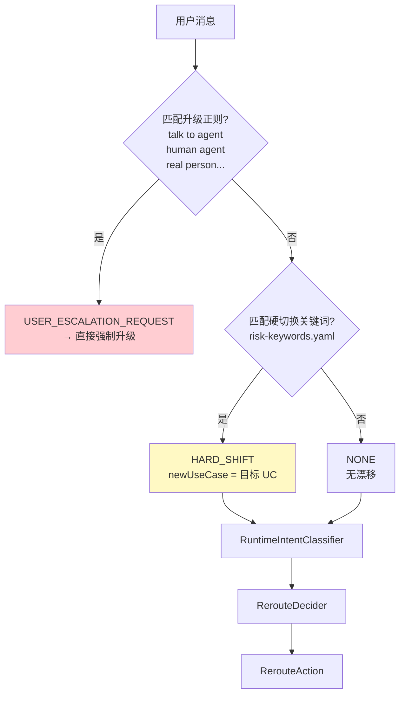

#### 硬切换关键词组（risk-keywords.yaml）

| 优先序 | 目标 UC | 关键词 |
|--------|---------|--------|
| 1 | UC-J (信任安全) | scam, scammed, fraud, fraudulent |
| 2 | UC-G (GDPR/数据删除) | delete my data, delete my account, gdpr, data deletion |
| 3 | UC-I (退款/支付纠纷) | refund, money back, charge back, chargeback |
| 4 | UC-J (信任安全) | unsafe, harassment, threatening, danger, abusive |
| 5 | UC-H (广告移除申诉) | ad removed, ad deleted, ad taken down, appeal |

#### Intent 分类与 Reroute 决策矩阵

`RuntimeIntentClassifier` 将漂移结果映射为意图关系（`IntentRelation`），`RerouteDecider` 据此决定动作：

| IntentRelation | 触发条件 | RerouteAction | 效果 |
|---------------|---------|---------------|------|
| `HUMAN_REQUEST` | 用户显式请求人工 | `ESCALATE_IMMEDIATELY` | 立即升级 |
| `CRITICAL_ESCALATION` | 危机信号 | `CONTINUE_CURRENT` | 仅标记，不自动升级 |
| `NEW_HIGH_RISK_UC` | 新 UC 属于高风险 Intake 集合 | `RISK_SHIFT_TO_INTAKE` | 切换 UC + 进入 RESOLVE（Intake） |
| `NEW_LOW_RISK_UC` | 新 UC 属于低风险 FAQ 集合 | `SOFT_SHIFT_TO_DISCOVER` | 切换 UC + 进入 DISCOVER |
| `SAME_ISSUE` | 同 UC 同问题，在 CONFIRM 阶段 | `REBOUND_TO_RESOLVE` | 回弹到 RESOLVE 继续处理 |
| `SAME_UC_NEW_TASK` | 同 UC 新任务，在 CONFIRM | `REBOUND_TO_RESOLVE` | 回弹到 RESOLVE |
| `UNKNOWN` | 无法分类 | `CONTINUE_CURRENT` | 维持当前状态 |

**UC 集合分类：**
- **低风险 FAQ 集**：UC-A, UC-B, UC-C, UC-D, UC-E, UC-F, UC-FP（Bot 可独立解决）
- **高风险 Intake 集**：UC-G, UC-H, UC-I, UC-J, UC-K（必须转人工，Bot 仅做信息收集）

### 2.3 Agent Run Loop

AgentRunLoop 是 LLM 与工具交互的有界执行引擎。其设计核心是**有界性**——通过 `PhasePlan.maxToolSteps` 限制循环次数，防止 LLM 陷入无限工具调用。每一步都经过计划白名单和策略执行器的双重校验。

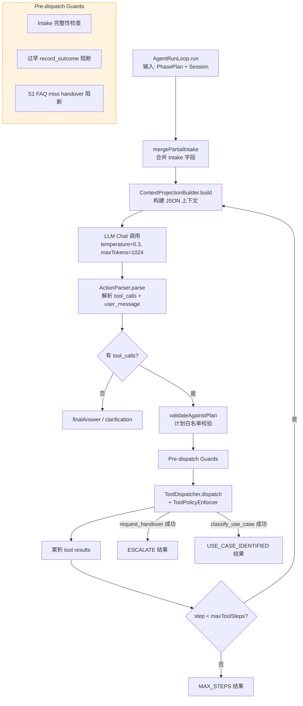

### 2.4 Domain Context Projection

Context Projection 是驱动 LLM 行为的核心机制，替代传统的"prompt 堆叠"方式。设计理念是：不在 system prompt 中用大段散文描述规则，而是将结构化的 JSON 上下文投影给 LLM，使行为可控、可审计、可迭代。投影是**计划感知的**——不同阶段投影不同的工具 schema、指令和状态线索。

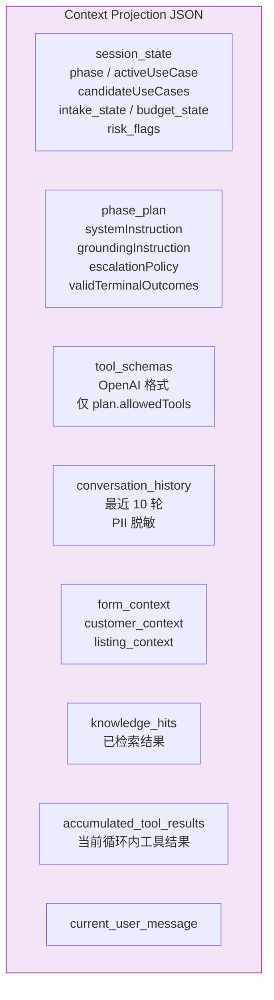

**投影迭代增强历史：**

| Sprint | 增强内容 |
|--------|---------|
| S7 | `candidate_use_cases` + DISCOVER 线索、`intake_state` |
| S10 | Reroute 决策 / 问题状态 slots |
| S11 | `task_status`、`resolve_disposition` |
| S12 | `drift_history`、`task_history` 聚合 |
| S14 | FAQ grounding 诊断 |

### 2.5 Tool Integration

工具是 Agent 与外部能力交互的接口。设计上采用**双层策略执行**：Phase Plan 白名单（按阶段过滤）和 Tool Policy（按 UC 过滤），两层独立执行，确保即使 LLM 尝试调用非授权工具也会被阻断。

#### Agent 可见工具

| 工具 | 用途 | 可用 UC |
|------|------|---------|
| `search_knowledge` | FAQ 知识库检索（pgvector 向量搜索 + Rerank） | UC-A/B/C/D/E/F/FP |
| `resolve_article` | 按 source_id 获取完整文章内容 | UC-A/B/C/D/E/F/FP |
| `get_customer_context` | 查询账户/广告上下文信息 | UC-A/C/D/F/FP/K |
| `classify_use_case` | DISCOVER 阶段提交 UC 分类假设 | ALL（仅 DISCOVER Plan 暴露） |
| `request_handover` | 触发转人工（构建转接 payload） | ALL |
| `record_outcome` | 记录终端结果（resolve/close） | ALL |

#### Runtime-Only 工具（LLM 不可见）

| 工具 | 用途 | 状态 |
|------|------|------|
| `create_case_controlled` | 升级路径上的 Case 创建 | 活跃 - kernel 直接调用 |
| `lookup_customer_account` | 账户查询 | 休眠 - 无调用方 |
| `lookup_listing_or_ad` | 广告查询 | 休眠 - 无调用方 |
| `get_moderation_review_context` | 审核上下文 | 休眠 - 无调用方 |

#### 双层策略执行

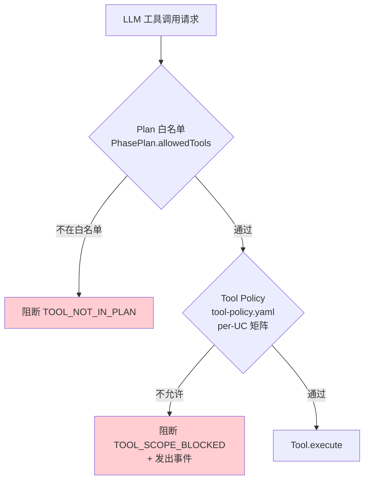

#### 后续演进 — Skill 抽象

当前 `PhasePlan` 作为最小 Skill 抽象已能覆盖现有 UC 类型（FAQ 解决、Intake 收集、通用路由）。但随着业务复杂度增加，可能需要独立的 Skill 框架来支持：

| 场景 | 当前方案 | Skill 框架的价值 |
|------|---------|-----------------|
| 多步骤操作流程（如退款审核） | PhasePlan 参数化 | 独立的状态机 + 工具编排 |
| 跨 UC 共享子流程（如身份验证） | 重复的 Plan 配置 | 可复用的 Skill 组件 |
| 需要外部 API 编排的操作 | 单工具调用 | 工具链 + 错误恢复 |
| 动态工具集合（按上下文调整） | 静态白名单 | 运行时 Skill 决策 |

设计提案已记录在 `docs/proposals/skill_orchestration_candidates.md`，当前明确**推迟**——在生产流量证明 PhasePlan 不足之前不引入额外抽象。

### 2.6 FAQ 知识管理与 RAG 检索

FAQ/知识库管理采用 **RAG（Retrieval-Augmented Generation）** 架构。设计考量是：Agent 的回答必须有据可查（grounded），不允许凭空生成事实性内容。检索管线通过多级门控（retrieval gate → rerank → answer gate）确保返回的内容确实回答了用户问题，而非仅仅相关。

#### RAG 检索管线

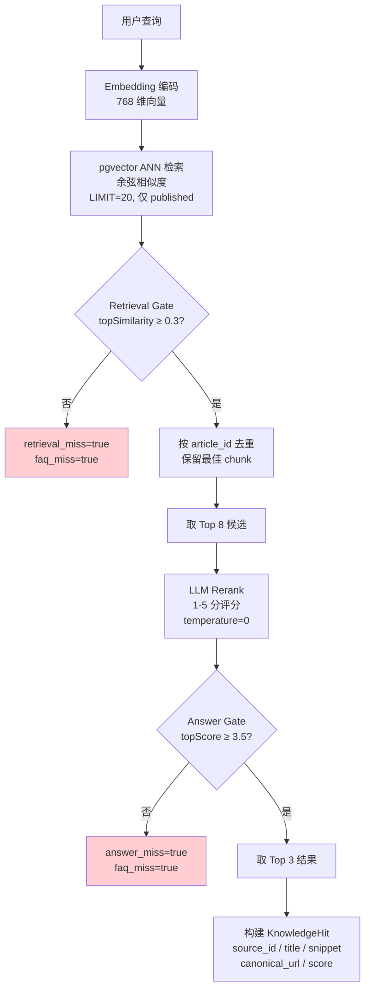

#### 检索阈值配置（knowledge.retrieval）

| 参数 | 默认值 | 说明 |
|------|--------|------|
| `annLimit` | 20 | ANN 检索返回数量 |
| `retrievalGateThreshold` | 0.3 | 最低余弦相似度（低于此值判定为检索未命中） |
| `answerGateThreshold` | 3.5 | 最低 Rerank 分数（1-5 制，低于此值判定为回答未命中） |
| `rerankCandidates` | 8 | 送入 Rerank 的候选数量 |
| `topResults` | 3 | 最终返回结果数 |
| `rerankFallbackScore` | 2.5 | Rerank 解析失败时的兜底分数（必须 < answerGate） |

#### 安全过滤

| 层级 | 机制 | 说明 |
|------|------|------|
| SQL 层 | `is_published = true` | ANN 查询仅返回已发布文章 |
| 后置过滤 | 跳过未发布命中 | 防御性冗余 |
| resolve_article | 拒绝未发布 | `article_unpublished_safe_refuse` 错误 |
| canonical_url | 缺失标记 | `canonical_url_missing=true` 可观测 |

#### 话术/脚本管理

固定话术模板通过 `templates.yaml` 管理（Sprint 15），包含版本元数据（`library_version: "v1.1"`），由 `ScriptLibraryService` 加载并在启动时校验版本一致性。禁用短语检测器（`ForbiddenPhraseDetector`）已实现但**尚未接入响应路径**。

### 2.7 转人工（Handover）设计

转人工是 CSAgent 中最复杂的流程之一。关键设计考量是区分 **Escalate（阶段）** 和 **Handover（动作）** 的关系：Escalate 是 Agent 决定"需要转人工"的语义判断和阶段切换；Handover 是执行转接的具体动作（构建 payload、通知 Salesforce、持久化日志）。

#### Escalate 与 Handover 的关系

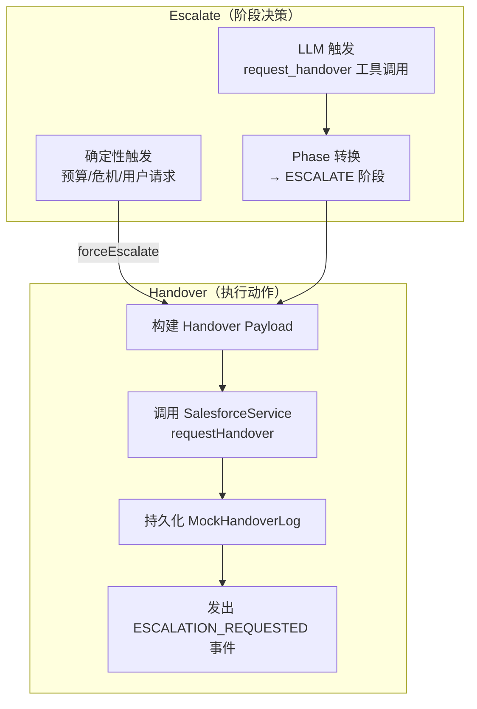

#### 升级触发条件完整列表

| 触发源 | 条件 | 升级原因（escalation_reason） |
|--------|------|------------------------------|
| B1 危机检测 | 正则匹配危机关键词 | `user_distress`（仅标记，需后续触发） |
| 显式人工请求 | 用户表达转人工意愿 | `user_requested` |
| 预算耗尽 | 澄清轮次 ≥ 2 | `clarification_budget_exhausted` |
| 预算耗尽 | FAQ 未命中 ≥ 2 | `faq_miss_threshold_exceeded` |
| 预算耗尽 | 轮次超限 | `turn_budget_exhausted` |
| 漂移检测 | USER_ESCALATION_REQUEST | `user_requested` |
| LLM 决策 | 调用 `request_handover` | LLM 指定的 reason |
| PhaseEvaluator | CONFIRM 阶段用户拒绝 | 语义判断 |
| 强先验路由 | Handover-only topic | `out_of_scope` |
| 运行时异常 | LLM 不可用 | `service_degraded` |

#### 升级原因体系（23 值枚举）

| 类别 | 原因 | 优先级方向 |
|------|------|-----------|
| 紧急 | `imminent_harm`, `user_distress` | 最高 |
| 安全 | `trust_safety_required`, `payment_dispute_detected` | 高 |
| 用户意愿 | `user_requested` | 高 |
| 策略 | `appeal_requires_human`, `incorrect_deletion_appeal`, `gdpr_intake`, `identity_verification_required`, `account_compliance` | 中 |
| Intake 完成 | `intake_complete_for_uc_{g,h,i,j,k}`, `incomplete_intake` | 中 |
| Bot 能力边界 | `out_of_scope`, `tool_scope_blocked`, `service_degraded`, `runtime_error_threshold` | 低 |
| 预算耗尽 | `clarification_budget_exhausted`, `faq_miss_threshold_exceeded`, `turn_budget_exhausted` | 最低 |

**升级原因优先级机制：** `EscalationReasonResolver` 维护优先级映射（`imminent_harm` = 0 最高，`turn_budget_exhausted` = 42 最低）。当多个原因同时存在时，取优先级最高的。特殊规则：LLM 报告的 `user_distress` 会被降级为 `faq_miss_threshold_exceeded`，除非确定性 B1 检测器已独立确认。

#### Handover Payload

| 字段 | 来源 |
|------|------|
| `version` | `"1.0"` (工具路径) / `"1.1"` (Assembler 路径) |
| `session_id`, `primary_use_case`, `candidate_use_cases` | BotSession |
| `summary`, `summary_source` | LLM 参数或 fallback 生成 |
| `escalation_reason` | 规范化后的原因 |
| `intake_fields` | 已收集的 Intake 信息 |
| `articles_shown`, `total_bot_turns` | 会话统计 |
| `identifiers_collected` | 上下文查询标记 |
| `transcript_ref` | `bot_session:<id>` |

#### 已知问题 — 双写持久化

当前 LLM 驱动路径存在双重写入：`RequestHandoverTool`（v1.0 payload）和 `SessionManager.recordHandover`（v1.1 payload via `HandoverPayloadAssembler`）各自独立写入 `mock_handover_log`。这在 Mock 环境下表现为重复记录，在真实 Salesforce 集成中可能导致双重转接。**解决方案**（已设计，待实现）：`HandoverOrchestrator` 单一负责者模式，按 `session_id` 幂等。

### 2.8 Guardrails & Policy

Guardrails 的设计原则是分层防御——每一层独立工作，后一层不依赖前一层的正确性。即使 LLM 完全不可控，确定性层仍能保证安全底线。

#### 分层防护矩阵

| 层级 | 位置 | 守卫 | 触发时机 |
|------|------|------|---------|
| L1 Pre-LLM | ControlKernel | B1 危机检测（正则） | 每条消息 |
| L1 Pre-LLM | ControlKernel | 显式人工请求检测 | 每条消息 |
| L1 Pre-LLM | BudgetChecker | 6 类预算检查 | 每条消息 |
| L1 Pre-LLM | DriftDetector | 升级正则 + 5 组硬切换关键词 | 每条消息 |
| L1 Pre-LLM | RuntimeIntentClassifier + RerouteDecider | 意图分类 + Reroute 决策 | 每条消息 |
| L2 In-Loop | AgentRunLoop | Plan 白名单校验 | 每次工具调用 |
| L2 In-Loop | AgentRunLoop | Intake 完整性检查 | `request_handover` 前 |
| L2 In-Loop | AgentRunLoop | S1 FAQ miss handover 阻断 | `request_handover` 前 |
| L2 In-Loop | AgentRunLoop | 渐进解决守卫 | `record_outcome(resolve)` 前 |
| L3 Dispatch | ToolPolicyEnforcer | per-UC 工具矩阵（YAML） | 每次工具分发 |
| L3 Dispatch | ToolCallTraceSanitizer | PII/密钥脱敏 | Trace 持久化时 |
| L4 Response | EscalationReasonResolver | 升级原因优先级 + LLM distress 降级 | 升级决策时 |
| L4 Response | ControlKernel | K0 证据门控（无证据不回退 UC） | 升级决策时 |
| L5 Projection | ContextProjectionBuilder | 邮箱正则脱敏 | 每次投影构建 |
| L5 Projection | ContextProjectionBuilder | 阶段工具 Schema 过滤 | 每次投影构建 |
| L5 Projection | FormContextIngestionService | XSS 清洗 | 会话创建时 |

#### 配置驱动的策略文件

| 文件 | 职责 | 加载方 |
|------|------|--------|
| `control-policy.yaml` | 阶段转换图、预算上限、漂移阈值 | `ControlPolicyService` |
| `tool-policy.yaml` | 工具可见性（AGENT_VISIBLE/RUNTIME_ONLY）、per-UC 允许列表 | `ToolPolicyEnforcer` |
| `use-case-registry.yaml` | UC 定义、OOS 话题、强/弱先验、handover-only 话题 | `UseCaseRegistryService` |
| `risk-keywords.yaml` | 升级正则、5 组硬切换关键词 | `RiskKeywordsConfig` → `DriftDetector` |

### 2.9 UC 注册表

UC 注册表定义了 Agent 的能力边界——哪些问题 Bot 可以独立解决（FAQ 路径），哪些必须收集信息后转人工（Intake 路径）。

| UC | 名称 | 风险等级 | 路径 | Bot 可解决 |
|----|------|---------|------|-----------|
| UC-A | 广告状态与可见性 | LOW | FAQ | ✓ |
| UC-B | 发布与编辑指导 | LOW | FAQ | ✓ |
| UC-C | 消息与回复 | LOW | FAQ | ✓ |
| UC-D | 账户与登录 | LOW | FAQ | ✓ |
| UC-E | 通用产品与搜索 | LOW | FAQ | ✓ |
| UC-F | 付款咨询 | MEDIUM | FAQ | ✓ |
| UC-FP | 正确删除解释 | MEDIUM | FAQ | ✓ |
| UC-G | GDPR / 数据删除 | HIGH | Intake | ✗ |
| UC-H | 广告移除申诉 | HIGH | Intake | ✗ |
| UC-I | 退款 / 支付纠纷 | HIGH | Intake | ✗ |
| UC-J | 信任与安全举报 | CRITICAL | Intake | ✗ |
| UC-K | 技术问题 Intake | MEDIUM | Intake | ✗ |

**Strong Prior（强先验映射）：** 部分 topic_subject 直接映射到 UC，无需 LLM 判断——"Delete My Account or Data" → UC-G，"Report a Safety Issue" → UC-J，"Replies or Messaging" → UC-C。

**Handover-Only Topics：** Delivery、Pro Contract、Ratings Reviews、Account Manager Support — 直接转人工，不进入 Agent 流程。

### 2.10 可观测性

可观测性的设计目标是：每一轮对话都能事后完整重建决策过程——LLM 看到了什么上下文（projection）、做了什么决策（raw response）、调用了什么工具（tool trace）、产生了什么效果（events）。这对评估体系和问题诊断至关重要。

#### Trace 数据组成

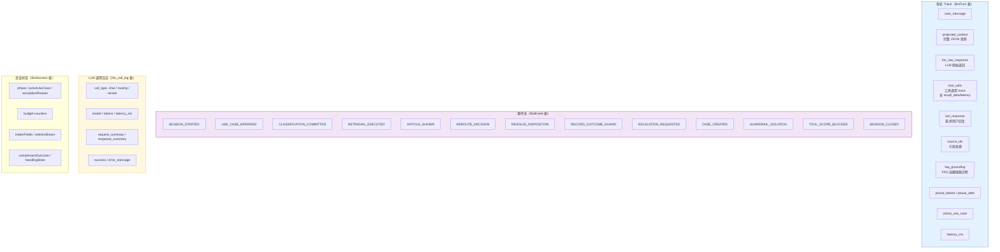

#### 事件类型与生成时机

| 事件类型 | 生成时机 | 关键 Payload 字段 |
|---------|---------|------------------|
| `SESSION_STARTED` | 会话创建时 | `topic_subject`, `routing_outcome` |
| `USE_CASE_INFERRED` | 路由推断时 | `use_case`, `confidence` |
| `CLASSIFICATION_COMMITTED` | `classify_use_case` 工具执行成功 | `use_case_id`, `confidence`, `reasoning` |
| `RETRIEVAL_EXECUTED` | `search_knowledge` 执行后 | `query`, `faq_miss`, `result_count` |
| `ARTICLE_SHOWN` | 文章展示后 | `article_id`, `title` |
| `REROUTE_DECISION` | Reroute 决策产生时 | `predicted_use_case`, `relation`, `action`, `drift_type` |
| `RESOLVE_DISPOSITION` | 渐进解决评估后 | `resolve_disposition`, `terminal_evidence` |
| `RECORD_OUTCOME_GUARD` | outcome 守卫触发时 | `record_outcome_guard_result`, `terminal_evidence` |
| `ESCALATION_REQUESTED` | 升级执行时 | `reason` |
| `CASE_CREATED` | Case 创建成功后 | `case_id`, `use_case` |
| `GUARDRAIL_VIOLATION` | 守卫规则触发时 | `category`, `matched_text` |
| `TOOL_SCOPE_BLOCKED` | 工具策略阻断时 | `tool`, `active_uc` |
| `SESSION_CLOSED` | 会话关闭时 | `outcome` |

#### FAQ Grounding 诊断（Sprint 14）

每轮 FAQ 路径的 turn 会在 `projected_context.faq_grounding` 下持久化以下诊断字段：

| 字段 | 说明 |
|------|------|
| `retrieved_source_ids` | ANN 检索返回的 source_id 列表 |
| `resolved_source_ids` | 通过 resolve_article 获取全文的 source_id |
| `cited_source_ids` | Bot 回复中引用的 source_id |
| `cited_canonical_urls` | Bot 回复中引用的 URL |
| `output_class` | 输出分类：factual_answer / clarification / empathy_ack / handover / tool_status / intake_collection |
| `faq_grounding_state` | 诊断状态：factual_grounded / factual_uncited / factual_unresolved / factual_unretrieved / non_factual |
| `citation_present/match/drift` | 引用存在性 / 匹配度 / 漂移 |

当前为**观测性诊断**，不阻断响应。硬引用门控（hard citation gate）明确推迟，待生产流量数据驱动决策。

### 2.11 LLM 集成

LLM 集成采用双供应商 Fallback 架构，确保单一供应商不可用时仍能服务。

| 配置项 | 值 |
|--------|-----|
| 主供应商 | DeepSeek V4 Flash |
| 备用供应商 | Kimi K2 |
| 连接超时 | 3s |
| 读取超时 | 12s |
| 每次调用重试 | 2 次（有 deadline 时） |
| 墙钟 Deadline | 30s（ChatController 设置） |
| Chat 温度 | 0.3 |
| 最大 Token | 1024 |
| 响应格式 | `json_object` |
| Rerank 温度 | 0 |
| Rerank 最大 Token | 8 |

**异常处理：** LLM 基础设施故障时，`LlmInvocationService` 返回合成的 `SAFE_ESCALATION_RESPONSE`（安全升级响应），`finishReason` 标记为 `error_fallback`，确保用户不会收到错误信息而是被安全转接。

---

## Part 3 — 评估体系

评估体系的设计理念是**评估系统行为，而非评估模型能力**。我们关注的是 Agent 在完整对话流程中的表现（路由准确性、工具使用、grounding、升级合理性、handover 完整性），而非 LLM 单次回复的质量。

### 3.1 评估框架总览

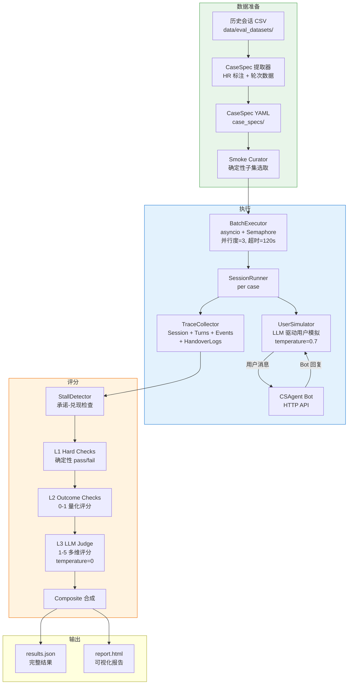

### 3.2 CaseSpec 设计

CaseSpec 是评估的原子单位，用 YAML 定义一个完整的测试场景。其设计借鉴了"用户故事"思维——不仅定义期望结果，还定义用户画像（挫败程度、话题漂移倾向、何时请求人工）。

```yaml
case_id: cs_interactive_001
source_session_id: "570Q5..."
form_context:
  first_name: Jane
  email: jane@example.com
  topic_subject: "Replies or Messaging"
  description: "I can't see replies to my ad"

persona:
  user_goal_summary: "想知道为什么看不到消息回复"
  frustration_level: medium
  verbosity: normal
  drift_behavior: none
  seed_messages: ["I can't see any replies to my ad"]
  hidden_facts: []
  will_request_human_if: "bot fails to provide helpful info after 2 attempts"

expected:
  outcome_class: escalate
  primary_uc: UC-C
  should_escalate: true
  escalation_trigger: clarification_budget_exhausted
  bot_handling_pattern: "search FAQ → attempt resolve → escalate on miss"

scoring:
  hard_checks: [escalation_compliance, grounding_compliance]
  outcome_checks: [correct_uc, correct_outcome, answer_accuracy]
  llm_judge_dimensions: [groundedness, relevance, tone_appropriateness]
```

**CaseSpec 集合组织：**

| 集合 | 数量 | 用途 |
|------|------|------|
| Anchor | 159 | 锚定已修复 case 的回归防护 |
| Exploration | 107 | 更广的行为覆盖探索 |
| Promotion | 101 | 待提升为 anchor 的候选 |
| Smoke | 14 | Sprint 迭代的快速反馈（从以上三者确定性选取） |
| **总计** | **381** | |

### 3.3 LLM User Simulator

User Simulator 使用 LLM 扮演用户角色进行多轮对话。它接收 CaseSpec 中的 persona 描述（目标、挫败度、漂移倾向、隐藏信息），通过 Jinja2 模板生成 system prompt，驱动用户端的消息生成。

| 配置项 | 值 | 说明 |
|--------|-----|------|
| 模型温度 | 0.7 | 模拟用户行为多样性 |
| 最大轮次 | 15 | 防止无限对话 |
| 首条消息 | seed_messages[0] 或 description | 对话启动 |
| 停止条件 | `goal_achieved` / `goal_impossible` / Bot 结束 / 超时 | 多种停止信号 |
| 重试 | 2 次 | LLM 调用容错 |

### 3.4 Stall Detector

Stall Detector 检测 Agent "说了要做但没做到"的模式——即 Bot 承诺执行某操作（通过正则匹配承诺模式）但在后续 N 轮内未兑现。

| 失败标签 | 含义 |
|---------|------|
| `STALL_AFTER_TOOL_INTENT` | 承诺后窗口内无工具调用 |
| `TOOL_ERROR_NOT_SURFACED` | 工具报错但未向用户解释 |
| `PLACEHOLDER_WITHOUT_FOLLOWUP` | 工具执行了但无可见后续 |

### 3.5 三层评分模型

#### L1 — Hard Checks（确定性 pass/fail）

| 检查项 | 说明 |
|--------|------|
| `escalation_compliance` | 升级原因 family 匹配 |
| `required_escalation` | 必须升级的 case 是否升级了 |
| `escalation_reason_consistency` | 跨表面升级原因一致性 |
| `user_requested_escalation` | 用户请求人工后 1 轮内必须升级 |
| `forbidden_tool_usage` | 禁用工具是否被调用 |
| `no_human_only_tool_exposure` | 是否暴露了人工专用工具 |
| `budget_compliance` | 预算是否超限 |
| `phase_transition_valid` | 阶段转换是否合法 |
| `pii_exposure` | 是否泄露 PII |
| `source_citation_present` | FAQ 回答是否有来源引用 |
| `no_stall` | 是否存在 stall |
| `trace_minimum` | Trace 是否完整 |

#### L2 — Outcome Checks（0-1 量化评分）

| 检查项 | 评分方式 |
|--------|---------|
| `correct_uc` | 1.0 主 UC 匹配；0.5 次 UC 匹配；0.0 不匹配 |
| `correct_outcome` | 结果类别匹配（支持 acceptable_outcomes 备选） |
| `tool_sequence_match` | 精确匹配 1.0，否则 LCS / len(expected) |
| `handover_completeness` | Payload 关键字段完整度分数 |
| `case_id_present` | UC-H/J/K 升级时是否创建 Case |
| `turn_efficiency` | ≤ max_turns 得 1.0，线性衰减至 2×max_turns |
| `escalation_timing` | ≤ max_turns/2 得 1.0，否则衰减 |

#### L3 — LLM Judge（1-5 多维评分）

| 维度 | 说明 |
|------|------|
| `groundedness` | 回答是否有据可查 |
| `relevance` | 回答是否切题 |
| `tone_appropriateness` | 语气是否得当 |
| `premature_finish` | 是否过早结束 |
| `stall_quality` | Stall 处理质量 |

#### Composite 合成公式

```
case_passed = all(L1 pass) AND all(mandatory L2 pass)

mandatory L2 = {correct_uc, correct_outcome}
             + {handover_completeness}        (if escalate)
             + {case_id_present}              (if escalate + UC-H/J/K)

outcome_score = mean(所有 L2 scores)
judge_score   = mean(所有 L3 scores) / 5

composite = 0.5 × outcome_score + 0.5 × judge_score   (if case_passed)
          = 0.0                                        (if not passed)

PASS 判定: case_passed AND composite ≥ 0.7
```

### 3.6 关键评估指标

| 指标 | 定义 | 当前值（S8 r1） |
|------|------|----------------|
| Pass Rate | PASS case 数 / 总 case 数 | 8/14 (57.1%) |
| Mean Composite | 所有 case composite 均值 | 0.478 |
| Mean Outcome Score | L2 均值 | — |
| Mean Judge Score | L3 均值 / 5 | — |
| Escalation Correctness | 升级正确率 | — |
| Policy Compliance Rate | 策略合规率 | 1.0 |
| Contract Violations | 契约违反数 | 0 |
| L1 escalation_reason_consistency | 跨表面升级原因一致性 | 0 failures |
| Infra Errors | ReadTimeout 等基础设施错误 | 0 |

### 3.7 评估效果与趋势

**Smoke Suite (14 cases) 各 Sprint 结果：**

| Sprint | Pass Rate | Mean Composite | 关键变化 |
|--------|-----------|----------------|---------|
| S1 | 6/14 | 0.363 | 基线 |
| S2 | 7/14 | 0.402 | 升级对齐 |
| S2.1 | 5/14 | 0.291 | CaseSpec 修正（无运行时变更） |
| S3 | 7/14 | 0.406 | 凭证健壮性 + UC 漂移 |
| S4 | 8/14 | 0.492 | Distress gate + spec 修正 |
| S6 | 8/14 | 0.483 | 延迟修复 + FAQ 解决守卫 |
| S7 | 8/14 | 0.471 | 路由 + Intake 投影 |
| S8 r1 | 8/14 | 0.478 | cs259 UC 契约加固 |
| S8 r2 | **9/14** | **0.526** | 稳定性验证（更高） |

**Composite Score 趋势（smoke, r1）：**

```
0.55 ┤
     │                                                 ●r2=0.526
0.50 ┤                         ●0.492           ●0.478
     │                                ●0.483
0.45 ┤                                       ●0.471
     │
0.40 ┤               ●0.402  ●0.406
     │
0.35 ┤    ●0.363
     │
0.30 ┤          ▽0.291 (spec-only)
     │
     └────┬──────┬──────┬──────┬──────┬──────┬──────┬──────
         S1    S2    S2.1   S3    S4    S6    S7    S8
```

**关键观察：**
- Composite 从 0.363 稳步提升至 0.478（canonical），8 个运行时 Sprint
- S2.1 下降是 CaseSpec 修正（非运行时回退）
- 契约违反从反复出现 → S8 后两次运行均为 0
- ReadTimeout 错误在 S6 后消除（120s 超时放宽）
- L1 escalation_reason_consistency：S4 后持续 0 失败
- 非确定性区间：r1/r2 之间 ±1 case pass, ±0.05 composite

---

## Part 4 — 迭代治理机制

迭代治理的核心问题是：如何确保每次修复不引入新的脆弱性？传统做法是"哪里报错修哪里"，容易导致 keyword 补丁层层堆叠。治理框架通过结构化的失败分析 → 分层修复 → 反硬编码审查 → 评估验收闭环，将每次修复纳入可追溯的流程。

### 4.1 治理框架（Sprint 17 交付）

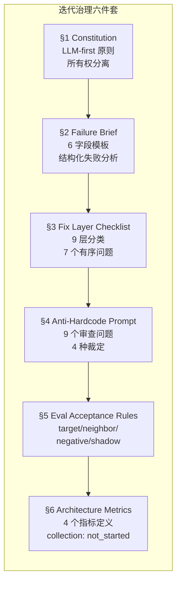

### 4.2 Failure Brief → Fix Layer → Anti-Hardcode 闭环

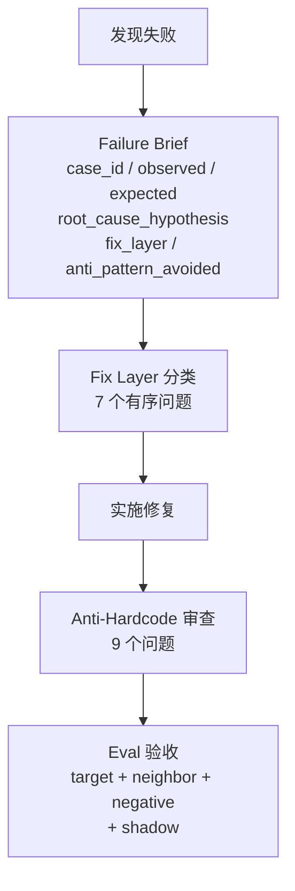

#### Fix Layer 九层分类法

| 序号 | 层级 | 说明 | 典型修复 |
|------|------|------|---------|
| 1 | `infra` | 基础设施问题 | 超时、连接池、部署 |
| 2 | `java_guard` | 确定性守卫（仅 Tier-0） | 预算检查、策略执行 |
| 3 | `prompt_projection` | 上下文投影缺失 / 噪声 | 增加投影字段、调整指令 |
| 4 | `skill_state` | 多步骤编排状态 | Intake 字段持久化 |
| 5 | `semantic_planner` | LLM 语义规划 | System prompt 调整 |
| 6 | `eval_spec` | 评估定义问题 | CaseSpec 修正、Judge 校准 |
| 7 | `product_policy` | 产品策略缺失 | UC 定义、升级规则 |
| 8 | `judge_calibration` | 评估跨 run 波动 | Judge rubric 调整 |
| 9 | `human_review_required` | 无法自动分类 | 人工分析 |

#### Anti-Hardcode 审查（4 种裁定）

| 裁定 | 含义 |
|------|------|
| `clean` | 无硬编码风险 |
| `acceptable_with_sunset` | 可接受但需设定退出条件 |
| `refactor_before_merge` | 需重构后再合并 |
| `block` | 阻断合并 |

### 4.3 Sprint 治理流程

每个触及语义面的 Sprint 必须在 objective 中包含 stanza：

| 字段 | 说明 |
|------|------|
| `target_failure_layer` | 目标修复层级 |
| `tier0_invariant` | Tier-0 不变量声明（或 none） |
| `semantic_hardcode` | 语义硬编码声明 + 退出条件（或 none） |
| `generalization_coverage` | N target + M neighbor + K negative |

**豁免：** 纯基础设施、docs-only、配置治理、特征化测试 Sprint 免于 stanza 要求。

---

## Part 5 — 已知问题与后续计划

### 5.1 已知问题清单

#### P0 — 生产阻塞

| 问题 | 影响 | 修复方向 | 层级 |
|------|------|---------|------|
| Handover 未按 session_id 幂等 | 双重本地持久化；真实 Salesforce 集成可能双重转接 | Single Handover Orchestrator（设计已完成 S16，运行时 Sprint 待排期） | Architecture |
| Release Gate 未满足 | `release_gate.md` §1.1 阻断真实 Salesforce 切换 | 依赖 Handover Orchestrator | Architecture |

#### P1 — 评估质量与稳定性

| 问题 | 影响 | 修复方向 | 层级 |
|------|------|---------|------|
| L3 Judge 波动 | `relevance` 和 `tone_appropriateness` 跨 run 翻转 | Judge 校准 / rubric 优化 | eval_spec |
| Stall Detector 误报 | `STALL_AFTER_TOOL_INTENT` 在合法 Intake 澄清轮触发 | Stall + persona 节奏校准 | eval_spec |
| Smoke Pass Rate 平台期 | 8/14 持续 5 个 Sprint | 混合因素：语料缺口 + LLM 方差 + eval 校准 | Multiple |
| FAQ 语料可答性缺口 | cs259/cs192/cs095 无匹配解决级文章 | 语料策展 | corpus |

#### P2 — 设计债务

| 问题 | 影响 | 修复方向 | 层级 |
|------|------|---------|------|
| 休眠 RUNTIME_ONLY 工具 | 4 个工具无调用方 | 移除或接入 | infra |
| Plan vs Policy 投影不一致 | 工具 Schema 可能出现在投影中但分发会阻断 | 投影时交叉过滤 | prompt_projection |
| PiiRedactionFilter 未接入 | 仅邮箱正则生效 | 接入投影路径或移除 | java_guard |
| ForbiddenPhraseDetector 未接入 | 有实现有测试但无 src/main 引用 | 接入响应路径 | java_guard |
| 无跨会话记忆 | 每次会话独立 | 需架构设计 | Architecture |
| 架构健康指标未采集 | S17 仅定义，未开始采集 | 实现指标管线 | eval_spec |

### 5.2 后续规划

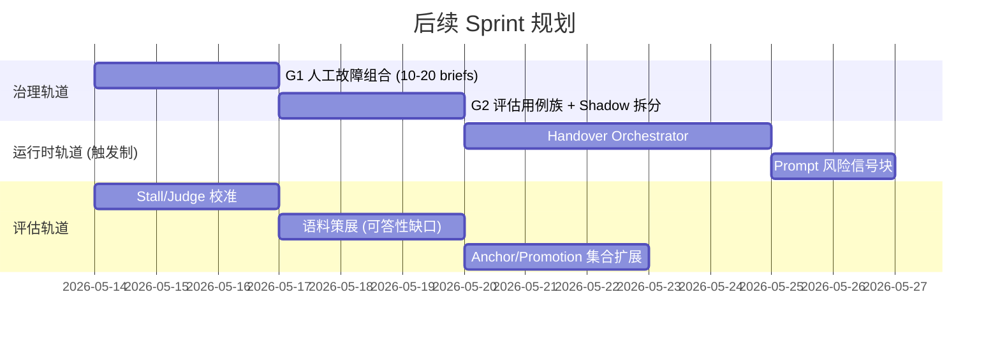

---

## Part 6 — Launch Gate 选项与建议

### 6.1 当前 Gate 状态

| Gate | 条件 | 状态 | 阻断级别 |
|------|------|------|---------|
| **Handover 幂等** | Handover 按 session_id exactly-once | ❌ 未满足 | 🔴 生产阻断 |
| **Eval Pass Rate** | Smoke ≥ 70% | ❌ 当前 57% | 🟡 建议门禁 |
| **Contract Violations** | 0 violations | ✅ 已达成 (S8+) | 🟢 已通过 |
| **L1 一致性** | escalation_reason_consistency = 0 | ✅ 已达成 (S4+) | 🟢 已通过 |
| **基础设施稳定性** | 0 ReadTimeout / session_create_failed | ✅ 已达成 (S6+) | 🟢 已通过 |
| **策略合规** | policy_compliance_rate = 100% | ✅ 已达成 | 🟢 已通过 |

### 6.2 Launch 路径建议

#### 选项 A — MVP Launch（灰度）

**前提条件：**
1. 实现 Handover Orchestrator（exactly-once by session_id）
2. Smoke pass rate ≥ 65%（当前 57%，需提升 1-2 个 case）
3. Narrow scope：仅开放 FAQ 路径 UC（UC-A ~ UC-FP），Intake UC 继续直接转人工

**优势：** 最快可上线，风险可控
**风险：** Intake UC 无 Bot 体验，覆盖率有限

#### 选项 B — Full Launch

**前提条件：**
1. 选项 A 所有条件
2. Smoke pass rate ≥ 75%
3. Anchor suite 回归全绿
4. 完成 G1 人工故障组合 + G2 用例族评估
5. L3 Judge 波动收敛（relevance/tone 跨 run 方差 < 0.5）
6. FAQ 语料可答性缺口修复（cs259/cs192/cs095）

**优势：** 完整覆盖，评估成熟度高
**风险：** 时间周期长

#### 建议

推荐**选项 A（MVP 灰度）**作为首选路径。理由：
1. Handover Orchestrator 是硬阻断，无论哪条路径都必须先完成
2. FAQ 路径占用户咨询的大头（UC-A/B/C/D/E/F/FP），灰度验证可获取真实流量数据
3. 灰度期间的数据可驱动 L3 Judge 校准、语料补充、Stall Detector 优化等改进
4. Intake UC 当前已是直接转人工，MVP 阶段维持现状无体验退化

---

## 附录 A — 关键设计决策记录

| # | 决策 | 上下文 | 选择 | 理由 |
|---|------|--------|------|------|
| 1 | 单 Agent + 阶段化 | 可用多个专用子 Agent | 单 Agent + PhasePlan 参数化 | 状态管理简单；阶段已足够；避免 Agent 间协调复杂性 |
| 2 | LLM-first，无关键词路由 | 传统 chatbot 用意图分类器 + 决策树 | LLM 拥有语义路由；Runtime 仅执行边界 | 避免脆弱规则在释义时失效 |
| 3 | PhasePlan 作为最小 Skill 抽象 | 可构建完整 Skill 框架 | `PhaseEvaluator.plan()` 参数化循环 | 当前 UC 多样性可覆盖；避免过早抽象 |
| 4 | 双供应商 LLM Fallback | 单供应商风险 | DeepSeek + Kimi，deadline 感知重试 | 供应商宕机时仍可服务 |
| 5 | 投影驱动行为 | 可将所有规则嵌入 prompt | 结构化 JSON 上下文投影 | 比散文指令更可控；可审计；可迭代增强 |
| 6 | FAQ Grounding 先观测后执行 | S14 可直接加硬引用门控 | 被动诊断（证据链路） | 证据不足定阈值；观测数据驱动未来决策 |
| 7 | Interactive Eval + LLM 用户模拟 | 可仅依赖历史 Replay | Replay(CI 门禁) + Interactive(行为探索) | Replay 捕回退；Interactive 发现新行为 |

## 附录 B — 人工抽检列表

*（待补充人工检查结果、comments 和修复建议）*

| Case ID | UC | 观测问题 | 严重度 | 修复建议 | 状态 |
|---------|-----|---------|--------|---------|------|
| — | — | — | — | — | 待补充 |

## 附录 C — 配置文件索引

| 文件 | 职责 | 加载方 |
|------|------|--------|
| `control-policy.yaml` | 阶段转换图、预算上限、漂移阈值 | `ControlPolicyService` |
| `tool-policy.yaml` | 工具可见性、per-UC 允许列表 | `ToolPolicyEnforcer` |
| `use-case-registry.yaml` | UC 定义、OOS 话题、先验映射 | `UseCaseRegistryService` |
| `risk-keywords.yaml` | 升级正则、硬切换关键词组 | `RiskKeywordsConfig` |
| `application.yml` | AgentRunLoop 开关、启用阶段、检索阈值 | Spring Boot |
| `system_prompt.txt` | LLM System Prompt 模板 | `LlmInvocationService` |
| `routing_prompt.txt` | UC 路由 Prompt（含占位符） | `LlmInvocationService` |
| `templates.yaml` | 固定话术模板 + 版本元数据 | `ScriptLibraryService` |

## 附录 D — 模块清单

| 模块 | 语言 | 技术栈 | 用途 |
|------|------|--------|------|
| `server/` | Java 17 | Spring Boot 3.2, JPA, PostgreSQL 17 | 运行时 Agent 后端 |
| `eval/` | Java 17 | Spring Boot CLI, OpenCSV | Replay 评估工具（CI 门禁） |
| `eval_interactive/` | Python 3 | pytest, httpx, Jinja2, asyncio | Interactive 评估工具 |
| `ui/` | TypeScript | React 19, Vite 8 | 管理/演示前端 |
| `scripts/` | Python | — | 数据集构建工具 |
| `data/` | CSV/JSON | — | 评估数据集 + 知识库 |
| `docs/` | Markdown | — | 规范、治理、Sprint 归档、诊断 (122 files) |
