# CSAgent 系统方案设计

> 面向：产品技术负责人、Agent 开发顾问
> 日期：2026-05-13 | 状态：内部评审稿
> 仓库：csagent-design-v1 | 已交付 Sprint：1–17（50 commits，2026-05-05 → 2026-05-11）

---

## Part 0 — 目标、总体思路与演进路径

### 0.1 业务背景与预期目标

CSAgent 是面向 **Gumtree**（英国在线分类广告平台）的 LLM 驱动智能客服 Agent，嵌入 **Salesforce Enhanced Chat** 作为用户首触达交互层。

**核心业务指标：**

| 指标 | 目标 |
|------|------|
| AI 自助解决率 | 70%（Bot 独立解决，不转人工） |
| 转人工率 | 按意图可接受区间 |
| AI 满意度（CSAT） | 40%–70% |
| AI 参评率 | 80%–90% |

**业务现状：** 月均约 5,700 次聊天会话，消耗约 4.1 FTE 人工坐席产能。高频联系原因包括数据删除/账户问题、登录/邮箱/密码、广告可见性、交易咨询等。Salesforce Enhanced Chat 已部署为渠道底座。

### 0.2 设计哲学 — LLM-First 架构

CSAgent 与传统规则驱动 chatbot 的核心区别在于**所有权分离原则**：

| 维度 | LLM 拥有（语义层） | Runtime 拥有（确定性层） |
|------|-------------------|------------------------|
| 用户意图理解 | ✓ 目标识别、假设推理 | |
| UC 路由与分类 | ✓ 语义判断 | ✓ 强先验映射（仅 strong-prior） |
| 漂移检测态度 | ✓ 语义感知 | ✓ 关键词硬切换 |
| 升级判断 | ✓ 升级时机与理由 | ✓ 预算耗尽强制升级 |
| 回复策略与语气 | ✓ | |
| 工具选择与参数 | ✓ | ✓ 白名单 + 策略执行 |
| 工具 Schema 与分发 | | ✓ |
| PII / 安全底线 | | ✓ |
| Grounding 底线 | | ✓ |
| 预算与幂等 | | ✓ |
| 持久化与状态 | | ✓ |
| Trace 与 Eval 契约 | | ✓ |

**核心原则：** 规则定义边界，规则不替代语义判断。语义类失败不得用关键词/正则/if-else/枚举扩展来修补，除非涉及 Tier-0 不变量。

### 0.3 演进路径

项目遵循从规范到交付的分阶段方法论：

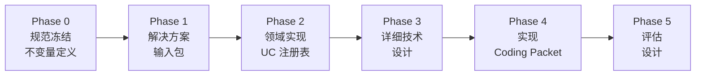

**Sprint 交付时间线（7 天 17 个 Sprint）：**

| 日期 | Sprint | 聚焦方向 |
|------|--------|----------|
| 05-05 | S5–S6 | Fix-layer 诊断；延迟 + FAQ 解决 |
| 05-06 | S7–S8 | 路由 + Intake；cs259 UC 契约 |
| 05-07 | S8.2–S9 | 工具对齐；工具契约 + Trace |
| 05-08 | S10–S12 | Reroute MVP；渐进解决；对齐加固 |
| 05-09 | S13 | 运行时冻结 + 风险策略 |
| 05-10 | S14–S15 | FAQ 证据链路；配置治理 |
| 05-11 | S16–S17 | Handover 幂等契约；迭代治理 |

Sprint 按聚焦方向分为四个阶段：

| 阶段 | Sprint | 聚焦 |
|------|--------|------|
| 基础构建 | S1–S4 | 核心运行时、升级对齐、凭证健壮性、UC 契约 |
| 诊断分析 | S5 | Fix-layer 分类法、Prompt-context 审计 |
| 运行时加固 | S6–S12 | 延迟、路由、Intake、Reroute、渐进解决、可观测性 |
| 策略与治理 | S13–S17 | 运行时冻结、FAQ 链路、配置治理、Handover 契约、迭代治理 |

---

## Part 1 — 整体架构

CSAgent 是 Gumtree 智能客服系统的核心服务。本章从业务架构和技术架构两个维度介绍系统全貌：1.1–1.2 从业务功能视角拆解系统模块及其上下游关系，对齐产品需求文档（PRD）的功能规划；1.3–1.4 从技术服务视角阐述组件边界和完整请求链路。

### 1.1 智能客服组成模块及上下游关系

CSAgent 智能客服系统覆盖从用户发起咨询到问题解决（或转交人工）的完整服务链路。系统由 **8 个业务功能模块** 组成，与上游渠道、下游业务系统共同构成端到端的客服能力。

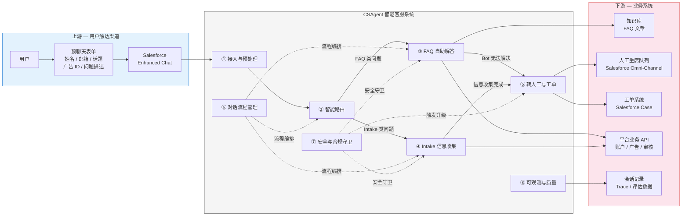

**上下游关系说明：**

| 方向 | 系统 | 交互方式 | 数据流 |
|------|------|---------|--------|
| **上游** | Salesforce Enhanced Chat | 用户聊天渠道，承载预聊天表单和消息交互 | 表单数据（姓名、邮箱、话题、广告 ID、问题描述）+ 逐条用户消息 |
| **上游** | 平台业务 API（14 个微服务，196 端点） | REST API 调用 | 客户账户信息、广告详情、审核状态、交易记录 |
| **下游** | 知识库（pgvector） | 向量检索 + 全文检索 | FAQ 文章检索、相关度排序、内容引用 |
| **下游** | Salesforce Omni-Channel | 人工坐席路由 | 会话转接请求 + 上下文摘要 |
| **下游** | Salesforce Case | 工单创建 | 高风险 UC（UC-H/J/K）自动创建工单到指定队列 |
| **下游** | 会话存储 | JPA 持久化 | Session、Turn、Event、Outcome、Handover 全量记录 |

### 1.2 关键模块职责

#### ① 接入与预处理

**业务定位：** 系统的入口模块，负责接收用户从 Salesforce Enhanced Chat 提交的预聊天表单，解析结构化字段，建立会话，并生成个性化欢迎语。

| 能力 | 说明 |
|------|------|
| 表单解析 | 从 `topic_subject`、`description`、`email`、`ad_id` 等字段提取问题上下文 |
| 客户上下文预加载 | 若用户提供邮箱且话题匹配特定 UC，自动拉取账户/广告/审核信息 |
| 会话创建 | 分配 sessionId，初始化阶段为 DISCOVER |
| 欢迎语生成 | 根据话题和路由结果生成差异化问候（标准 / 模糊话题 / 超范围） |
| 超范围快速通道 | 不在服务范围的话题（如 Delivery、Pro Contract）直接生成转人工响应 |

#### ② 智能路由

**业务定位：** 将用户的自然语言描述映射到 12 个预定义用例（Use Case），决定对话走 FAQ 自助解答还是 Intake 信息收集路径。

| 路由方式 | 触发条件 | 示例 |
|---------|---------|------|
| **强先验路由** | 预聊天话题与 UC 存在唯一映射 | "Delete My Account or Data" → UC-G |
| **LLM 辅助分类** | 话题存在多候选 UC，由 LLM 根据描述判断 | "Ad Support" + "ad not showing" → UC-A (0.95) |
| **漂移重路由** | 对话中用户切换话题，触发 UC 重新分类 | 正在处理 UC-A，用户提到 "scammed" → UC-J |

**UC 服务范围：**

| 分类 | Use Case | 业务场景 | 服务模式 |
|------|---------|---------|---------|
| **FAQ** | UC-A 广告状态与可见性 | 广告为什么看不到、审核中、被下架 | Bot 检索 FAQ 自主解答 |
| **FAQ** | UC-B 发布与编辑指导 | 如何发布/编辑广告 | Bot 知识引导 |
| **FAQ** | UC-C 消息与回复 | 收不到回复、消息问题 | Bot FAQ 解答 |
| **FAQ** | UC-D 账户与登录 | 登录失败、密码重置、邮箱变更 | Bot FAQ 解答 |
| **FAQ** | UC-E 产品与搜索 | 搜索功能、产品使用 | Bot FAQ 解答 |
| **FAQ** | UC-F 支付咨询 | 非纠纷类支付问题 | Bot FAQ 解答 |
| **FAQ** | UC-FP 正确删除/政策解释 | 广告被删原因、政策说明、申诉引导 | Bot 政策解释 |
| **Intake** | UC-G GDPR / 数据删除 | 删除账户、GDPR 请求 | 收集信息 → 转人工 |
| **Intake** | UC-H 广告移除申诉 | 广告被移除后的申诉 | 收集信息 → 创建工单 → 转人工 |
| **Intake** | UC-I 退款/支付纠纷 | 退款、争议交易 | 收集信息 → 转人工 |
| **Intake** | UC-J 信任与安全举报 | 诈骗、骚扰、危险行为 | 收集信息 → 创建工单(Safety Queue) → 转人工 |
| **Intake** | UC-K 技术问题 | 功能故障、技术报错 | 收集信息 → 创建工单 → 转人工 |

#### ③ FAQ 自助解答

**业务定位：** 系统的核心价值模块，直接影响 AI 自助解决率（目标 70%）。通过检索知识库中的 FAQ 文章，生成**有据可查**的回答，帮助用户自助解决问题。

| 能力 | 说明 |
|------|------|
| 知识检索 | 基于用户问题进行向量相似度检索 + LLM 重排序 |
| 有据回答 | 回复必须基于检索到的 FAQ 文章内容，不允许凭空编造 |
| 客户上下文增强 | 结合用户的账户/广告/审核状态，给出针对性回答（如"您的广告因违反 X 政策被暂停"） |
| 澄清追问 | 问题不明确时主动追问，但限制澄清轮次（≤2 轮） |
| 解决确认 | 给出解答后进入确认阶段，确认用户问题是否已解决 |

#### ④ Intake 信息收集

**业务定位：** 对 Bot 无法独立解决的高风险/合规类问题（UC-G 至 UC-K），系统化地收集必要信息，为人工坐席提供完整上下文，减少用户重复描述的体验损耗。

| 能力 | 说明 |
|------|------|
| 结构化收集 | 按 UC 定义的必填字段（如邮箱、广告 ID、问题描述）引导用户提供信息 |
| 完整性校验 | 必填字段缺失时阻断转交，引导用户补充 |
| 共情表达 | 在信息收集过程中保持共情语气，特别是安全类问题（UC-J） |
| 预填充 | 利用预聊天表单和客户上下文预填已知字段，减少重复询问 |

#### ⑤ 转人工与工单

**业务定位：** 确保需要人工处理的问题能无缝转交给人工坐席，同时传递完整的对话上下文和收集到的信息，避免用户"从头说起"。

| 能力 | 说明 |
|------|------|
| 自动转交 | 满足转交条件时自动发起 Handover 请求 |
| 上下文传递 | 打包会话摘要、收集字段、升级原因、对话历史等转交给人工坐席 |
| 工单创建 | 高风险 UC（UC-H/J/K）自动创建 Salesforce Case 到指定队列（Safety Queue / Ad Support Queue 等） |
| 升级原因标注 | 23 种标准化升级原因编码，支撑运营分析和坐席分流 |

**转交触发条件分类：**

| 触发类型 | 示例 |
|---------|------|
| 用户主动请求 | "I want to talk to a human" |
| 高风险话题切入 | 用户提到诈骗、骚扰等关键词 |
| Intake 信息收集完成 | Intake 类 UC 收集完必要信息后 |
| Bot 能力边界 | FAQ 多次未命中、澄清预算耗尽、轮次超限 |
| 超出服务范围 | Delivery、Pro Contract 等未覆盖话题 |

#### ⑥ 对话流程管理

**业务定位：** 编排多轮对话的生命周期，管理对话从"发现问题"到"解决/转交"的完整阶段流转，处理用户话题切换等复杂对话场景。

| 能力 | 说明 |
|------|------|
| 阶段管理 | 对话经历 DISCOVER → RESOLVE → CONFIRM → CLOSE（或 ESCALATE）的标准生命周期 |
| 话题漂移处理 | 用户在对话中切换话题时，根据风险级别决定：继续当前话题（Minor Drift）、切换到新话题（Soft Shift）、紧急切换到高风险话题（Hard Shift） |
| 确认闭环 | 给出解答后询问用户是否满意，支持"回弹"（用户追问时回到解决阶段） |
| 预算控制 | 对澄清轮次、FAQ 失败次数、总对话轮次设定上限，防止对话无限循环 |

**对话阶段说明：**

| 阶段 | 业务含义 | 用户感知 |
|------|---------|---------|
| DISCOVER | 识别用户真实问题 | Bot 在倾听和理解问题 |
| RESOLVE | 解决问题（FAQ 检索/Intake 收集） | Bot 在积极帮助解决 |
| CONFIRM | 确认问题是否解决 | Bot 在确认用户是否满意 |
| CLOSE | 对话正常结束 | 问题已解决，感谢使用 |
| ESCALATE | 转交人工坐席 | Bot 通知即将连接人工坐席 |

#### ⑦ 安全与合规守卫

**业务定位：** 在整个对话过程中执行安全和合规检查，确保系统在异常情况下能做出安全的兜底决策——即使 AI 判断失误，也不会导致用户体验灾难或合规风险。

| 守卫类型 | 能力 | 示例 |
|---------|------|------|
| 危机信号检测 | 识别用户可能处于危险状态的表达 | 自残、暴力威胁等 |
| 高风险关键词监控 | 实时检测诈骗、骚扰等安全类关键词 | "scammed"、"fraud"、"harassment" |
| 回复质量保障 | 确保回复基于知识库、防止编造信息 | FAQ 回复必须引用来源文章 |
| 升级判断兜底 | 当 AI 行为异常或超时时强制转人工 | LLM 连续出错 → 自动升级 |
| 策略执行 | 按 UC 和阶段控制 AI 可使用的工具和行为 | Intake UC 只允许收集信息，不允许自行"解决" |

#### ⑧ 可观测与质量评估

**业务定位：** 记录全量对话数据并提供评估框架，支撑运营分析、质量监控和系统持续迭代。

| 能力 | 说明 |
|------|------|
| 全量对话记录 | 每轮对话的用户输入、Bot 回复、工具调用、LLM 原始响应均持久化 |
| 结构化事件流 | 关键业务事件（路由、升级、确认、FAQ 检索等）以结构化 Event 记录 |
| 自动化评估 | 基于测试场景（CaseSpec）+ LLM 模拟用户的交互式评估框架 |
| 关键指标监控 | 自助解决率、升级率、FAQ 命中率、平均对话轮次等 |

### 1.3 技术服务组成与组件职责

前两节从业务功能视角介绍了智能客服的模块划分。本节切换到技术实现视角，阐明实现上述业务能力的核心技术组件——每个组件**拥有什么、不拥有什么**，以及它们如何分层协作。

#### 职责边界定义

| 组件 | 核心职责（拥有） | 明确不负责（边界） | 输入 | 输出 |
|------|----------------|------------------|------|------|
| **SessionManager** | HTTP 会话生命周期管理；表单解析与预路由；数据持久化（Session、Turn、Outcome、Handover）；事务边界 | 不涉及 LLM 调用、阶段计划、漂移检测、工具执行 | REST 请求（sessionId, userMessage） | `ChatSessionResponse` |
| **ControlKernel** | 确定性前置守卫（危机、预算、漂移、路由切换）；`forceEscalate` 快速通道；编排 Plan→Run→Interpret→Transition 全链路；Turn 记录；升级侧效（Case 创建、事件发射） | 不构造 `PhasePlan` 细节；不执行 LLM/Tool 循环；不管理 HTTP 响应格式 | `BotSession`（可变）, `userMessage` | `KernelResult`（responseText, shouldEndChat, latencyMs） |
| **PhaseEvaluator** | 为当前阶段生成 `PhasePlan`（工具白名单、最大步数、指令文本、终止条件）；解释 `AgentRunResult` → `PhaseTransitionDecision`（下一阶段、响应文本、升级原因） | 不执行 LLM 调用和工具分发；不管理全局预算和漂移；不做持久化 | `session`, `userMessage`, `history` / `plan`, `AgentRunResult` | `PhasePlan` / `PhaseTransitionDecision` |
| **AgentRunLoop** | 有界 LLM↔Tool 循环执行；Context Projection 构建；LLM 调用与响应解析；循环内守卫（Intake 完整性、过早 record_outcome 阻断、FAQ miss handover 阻断）；classify_use_case 短路（DISCOVER→RESOLVE 触发） | 不做阶段转移决策；不管理全局 session 生命周期；不做持久化 | `PhasePlan`, `session`, `userMessage`, `history` | `AgentRunResult`（messages, toolEvents, llmEvents, terminalOutcome, escalationReason） |
| **ToolDispatcher** | 工具注册表管理；per-UC 策略执行（`ToolPolicyEnforcer`）；Plan 白名单校验；escalation_reason 规范化；工具 Bean 执行 | 不构造 PhasePlan；不做 LLM 调用；不做阶段判断 | `toolName`, `session`, `parameters` | `ToolResult`（success/error + data） |

#### 业界概念 → CSAgent 映射

业界讨论 Agent 架构时常用 **Agent Loop** 和 **Harness** 两个概念。它们在 CSAgent 中的对应关系：

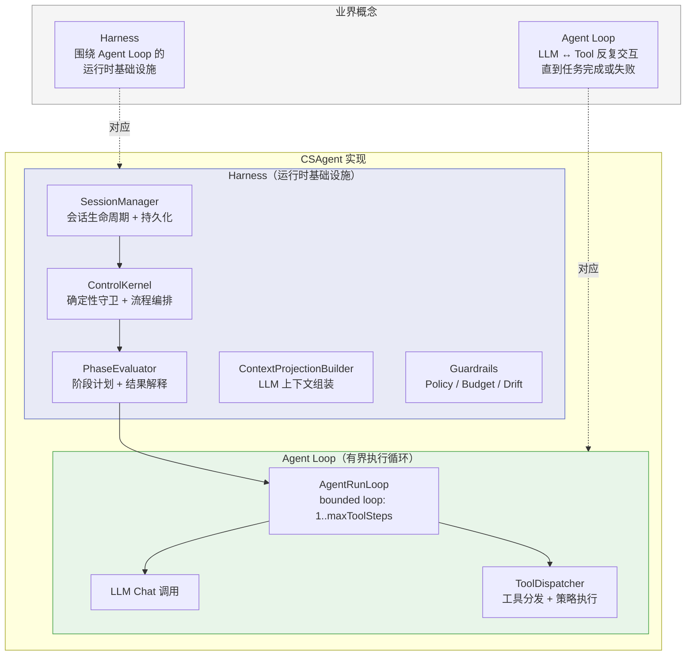

| 业界概念 | 含义 | CSAgent 对应 | 说明 |
|---------|------|-------------|------|
| **Agent Loop** | LLM 与工具的反复交互循环，直到产出最终答案或触发终止条件 | `AgentRunLoopImpl.run()` | 有界循环（`maxToolSteps`），每步包含 Projection→LLM→Parse→Guard→Dispatch，循环结束时产出 `AgentRunResult` |
| **Harness** | Agent Loop 之外的运行时基础设施——负责上下文准备、状态管理、守卫策略、结果解释、持久化 | `SessionManager` + `ControlKernel` + `PhaseEvaluator` + `ContextProjectionBuilder` + Guardrails | CSAgent 的 Harness 强调**确定性优先**：所有安全关键决策（危机、预算、漂移）在进入 Agent Loop 之前完成 |
| **Orchestrator** | 多 Agent 间的调度协调 | `ControlKernel`（单 Agent 编排） | CSAgent 当前为单 Agent 架构，ControlKernel 承担编排职责而非多 Agent 调度 |
| **Planner** | 根据当前状态决定下一步行动策略 | `PhaseEvaluator.plan()` | 产出 `PhasePlan`——不是通用规划器，而是按阶段参数化的任务配置 |
| **Memory** | Agent 的上下文记忆 | `BotSession`（持久化）+ `BotTurn` 历史 + `ContextProjectionBuilder`（投影） | Session 字段 = 长期记忆，Turn 历史 = 短期记忆，Projection = 工作记忆 |
| **Tool Use** | Agent 调用外部能力 | `ToolDispatcher` + 11 个 `Tool` Bean | 双层策略执行：Plan 白名单 + per-UC Policy |

### 1.4 完整请求生命周期 — 从 Session 创建到问题解决

以下以一个**典型 FAQ 场景**（用户咨询广告不可见 → Bot 检索 FAQ 解决）和一个**Intake 升级场景**（用户举报诈骗 → Bot 收集信息后转人工）为例，展示完整的请求生命周期——说明 1.2 中的业务模块如何通过 1.3 中的技术组件串联执行。

##### 场景 A：FAQ 解决（UC-A 广告可见性）

```mermaid
flowchart TD
    subgraph S1["① Session 创建"]
        U1["用户提交表单<br/>topic=Ad Visibility<br/>desc=My ad is not showing"]
        U1 --> SM1["SessionManager<br/>表单解析 + FormIngestion"]
        SM1 --> RT1["UseCaseRouter<br/>topic → UC-A (strong prior)"]
        RT1 --> SAVE1["save BotSession<br/>phase=DISCOVER, UC=UC-A"]
        SAVE1 --> GREET["返回 greeting + sessionId"]
    end

    subgraph S2["② 第 1 轮: 用户消息 → DISCOVER + RESOLVE（同轮 Replan）"]
        U2["用户: Why can't anyone see my ad?"]
        U2 --> CK2["ControlKernel<br/>✓ 无危机 ✓ 无预算超限 ✓ 无漂移"]

        subgraph DISC["DISCOVER 阶段"]
            CK2 --> P2A["PhasePlan: DISCOVER<br/>tools=[search_knowledge,<br/>classify_use_case]<br/>maxSteps=2"]
            P2A --> L2A["LLM → classify_use_case(UC-A, 0.95)"]
            L2A --> UCI["terminalOutcome=<br/>USE_CASE_IDENTIFIED"]
        end

        UCI --> REPLAN["同轮 Replan<br/>检查 deadline ≥ 阈值<br/>DISCOVER → RESOLVE"]

        subgraph RESV["RESOLVE_FAQ 阶段"]
            REPLAN --> P2B["PhasePlan: RESOLVE_FAQ<br/>tools=[search_knowledge,<br/>resolve_article, ...]<br/>maxSteps=4"]
            P2B --> L2B1["LLM → search_knowledge<br/>→ hits: KB-042"]
            L2B1 --> L2B2["LLM → resolve_article(KB-042)<br/>→ 完整 FAQ 内容"]
            L2B2 --> L2B3["LLM 生成基于 FAQ 的回复<br/>terminalOutcome=FINAL_ANSWER"]
        end

        L2B3 --> INT2["interpretRunResult<br/>→ nextPhase=CONFIRM"]
        INT2 --> RESP2["Bot 回复: 根据 FAQ 文章的解释..."]
    end

    subgraph S3["③ 第 2 轮: 用户确认 → CLOSE"]
        U3["用户: OK, that helps, thanks!"]
        U3 --> CK3["ControlKernel → PhasePlan: CONFIRM"]
        CK3 --> L3["LLM → record_outcome(resolve)"]
        L3 --> INT3["interpretRunResult → CLOSE"]
        INT3 --> END3["recordOutcome(RESOLVED)<br/>session.closedAt<br/>会话结束"]
    end

    GREET -.-> U2
    RESP2 -.-> U3

    style S1 fill:#e3f2fd,stroke:#1976d2
    style DISC fill:#fff8e1,stroke:#ffc107
    style RESV fill:#e8f5e9,stroke:#66bb6a
    style S3 fill:#f3e5f5,stroke:#7b1fa2
```

##### 场景 B：Intake 升级（UC-J 诈骗举报 — Hard Shift 触发）

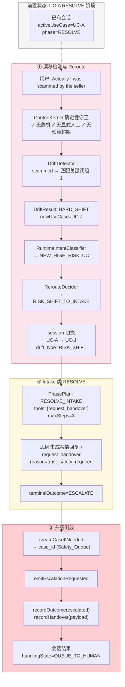

#### 一次请求的完整调用链路

将上述场景抽象为通用流程：

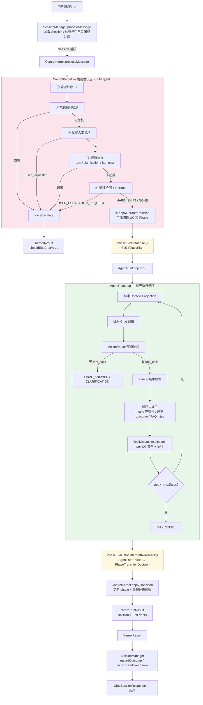

#### PhasePlan — Agent Loop 的执行参数

`PhasePlan` 是连接 Harness 与 Agent Loop 的关键契约。PhaseEvaluator 根据当前阶段和 UC 生成不同的计划，Agent Loop 严格按计划执行：

| PhasePlan 字段 | 作用 | 示例 |
|---------------|------|------|
| `phase` | 当前执行阶段标识 | `DISCOVER` / `RESOLVE` / `CONFIRM` |
| `useCase` | 当前活跃 UC | `UC-A` |
| `objective` | 阶段目标（传递给 LLM） | "Identify the user's use case" |
| `allowedTools` | 本阶段允许的工具集 | `[search_knowledge, classify_use_case]` |
| `maxToolSteps` | 循环上界 | DISCOVER: 2, RESOLVE_FAQ: 4, RESOLVE_INTAKE: 3 |
| `validTerminalOutcomes` | 合法的终止状态 | DISCOVER: `{FINAL_ANSWER, CLARIFICATION, USE_CASE_IDENTIFIED}` |
| `systemInstruction` | 阶段特定的系统指令 | Phase-specific behavior rules |
| `groundingInstruction` | FAQ grounding 指令 | Citation requirements for RESOLVE_FAQ |
| `escalationPolicy` | 升级策略描述 | When and how to escalate |

| 阶段 | 允许工具 | maxToolSteps | 典型 terminalOutcome |
|------|---------|-------------|---------------------|
| DISCOVER | `search_knowledge`, `classify_use_case` | 2 | `USE_CASE_IDENTIFIED` → 触发同轮 Replan |
| RESOLVE (FAQ) | `search_knowledge`, `resolve_article`, `get_customer_context`, `record_outcome`, `request_handover` | 4 | `FINAL_ANSWER` → CONFIRM |
| RESOLVE (Intake) | `request_handover` | 3 | `ESCALATE` → 转人工 |
| CONFIRM | `record_outcome`, `request_handover` | 2 | `FINAL_ANSWER`(resolve) → CLOSE |
| CLOSE | `record_outcome` | 2 | `FINAL_ANSWER` → 会话结束 |
| ESCALATE | `request_handover`, `record_outcome` | 2 | `ESCALATE` → 转人工 |

---

## Part 2 — 核心模块详解

### 2.1 Agent Loop 完整设计

本节以一条用户消息的完整生命周期为主线，从外到内描述 CSAgent 的 Agent Loop 如何工作。设计的核心理念是**确定性优先、LLM 有界**——所有安全关键决策在 LLM 调用之前由确定性代码完成；LLM 的工具交互被限制在有界循环内；循环结果由确定性逻辑解释并决定阶段转移。

#### 2.1.1 三层架构概览

CSAgent 的 Agent Loop 分为三层，各层职责严格隔离：

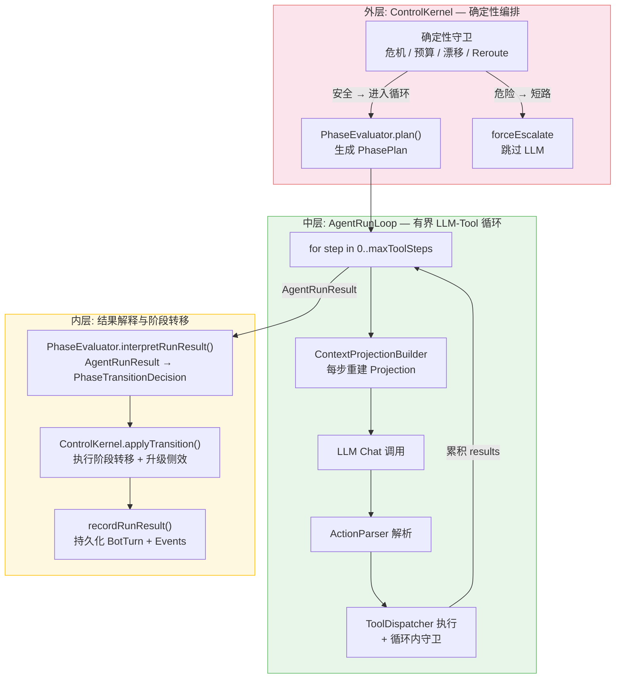

| 层级 | 组件 | 核心职责 | 执行频率 |
|------|------|---------|---------|
| **外层** | ControlKernel | 确定性前置守卫（5 步检查）；路由决策（Agent 路径 vs Legacy）；DISCOVER→RESOLVE 同轮 Replan；升级侧效编排 | 每条用户消息一次 |
| **中层** | AgentRunLoop | 有界 LLM↔Tool 循环（1..maxToolSteps 步）；每步重建 Context Projection；循环内守卫（3 类阻断）；工具结果累积 | 每次 plan 调用一次（同轮可能两次） |
| **内层** | PhaseEvaluator | 为阶段生成 PhasePlan；将 AgentRunResult 解释为 PhaseTransitionDecision（下一阶段 + 响应文本 + 升级原因） | 与中层对称 |

#### 2.1.2 外层：ControlKernel 确定性编排

ControlKernel 是每条用户消息的唯一入口（`processMessage(BotSession, String)`）。其设计考量是：将所有确定性判断前置于 LLM 调用之前，确保即使 LLM 不可用或行为异常，系统仍能做出安全的兜底决策。

**消息处理完整流程：**

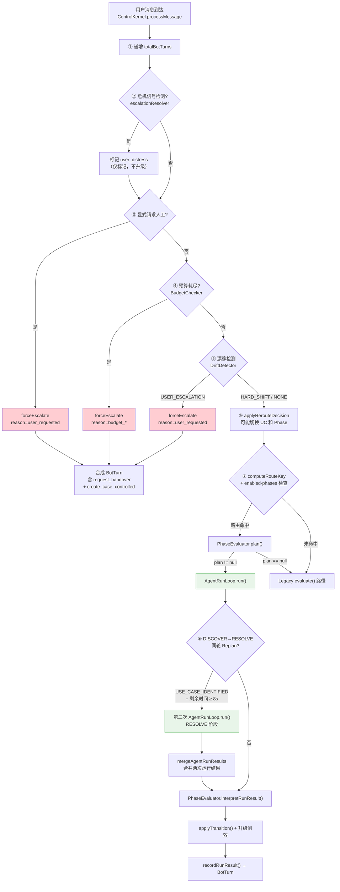

**关键设计点：**

- **forceEscalate 快速通道：** 步骤 ③④⑤ 的任何一步触发升级，都会**直接跳过 LLM 调用**，通过 `forceEscalate` 合成一个包含 `request_handover` 工具调用的 `BotTurn`（对外表现与 LLM 正常升级一致），同时处理 Case 创建和事件发射。

- **Reroute 先于 Plan：** 步骤 ⑥ 的 `applyRerouteDecision` 可能修改 session 的 `activeUseCase` 和 `currentPhase`，随后步骤 ⑦ 使用**修改后的 session 状态**计算路由键——确保漂移后的阶段计划与新 UC 匹配。

- **路由决策（`computeRouteKey`）：** 决定当前消息走 Agent Loop 还是 Legacy 路径：

| 当前 Phase | activeUseCase | 路由键 | 走向 |
|-----------|---------------|--------|------|
| RESOLVE | UC-A..F, UC-FP | `RESOLVE_FAQ` | Agent Loop |
| RESOLVE | UC-G..K | `RESOLVE_INTAKE` | Agent Loop |
| RESOLVE | null / 其他 | null | Legacy |
| DISCOVER / CONFIRM / CLOSE / ESCALATE | — | 阶段名 | Agent Loop |
| INIT / 其他 | — | null | Legacy |

- **DISCOVER→RESOLVE 同轮 Replan：** 当 AgentRunLoop 在 DISCOVER 阶段返回 `USE_CASE_IDENTIFIED` 时，ControlKernel 检查墙钟剩余预算（`MIN_RESOLVE_REPLAN_BUDGET_MS = 8s`）。若充足，立即调用 `PhaseEvaluator.plan()` 生成 RESOLVE 计划，再次执行 `AgentRunLoop.run()`。两次运行结果通过 `mergeAgentRunResults` 合并——RESOLVE 的终端结果覆盖 DISCOVER 的，但工具事件和 LLM 调用事件拼接保留。

**阶段机：**

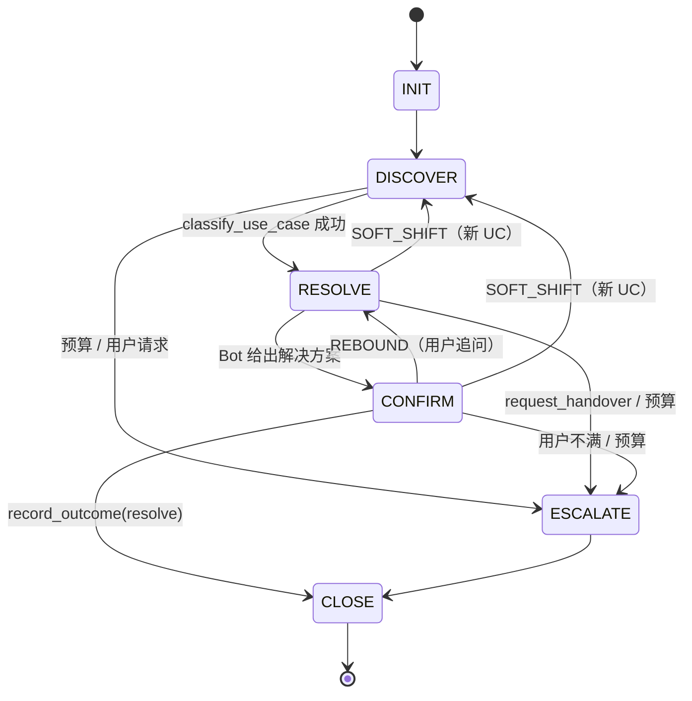

**预算体系：**

| 预算类型 | 上限 | 耗尽效果 |
|---------|------|---------|
| 澄清轮次 (`max-clarification-rounds`) | 2 | 强制升级 `clarification_budget_exhausted` |
| FAQ 未命中 (`max-faq-miss`) | 2 | 强制升级 `faq_miss_threshold_exceeded` |
| Bot 轮次 - FAQ 路径 (`max-bot-turns-faq`) | 15 | 强制升级 `turn_budget_exhausted` |
| Bot 轮次 - Intake 路径 (`max-bot-turns-intake`) | 10 | 强制升级 `turn_budget_exhausted` |
| 重复相同动作 (`max-repeated-same-action`) | 2 | 强制升级 |
| 总 Bot 轮次 (`max-total-bot-turns`) | 25 | 强制升级 `turn_budget_exhausted` |

#### 2.1.3 中层：AgentRunLoop 有界执行

AgentRunLoop 是 LLM 与工具交互的有界执行引擎（`run(PhasePlan, BotSession, String, List<BotTurn>)`）。每一次调用执行一个完整的循环——步数上限由 `PhasePlan.maxToolSteps` 决定，每步完整经历 Projection→LLM→Parse→Guard→Dispatch 五个阶段。

**循环内部流程：**

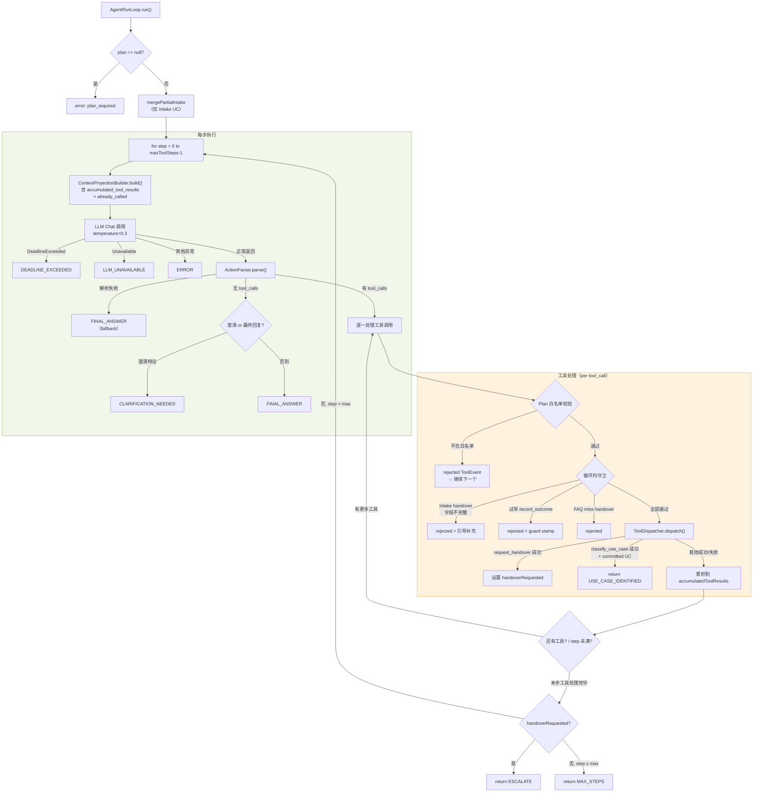

**循环内守卫（3 类阻断）：**

| 守卫 | 触发条件 | 阻断效果 | 设计意图 |
|------|---------|---------|---------|
| **Intake 完整性** | `request_handover` + Intake UC + 必填字段缺失 | rejected ToolEvent + 将缺失字段信息注入 `accumulatedToolResults` 引导 LLM 继续收集 | 防止 LLM 在信息不完整时过早升级 |
| **渐进解决守卫** | `record_outcome(resolve)` + RESOLVE/FAQ plan + 终端条件未满足 | rejected + session guard stamp | 防止 LLM 在未完成知识检索就声称解决 |
| **S1 FAQ miss 守卫** | `request_handover(faq_miss_*)` + S1 阈值断言 | rejected | 防止 LLM 在首次 FAQ miss 就放弃升级 |

**工具结果累积机制：** `accumulatedToolResults` 是一个 `LinkedHashMap<String, Object>`，按工具名存储最新结果（同名工具后调覆盖前调）。每步循环开始时，`ContextProjectionBuilder.build()` 将当前累积结果注入 `accumulated_tool_results` 字段，同时从历史 `ToolEvent` 生成 `already_called` 列表——让 LLM 知道哪些工具已调用过、用了什么参数。

**PhasePlan 参数化（每阶段不同的循环配置）：**

| 阶段 | 允许工具 | maxToolSteps | 典型终端结果 |
|------|---------|-------------|-------------|
| DISCOVER | `search_knowledge`, `classify_use_case` | 2 | `USE_CASE_IDENTIFIED` → 触发同轮 Replan |
| RESOLVE (FAQ) | `search_knowledge`, `resolve_article`, `get_customer_context`, `record_outcome`, `request_handover` | 4 | `FINAL_ANSWER` → CONFIRM |
| RESOLVE (Intake) | `request_handover` | 3 | `ESCALATE` → 转人工 |
| CONFIRM | `record_outcome`, `request_handover` | 2 | `FINAL_ANSWER`(resolve) → CLOSE |
| CLOSE | `record_outcome` | 2 | `FINAL_ANSWER` → 会话结束 |
| ESCALATE | `request_handover`, `record_outcome` | 2 | `ESCALATE` → 转人工 |

#### 2.1.4 内层：结果解释与阶段转移

`PhaseEvaluator.interpretRunResult()` 将 `AgentRunResult` 的 8 种 `TerminalOutcome` 映射为 `PhaseTransitionDecision`：

| TerminalOutcome | 行为 | 典型 nextPhase |
|----------------|------|--------------|
| `FINAL_ANSWER` | 按阶段映射（DISCOVER→RESOLVE, RESOLVE→CONFIRM, CONFIRM→CLOSE 等） | 视阶段而定 |
| `CLARIFICATION_NEEDED` | 保持当前阶段，等待用户补充 | 当前阶段 |
| `ESCALATE` | 升级，规范化 escalation_reason | ESCALATE |
| `USE_CASE_IDENTIFIED` | UC 分类成功，准备进入 RESOLVE | RESOLVE |
| `MAX_STEPS` | 循环步数耗尽，根据阶段决定升级原因 | ESCALATE |
| `ERROR` | 第 1 次：保持阶段 + 重试提示；第 2 次连续：升级 `runtime_error_threshold` | 当前阶段 / ESCALATE |
| `DEADLINE_EXCEEDED` | 保持阶段 + 递增 deadline 计数 + 占位符消息 | 当前阶段 |
| `LLM_UNAVAILABLE` | 保持阶段 + 固定致歉消息 | 当前阶段 |

`ControlKernel.applyTransition()` 执行实际的阶段转移（需通过 `controlPolicy.isValidTransition()` 校验），并在转移到 ESCALATE 时触发升级侧效链：`applyEscalationReason` → `setHandlingState(QUEUE_TO_HUMAN)` → `applyMissingUseCaseFallback`（K0 证据门控）→ `emitEscalationRequested` → `createCaseIfNeeded`。

#### 2.1.5 UC 漂移在 Agent Loop 中如何工作

UC 漂移处理发生在 Agent Loop 的**外层**（ControlKernel），在 LLM 调用之前完成。这一设计选择意味着：LLM 在循环内工作时，session 的 UC 和 Phase 已经是漂移调整后的状态。

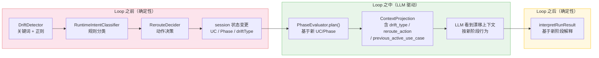

**漂移类型与 Agent Loop 的交互：**

| 漂移类型 | Loop 之前的效果 | Loop 之中的影响 | 示例 |
|---------|---------------|---------------|------|
| **Hard Shift** → `RISK_SHIFT_TO_INTAKE` | UC 切换 + Phase→RESOLVE | PhasePlan 切换为 RESOLVE_INTAKE（仅 `request_handover`） | UC-A→UC-J：用户提到诈骗 |
| **Soft Shift** → `SOFT_SHIFT_TO_DISCOVER` | UC 切换 + Phase→DISCOVER 或保持 RESOLVE | PhasePlan 切换为对应阶段 | UC-A→UC-C：用户提到消息问题 |
| **Minor Drift** → `CONTINUE_CURRENT` | 无状态变更 | PhasePlan 不变，LLM 在当前阶段处理 | 用户补充广告 ID |
| **Rebound** → `REBOUND_TO_RESOLVE` | Phase CONFIRM→RESOLVE | PhasePlan 回到 RESOLVE_FAQ | 用户在确认阶段追问 |
| **User Escalation** | forceEscalate（跳过 Loop） | — 不进入 Loop | 用户说 "talk to a human" |

**Reroute 决策矩阵：**

| IntentRelation | RerouteAction | UC 变更 | Phase 变更 |
|---------------|---------------|---------|-----------|
| `NEW_HIGH_RISK_UC` | `RISK_SHIFT_TO_INTAKE` | → 目标高风险 UC | → RESOLVE |
| `NEW_LOW_RISK_UC`（新 UC） | `SOFT_SHIFT_TO_DISCOVER` | → 目标低风险 UC | → DISCOVER 或保持 |
| `SAME_ISSUE` / `SAME_UC_NEW_TASK`（CONFIRM） | `REBOUND_TO_RESOLVE` | 不变 | → RESOLVE |
| `HUMAN_REQUEST` | `ESCALATE_IMMEDIATELY` | 不变 | — （Kernel 处理） |
| `UNKNOWN` | `CONTINUE_CURRENT` | 不变 | 不变 |

> **关键：Loop 内部不做漂移检测。** 如果 LLM 在循环的多步工具调用中触发了话题偏移（如用户在 search_knowledge 后追问无关话题），当前设计不会在循环内中断——需要等到下一条用户消息时由 ControlKernel 重新检测。

#### 2.1.6 当前设计的限制与改进方向

| 限制 | 当前现状 | 影响 | 改进方向 |
|------|---------|------|---------|
| **单次同步循环** | 每条消息最多执行一次 `AgentRunLoop.run()`（加上可选的 DISCOVER→RESOLVE Replan） | 复杂任务无法跨多个 plan 阶段连续推理 | 引入 multi-plan chaining |
| **有界但不自适应** | `maxToolSteps` 是 PhasePlan 硬编码（FAQ=4, Intake=3, 其他=2） | 无法根据问题复杂度动态调整步数 | 基于 LLM 信号的动态步数预算 |
| **循环内无漂移检测** | 漂移仅在 ControlKernel 层（Loop 外）检测 | 若 LLM 循环多步后用户意图在工具结果中发生变化，无法即时响应 | 循环内轻量级意图监控 |
| **工具同步执行** | 每个工具调用阻塞等待结果 | 串行执行延迟叠加；无法并行调用独立工具 | 并行工具调度 |
| **单 Agent 架构** | 只有一个 LLM 实例在循环中工作 | 无法将子任务委托给专用 Agent | Skill / Sub-agent 编排 |
| **accumulatedToolResults 同名覆盖** | 相同工具名的结果后调覆盖前调 | 连续两次 `search_knowledge` 只保留最后一次结果 | 按调用序号索引（`tool_name#step`） |
| **Legacy 路径残留** | `computeRouteKey` 返回 null 时回退到 `PhaseEvaluator.evaluate()` | 两套执行路径并存增加维护成本 | 完成全阶段迁移后移除 Legacy |
| **语义漂移检测缺失** | `DriftDetector` 仅用关键词/正则；YAML 阈值（`minor-drift-similarity`）未接入 | 无法检测语义级别的话题偏移 | 引入嵌入相似度检测 |
| **PhasePlan 静态定义** | Plan 的 `validTerminalOutcomes` 仅为元数据，无运行时强制校验 | 可能出现不在预期终端集合中的结果 | 在 `interpretRunResult` 入口校验 |

### 2.2 Prompt 组装与 Context Projection

CSAgent 与 LLM 的交互不是简单的"把用户消息发给模型"。整个 Prompt 由三层组装而成：**静态模板**（system_prompt.txt，定义角色规则和工具使用协议）、**动态投影**（Context Projection JSON，携带会话状态/阶段计划/工具 schema/历史/检索结果）、**用户消息**。这三者拼接后构成发给 LLM 的完整请求。设计理念是：静态模板定义"通用行为规范"，动态投影定义"当前这一步该做什么"，二者分离使得行为可控、可审计、可独立迭代。

#### Prompt → LLM 完整组装流程

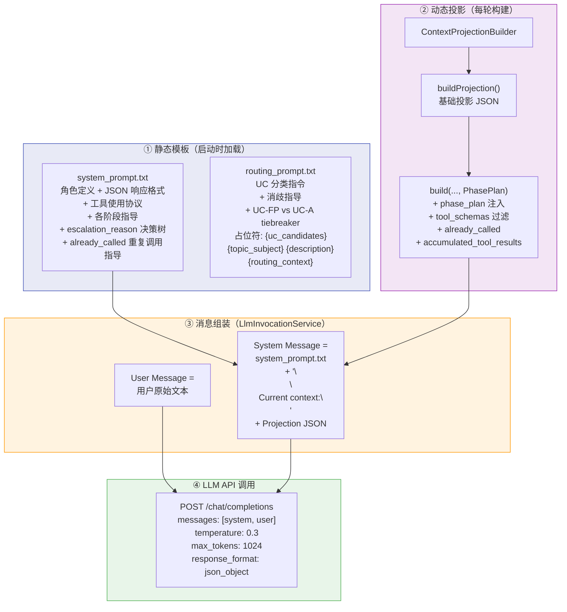

#### 两条 Prompt 路径

系统中存在两条独立的 LLM 调用路径，使用不同的模板和投影方式：

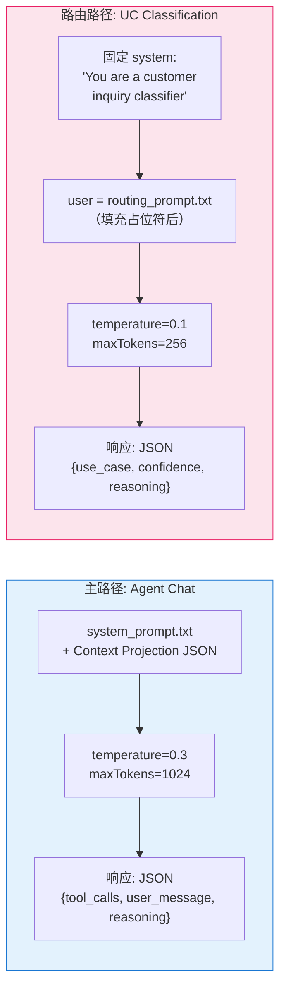

| 维度 | 主路径（Agent Chat） | 路由路径（UC Classification） |
|------|---------------------|------------------------------|
| 模板 | `system_prompt.txt`（87 行） | `routing_prompt.txt`（28 行） |
| System 消息 | 模板 + `\n\nCurrent context:\n` + Projection JSON | 固定一句话 `"You are a customer inquiry classifier..."` |
| User 消息 | 用户原始文本 | routing_prompt 模板填充后的完整文本 |
| 温度 | 0.3 | 0.1（更确定性） |
| Max Tokens | 1024 | 256 |
| 调用时机 | AgentRunLoop 每步 | 会话创建后路由（非每轮） |
| 响应格式 | `{tool_calls, user_message, reasoning}` | `{use_case, confidence, reasoning}` |

#### system_prompt.txt 结构概览

system_prompt.txt 是 Agent 的"行为宪法"，共 87 行，包含以下模块：

| 模块 | 行数 | 职责 |
|------|------|------|
| 角色定义 | 1 | "You are a Gumtree customer service assistant" |
| JSON 响应格式 | 3-6 | 强制 `{user_message, reasoning, tool_calls}` 三字段 |
| 工具使用协议 | 8-16 | 何时用空 tool_calls（直接回答/澄清）vs 非空（需数据/副作用） |
| 行为规则 | 18-24 | 不冒充人类、不承诺无法执行的操作、grounded 回答 |
| already_called 指导 | 26-35 | 避免重复工具调用的语义协议 |
| DISCOVER 阶段指导 | 37-51 | UC 分类置信度梯度、何时澄清 vs 分类 vs 升级 |
| escalation_reason 决策树 | 53-87 | 23 值枚举的完整选择指导、优先级规则、Tier-2 逃逸舱 |

**关键设计：** system_prompt.txt 是**静态的**，不随阶段/UC 变化。阶段特定行为由 Context Projection 中的 `phase_plan.system_instruction` 和 `phase_plan.grounding_instruction` 动态注入。

#### Context Projection JSON 结构

Context Projection 是每轮动态构建的 JSON 对象，携带 Agent 在当前这一步需要的全部上下文。投影是**计划感知的**——不同阶段投影不同的工具 schema、指令和状态线索。

```mermaid
graph TB
    subgraph Projection["Context Projection JSON（按插入顺序）"]
        direction TB
        S1["session<br/>session_id / current_phase<br/>active_use_case / total_bot_turns<br/>clarification_count / faq_miss_count"]
        S2["task_summary / risk_flags"]
        S3["intake_state ⓒ<br/>required_fields / fields_collected<br/>fields_remaining / intake_complete"]
        S4["candidate_use_cases"]
        S5["reroute 状态 ⓓ<br/>previous_active_use_case / drift_type<br/>predicted_use_case / intent_relation<br/>reroute_action / resolve_disposition"]
        S6["budget_state<br/>各预算剩余量"]
        S7["tool_schemas ⓟ<br/>OpenAI 格式工具定义<br/>仅 plan.allowedTools 子集"]
        S8["form_context / customer_context<br/>listing_context"]
        S9["conversation_history<br/>最近 10 轮（PII 脱敏）"]
        S10["knowledge_hits + instruction ⓚ"]
        S11["current_user_message（PII 脱敏）"]
        S12["phase_plan ⓟ<br/>phase / system_instruction<br/>grounding_instruction<br/>allowed_tools / valid_terminal_outcomes"]
        S13["already_called ⓟ<br/>tool / arguments_hash / at_step"]
        S14["accumulated_tool_results ⓟ<br/>当前循环内工具返回结果"]
    end

    style Projection fill:#f3e5f5,stroke:#9c27b0
```

> ⓒ = 仅 Intake UC 时出现 &nbsp; ⓓ = Sprint 10+ 增加 &nbsp; ⓟ = Plan-aware build 阶段追加 &nbsp; ⓚ = 仅有检索结果时出现

#### 阶段特定指令（phase_plan 内嵌）

`PhaseEvaluator.plan()` 为每个阶段生成不同的 `system_instruction` 和 `grounding_instruction`，嵌入 Context Projection 的 `phase_plan` 字段中，引导 LLM 在不同阶段采取不同行为：

| 阶段 | system_instruction 要点 | grounding_instruction 要点 |
|------|------------------------|---------------------------|
| **DISCOVER** | 识别 UC，不回答问题；当意图明确时调用 `classify_use_case`（置信度 ≥ 0.7 直接分类，< 0.5 先澄清）；弱候选时先搜索再分类 | 不在 DISCOVER 给详细回答 |
| **RESOLVE (FAQ)** | FAQ 解决流程：`search_knowledge` → `resolve_article` → grounded 回答（附 source_id）→ `record_outcome`；仅在无法 resolve 时 escalate | 必须先检索再回答；无 viable hit 才可 escalate |
| **RESOLVE (Intake)** | 收集 Intake 信息（动态注入 UC 名称/团队/SLA/必填字段）；不尝试自行解决 | 使用固定话术；不引用知识库文章 |
| **CONFIRM** | 判断用户是否满意；满意则 `record_outcome(RESOLVED)`；不满意则 `request_handover` 或回退 RESOLVE | 关注情感信号；不确定时问 yes/no |
| **CLOSE** | 感谢用户，确认结果 | 简短、温暖、终结性 |
| **ESCALATE** | 发送清晰的转接消息，确保 `request_handover` 已调用 | 告知用户人工将协助；不承诺具体结果 |

#### routing_prompt.txt 占位符填充

routing_prompt.txt 在 UC 路由时使用，4 个占位符在运行时替换：

| 占位符 | 来源 | 说明 |
|--------|------|------|
| `{uc_candidates}` | `UseCaseRouter` 候选列表 | 格式化的 UC 选项文本 |
| `{topic_subject}` | 表单 `topic_subject` | 用户选择的话题类别 |
| `{description}` | 表单 `description` | 用户描述文本 |
| `{routing_context}` | `buildModerationRoutingContext()` | 审核状态、广告状态等（无信号时为 `"moderation_status: unknown ..."`） |

routing_prompt 还包含 Sprint 7 §I1 的 UC-FP vs UC-A tiebreaker 规则和通用消歧指导。

#### 完整的一次 LLM Chat 调用组装过程

```mermaid
flowchart LR
    subgraph Plan["① 计划生成"]
        PE["PhaseEvaluator.plan()"]
        PE --> PP["PhasePlan<br/>phase / allowedTools<br/>systemInstruction<br/>groundingInstruction"]
    end

    subgraph Build["② 上下文构建"]
        CPB["ContextProjectionBuilder.build()"]
        CPB --> |"1"| BASE["buildProjection()<br/>基础 JSON"]
        BASE --> |"2"| INJECT["注入 phase_plan<br/>+ 过滤 tool_schemas<br/>+ already_called<br/>+ accumulated_tool_results"]
        INJECT --> PROJ["Projection JSON"]
    end

    subgraph Assemble["③ 消息组装"]
        SYS["System Message =<br/>system_prompt.txt<br/>+ Current context:<br/>+ Projection JSON"]
        USR["User Message =<br/>用户原始文本"]
    end

    subgraph Call["④ LLM 调用"]
        REQ["POST /chat/completions<br/>messages: [system, user]<br/>temperature=0.3<br/>max_tokens=1024<br/>response_format=json_object"]
        RESP["LLM 返回<br/>tool_calls + user_message<br/>+ reasoning"]
    end

    subgraph Post["⑤ 后处理"]
        PARSE["ActionParser 解析"]
        VAL["Plan 白名单校验"]
        DISP["ToolDispatcher 执行"]
        ACC["累积 tool_results<br/>→ 下一步循环"]
    end

    PP --> CPB
    PROJ --> SYS
    SYS --> REQ
    USR --> REQ
    REQ --> RESP
    RESP --> PARSE
    PARSE --> VAL
    VAL --> DISP
    DISP --> ACC
    ACC -.->|"step < maxToolSteps"| CPB

    style Plan fill:#fff8e1,stroke:#ffc107
    style Build fill:#e8eaf6,stroke:#5c6bc0
    style Assemble fill:#e3f2fd,stroke:#1976d2
    style Call fill:#fff3e0,stroke:#f57c00
    style Post fill:#e8f5e9,stroke:#66bb6a
```

**投影迭代增强历史：**

| Sprint | 增强内容 |
|--------|---------|
| S7 | `candidate_use_cases` + DISCOVER 线索、`intake_state` |
| S10 | Reroute 决策 / 问题状态 slots |
| S11 | `task_status`、`resolve_disposition` |
| S12 | `drift_history`、`task_history` 聚合 |
| S14 | FAQ grounding 诊断 |

### 2.3 Tool Integration

工具是 Agent 与外部能力交互的接口。设计上采用**双层策略执行**：Phase Plan 白名单（按阶段过滤）和 Tool Policy（按 UC 过滤），两层独立执行，确保即使 LLM 尝试调用非授权工具也会被阻断。

#### Agent 可见工具

| 工具 | 用途 | 可用 UC |
|------|------|---------|
| `search_knowledge` | FAQ 知识库检索（pgvector 向量搜索 + Rerank） | UC-A/B/C/D/E/F/FP |
| `resolve_article` | 按 source_id 获取完整文章内容 | UC-A/B/C/D/E/F/FP |
| `get_customer_context` | 查询账户/广告上下文信息 | UC-A/C/D/F/FP/K |
| `classify_use_case` | DISCOVER 阶段提交 UC 分类假设 | ALL（仅 DISCOVER Plan 暴露） |
| `request_handover` | 触发转人工（构建转接 payload） | ALL |
| `record_outcome` | 记录终端结果（resolve/close） | ALL |

#### Runtime-Only 工具（LLM 不可见）

| 工具 | 用途 | 状态 |
|------|------|------|
| `create_case_controlled` | 升级路径上的 Case 创建 | 活跃 - kernel 直接调用 |
| `lookup_customer_account` | 账户查询 | 休眠 - 无调用方 |
| `lookup_listing_or_ad` | 广告查询 | 休眠 - 无调用方 |
| `get_moderation_review_context` | 审核上下文 | 休眠 - 无调用方 |

#### 双层策略执行

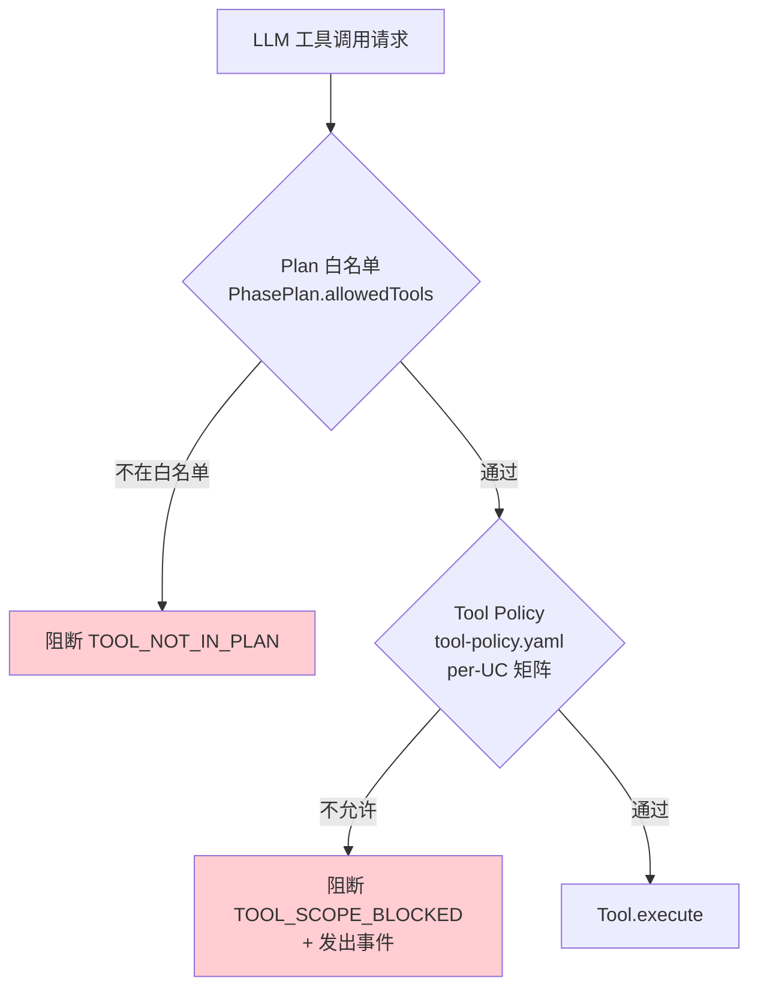

#### 后续演进 — Skill 抽象

当前 `PhasePlan` 作为最小 Skill 抽象已能覆盖现有 UC 类型（FAQ 解决、Intake 收集、通用路由）。但随着业务复杂度增加，可能需要独立的 Skill 框架来支持：

| 场景 | 当前方案 | Skill 框架的价值 |
|------|---------|-----------------|
| 多步骤操作流程（如退款审核） | PhasePlan 参数化 | 独立的状态机 + 工具编排 |
| 跨 UC 共享子流程（如身份验证） | 重复的 Plan 配置 | 可复用的 Skill 组件 |
| 需要外部 API 编排的操作 | 单工具调用 | 工具链 + 错误恢复 |
| 动态工具集合（按上下文调整） | 静态白名单 | 运行时 Skill 决策 |

设计提案已记录在 `docs/proposals/skill_orchestration_candidates.md`，当前明确**推迟**——在生产流量证明 PhasePlan 不足之前不引入额外抽象。

#### Tool ↔ 业务系统 API 映射

Agent 的工具并不直接对外调用裸 API，而是通过 `GumtreeApiService` 和 `SalesforceService` 两个服务抽象层与业务系统交互。下表列出工具→服务方法→外部 API 的完整映射关系（基于 tool_spec v0.3 和代码实现）：

| Agent Tool | 服务层方法 | 外部 API / 数据源 | 入参 | 关键返回字段 |
|-----------|-----------|-----------------|------|------------|
| `search_knowledge` | `KbChunkRepository.findNearest*` | 内部 pgvector 向量搜索 | `query`(→ embedding), `uc_tags` | `hits[]`: source_id, title, snippet, score, canonical_url |
| `resolve_article` | `KbArticleRepository.findById` | 内部 PostgreSQL | `source_id` | title, summary, description, canonical_url, is_published |
| `get_customer_context` | `GumtreeApiService.lookupAccount` + `.lookupListing` + `.getModerationReview` | Gumtree Account API / Listing API / Moderation API | `email` 和/或 `ad_id` | account(脱敏), listing, moderation_review |
| `classify_use_case` | — (内部状态操作) | 无外部调用 | `use_case_id`, `confidence` | committed, use_case_id |
| `request_handover` | `SalesforceService.requestHandover` | Salesforce Omni-Channel API | `escalation_reason`, `summary` | transfer_result, session_id |
| `record_outcome` | `SessionOutcomeRepository.save` | 内部 PostgreSQL | `outcome_class` | session_id, outcome_class |
| `create_case_controlled` (Runtime-Only) | `SalesforceService.createCase` | Salesforce Case API | `subject`, `description`, `email`, `ad_id` | case_id, queue_name |
| `lookup_customer_account` (Runtime-Only) | `GumtreeApiService.lookupAccount` | Gumtree Account API | `email` | found, account |
| `lookup_listing_or_ad` (Runtime-Only) | `GumtreeApiService.lookupListing` | Gumtree Listing API | `ad_id` | found, listing |
| `get_moderation_review_context` (Runtime-Only) | `GumtreeApiService.getModerationReview` | Gumtree Moderation API | `ad_id` | review + reason_code → 客户可读解释 |
| `get_message_moderation_context` (Runtime-Only) | `GumtreeApiService.getMessageModerationHistory` | Gumtree Message Moderation API | `conversation_id` | 消息审核历史 |

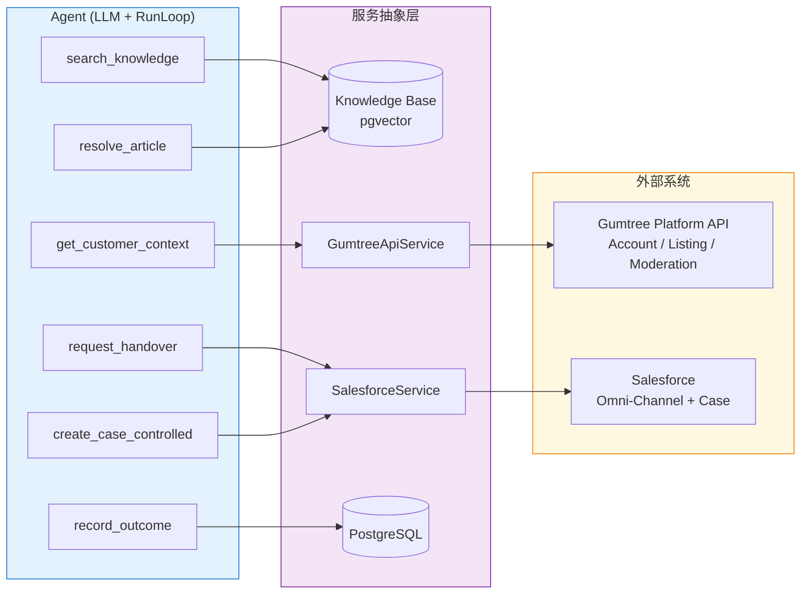

> **本地开发模式说明：** 当前 profile=local 时，`GumtreeApiService` 和 `SalesforceService` 使用 Mock 实现（`MockGumtreeApiService`、`MockSalesforceService`），数据来自本地 PostgreSQL 种子数据。4 个 Runtime-Only 休眠工具（无活跃调用方）计划在后续评估其是否应接入确定性调用路径或退役。

### 2.4 FAQ 知识管理与 RAG 检索

FAQ/知识库管理采用 **RAG（Retrieval-Augmented Generation）** 架构。设计考量是：Agent 的回答必须有据可查（grounded），不允许凭空生成事实性内容。检索管线通过多级门控（retrieval gate → rerank → answer gate）确保返回的内容确实回答了用户问题，而非仅仅相关。

#### RAG 检索管线

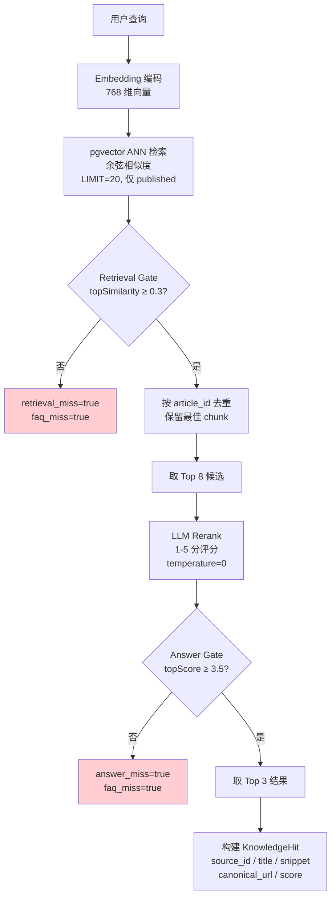

#### 检索阈值配置（knowledge.retrieval）

| 参数 | 默认值 | 说明 |
|------|--------|------|
| `annLimit` | 20 | ANN 检索返回数量 |
| `retrievalGateThreshold` | 0.3 | 最低余弦相似度（低于此值判定为检索未命中） |
| `answerGateThreshold` | 3.5 | 最低 Rerank 分数（1-5 制，低于此值判定为回答未命中） |
| `rerankCandidates` | 8 | 送入 Rerank 的候选数量 |
| `topResults` | 3 | 最终返回结果数 |
| `rerankFallbackScore` | 2.5 | Rerank 解析失败时的兜底分数（必须 < answerGate） |

#### 安全过滤

| 层级 | 机制 | 说明 |
|------|------|------|
| SQL 层 | `is_published = true` | ANN 查询仅返回已发布文章 |
| 后置过滤 | 跳过未发布命中 | 防御性冗余 |
| resolve_article | 拒绝未发布 | `article_unpublished_safe_refuse` 错误 |
| canonical_url | 缺失标记 | `canonical_url_missing=true` 可观测 |

#### 话术/脚本管理

固定话术模板通过 `templates.yaml` 管理（Sprint 15），包含版本元数据（`library_version: "v1.1"`），由 `ScriptLibraryService` 加载并在启动时校验版本一致性。禁用短语检测器（`ForbiddenPhraseDetector`）已实现但**尚未接入响应路径**。

### 2.5 转人工（Handover）设计

转人工是 CSAgent 中最复杂的流程之一。关键设计考量是区分 **Escalate（阶段）** 和 **Handover（动作）** 的关系：Escalate 是 Agent 决定"需要转人工"的语义判断和阶段切换；Handover 是执行转接的具体动作（构建 payload、通知 Salesforce、持久化日志）。

#### Escalate 与 Handover 的关系

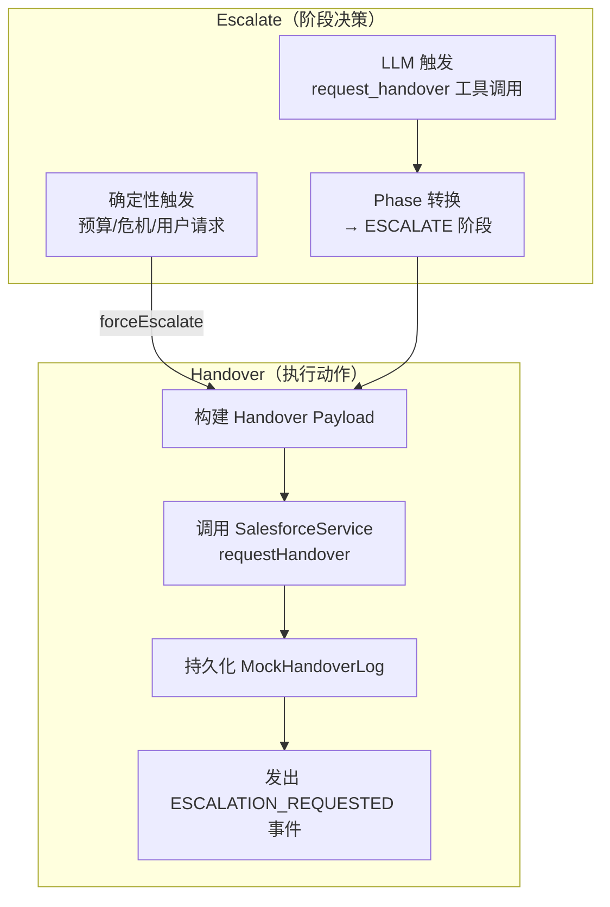

#### 升级触发条件完整列表

| 触发源 | 条件 | 升级原因（escalation_reason） |
|--------|------|------------------------------|
| B1 危机检测 | 正则匹配危机关键词 | `user_distress`（仅标记，需后续触发） |
| 显式人工请求 | 用户表达转人工意愿 | `user_requested` |
| 预算耗尽 | 澄清轮次 ≥ 2 | `clarification_budget_exhausted` |
| 预算耗尽 | FAQ 未命中 ≥ 2 | `faq_miss_threshold_exceeded` |
| 预算耗尽 | 轮次超限 | `turn_budget_exhausted` |
| 漂移检测 | USER_ESCALATION_REQUEST | `user_requested` |
| LLM 决策 | 调用 `request_handover` | LLM 指定的 reason |
| PhaseEvaluator | CONFIRM 阶段用户拒绝 | 语义判断 |
| 强先验路由 | Handover-only topic | `out_of_scope` |
| 运行时异常 | LLM 不可用 | `service_degraded` |

#### 升级原因体系（23 值枚举）

| 类别 | 原因 | 优先级方向 |
|------|------|-----------|
| 紧急 | `imminent_harm`, `user_distress` | 最高 |
| 安全 | `trust_safety_required`, `payment_dispute_detected` | 高 |
| 用户意愿 | `user_requested` | 高 |
| 策略 | `appeal_requires_human`, `incorrect_deletion_appeal`, `gdpr_intake`, `identity_verification_required`, `account_compliance` | 中 |
| Intake 完成 | `intake_complete_for_uc_{g,h,i,j,k}`, `incomplete_intake` | 中 |
| Bot 能力边界 | `out_of_scope`, `tool_scope_blocked`, `service_degraded`, `runtime_error_threshold` | 低 |
| 预算耗尽 | `clarification_budget_exhausted`, `faq_miss_threshold_exceeded`, `turn_budget_exhausted` | 最低 |

**升级原因优先级机制：** `EscalationReasonResolver` 维护优先级映射（`imminent_harm` = 0 最高，`turn_budget_exhausted` = 42 最低）。当多个原因同时存在时，取优先级最高的。特殊规则：LLM 报告的 `user_distress` 会被降级为 `faq_miss_threshold_exceeded`，除非确定性 B1 检测器已独立确认。

#### Handover Payload

| 字段 | 来源 |
|------|------|
| `version` | `"1.0"` (工具路径) / `"1.1"` (Assembler 路径) |
| `session_id`, `primary_use_case`, `candidate_use_cases` | BotSession |
| `summary`, `summary_source` | LLM 参数或 fallback 生成 |
| `escalation_reason` | 规范化后的原因 |
| `intake_fields` | 已收集的 Intake 信息 |
| `articles_shown`, `total_bot_turns` | 会话统计 |
| `identifiers_collected` | 上下文查询标记 |
| `transcript_ref` | `bot_session:<id>` |


### 2.6 Guardrails & Policy

Guardrails 的设计原则是分层防御——每一层独立工作，后一层不依赖前一层的正确性。即使 LLM 完全不可控，确定性层仍能保证安全底线。

#### 分层防护矩阵

| 层级 | 位置 | 守卫 | 触发时机 |
|------|------|------|---------|
| L1 Pre-LLM | ControlKernel | B1 危机检测（正则） | 每条消息 |
| L1 Pre-LLM | ControlKernel | 显式人工请求检测 | 每条消息 |
| L1 Pre-LLM | BudgetChecker | 6 类预算检查 | 每条消息 |
| L1 Pre-LLM | DriftDetector | 升级正则 + 5 组硬切换关键词 | 每条消息 |
| L1 Pre-LLM | RuntimeIntentClassifier + RerouteDecider | 意图分类 + Reroute 决策 | 每条消息 |
| L2 In-Loop | AgentRunLoop | Plan 白名单校验 | 每次工具调用 |
| L2 In-Loop | AgentRunLoop | Intake 完整性检查 | `request_handover` 前 |
| L2 In-Loop | AgentRunLoop | S1 FAQ miss handover 阻断 | `request_handover` 前 |
| L2 In-Loop | AgentRunLoop | 渐进解决守卫 | `record_outcome(resolve)` 前 |
| L3 Dispatch | ToolPolicyEnforcer | per-UC 工具矩阵（YAML） | 每次工具分发 |
| L3 Dispatch | ToolCallTraceSanitizer | PII/密钥脱敏 | Trace 持久化时 |
| L4 Response | EscalationReasonResolver | 升级原因优先级 + LLM distress 降级 | 升级决策时 |
| L4 Response | ControlKernel | K0 证据门控（无证据不回退 UC） | 升级决策时 |
| L5 Projection | ContextProjectionBuilder | 邮箱正则脱敏 | 每次投影构建 |
| L5 Projection | ContextProjectionBuilder | 阶段工具 Schema 过滤 | 每次投影构建 |
| L5 Projection | FormContextIngestionService | XSS 清洗 | 会话创建时 |

#### 配置驱动的策略文件

| 文件 | 职责 | 加载方 |
|------|------|--------|
| `control-policy.yaml` | 阶段转换图、预算上限、漂移阈值 | `ControlPolicyService` |
| `tool-policy.yaml` | 工具可见性（AGENT_VISIBLE/RUNTIME_ONLY）、per-UC 允许列表 | `ToolPolicyEnforcer` |
| `use-case-registry.yaml` | UC 定义、OOS 话题、强/弱先验、handover-only 话题 | `UseCaseRegistryService` |
| `risk-keywords.yaml` | 升级正则、5 组硬切换关键词 | `RiskKeywordsConfig` → `DriftDetector` |
| `scripts/templates.yaml` | 标准话术模板（v1.1）、变量占位符、OOS 模板 | `ScriptLibraryService` |

#### 标准话术管理（Script Library）

Agent 面向客户的标准化回复（开场白、等待提示、Intake 引导、升级告知、OOS 拒绝等）通过 YAML 模板集中管理，确保客户体验一致且可审计。

**存储与加载：** 话术模板存储在 `server/src/main/resources/scripts/templates.yaml`，由 `ScriptLibraryService`（Spring Bean）在启动时一次性加载到内存中。模板通过 `library_version`（当前 v1.1）进行版本管控，构建时由一致性测试（`Sprint15ScriptLibraryConsistencyTest`）校验必需模板 ID、占位符合法性和版本标注。

**模板结构：**

```yaml
library_version: "v1.1"
library_version_date: "2026-04-21"

templates:
  opening:                        # 通用开场白
    pattern: "Hi {first_name} — I'm the Gumtree Support Assistant..."
    variables: [first_name]

  hold_placeholder:               # 等待提示（嵌套子键）
    short:
      pattern: "One moment while I look into this for you."
    medium:
      pattern: "Thanks for your patience — I'm checking your details now."

  h_empathy:                      # UC-H 专属共情话术
    pattern: "I understand this must be frustrating..."
  h_intake_prompt:                # UC-H Intake 信息收集引导
    pattern: "To help you with your appeal, I'll need..."
  h_intake_complete_case_created: # UC-H 升级确认
    pattern: "I've created case {CASE_NUMBER} for the {TEAM_NAME} team..."

  oos_delivery:                   # OOS: Delivery 类话题拒绝模板
    pattern: "Delivery enquiries need specialist support..."
```

**模板分类体系：**

| 类别 | 模板前缀/Key | 用途 | 状态 |
|------|-------------|------|------|
| 通用开场 | `opening` | 会话开场白 | 已定义，SessionManager 硬编码（待迁移） |
| 等待提示 | `hold_placeholder` | 工具调用期间的等待话术 | 已定义，ProgressPlaceholderService 硬编码（待迁移） |
| UC-G~K Intake | `{prefix}_empathy` / `{prefix}_intake_prompt` / `{prefix}_escalation` | Intake 类 UC 的共情、引导、升级话术 | 已定义，legacy 路径使用 |
| FAQ 解决 | `fp_empathy` / `resolution_check` | FAQ 路径的解决确认话术 | 已定义，当前未接入 |
| OOS 拒绝 | `oos_delivery` / `oos_generic` 等 | 超范围话题的标准拒绝 | 已定义，当前未接入 |
| 关闭/空闲 | `idle_check` / `idle_close` | 空闲超时提醒和关闭 | 已定义，当前未接入 |

**当前接入状态与演进路径：**

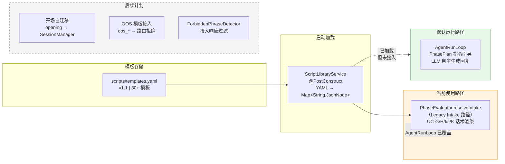

**关键设计决策：** 当前 AgentRunLoop 路径默认启用（覆盖所有阶段包括 `RESOLVE_INTAKE`），此时 `PhaseEvaluator.resolveIntake`（话术渲染的唯一活跃调用方）不会被执行。LLM 通过 `PhasePlan.groundingInstruction` 中的文本指令（如 "Use fixed-script templates and standard intake questions"）引导回复风格，而非直接注入话术模板。这一设计选择使 LLM 回复更自然灵活，但牺牲了话术的逐字可控性——后续需要评估是否引入 hybrid 模式（模板骨架 + LLM 填充）。

### 2.7 UC 注册表

UC 注册表定义了 Agent 的能力边界——哪些问题 Bot 可以独立解决（FAQ 路径），哪些必须收集信息后转人工（Intake 路径）。

| UC | 名称 | 风险等级 | 路径 | Bot 可解决 |
|----|------|---------|------|-----------|
| UC-A | 广告状态与可见性 | LOW | FAQ | ✓ |
| UC-B | 发布与编辑指导 | LOW | FAQ | ✓ |
| UC-C | 消息与回复 | LOW | FAQ | ✓ |
| UC-D | 账户与登录 | LOW | FAQ | ✓ |
| UC-E | 通用产品与搜索 | LOW | FAQ | ✓ |
| UC-F | 付款咨询 | MEDIUM | FAQ | ✓ |
| UC-FP | 正确删除解释 | MEDIUM | FAQ | ✓ |
| UC-G | GDPR / 数据删除 | HIGH | Intake | ✗ |
| UC-H | 广告移除申诉 | HIGH | Intake | ✗ |
| UC-I | 退款 / 支付纠纷 | HIGH | Intake | ✗ |
| UC-J | 信任与安全举报 | CRITICAL | Intake | ✗ |
| UC-K | 技术问题 Intake | MEDIUM | Intake | ✗ |

**Strong Prior（强先验映射）：** 部分 topic_subject 直接映射到 UC，无需 LLM 判断——"Delete My Account or Data" → UC-G，"Report a Safety Issue" → UC-J，"Replies or Messaging" → UC-C。

**Handover-Only Topics：** Delivery、Pro Contract、Ratings Reviews、Account Manager Support — 直接转人工，不进入 Agent 流程。

### 2.8 Session、Message、Case 数据模型与持久化

本节描述 Agent 运行时的核心数据实体、它们之间的关系、生命周期状态流转及持久化机制。设计考量是：保证每一轮对话都可事后完整重建（包括 LLM 视角的上下文、决策和效果），同时支撑评估体系所需的全链路 Trace。

#### 实体关系总览

```mermaid
erDiagram
    BotSession ||--o{ BotTurn : "1:N (per turn)"
    BotSession ||--o| SessionOutcome : "1:0..1"
    BotSession ||--o{ BotEvent : "1:N (lifecycle events)"
    BotSession ||--o{ LlmCallLog : "1:N (LLM calls)"
    BotSession ||--o{ MockHandoverLog : "1:N (handover records)"
    BotSession ||--o| MockCase : "1:0..1 (case for intake UCs)"

    BotSession {
        string session_id PK
        string sf_bot_session_id
        string case_id FK
        string handling_state
        string current_phase
        string active_use_case
        text_array candidate_use_cases
        decimal intent_confidence
        int total_bot_turns
        int clarification_count
        int faq_miss_count
        int runtime_error_count
        string containment_outcome
        string escalation_reason
        jsonb form_context
        jsonb customer_context
        jsonb listing_context
        jsonb intake_fields
        text_array articles_shown
        timestamp created_at
        timestamp updated_at
        timestamp closed_at
    }

    BotTurn {
        string turn_id PK
        string session_id FK
        int turn_index
        string user_message
        jsonb projected_context
        string llm_raw_response
        jsonb tool_calls
        string bot_response
        text_array source_ids
        string phase_before
        string phase_after
        string active_use_case
        int latency_ms
        timestamp created_at
    }

    SessionOutcome {
        string session_id PK_FK
        string outcome
        string use_case_id
        string escalation_reason
        text_array articles_shown
        int total_turns
        long total_latency_ms
        jsonb trace_metadata
        timestamp created_at
    }

    BotEvent {
        string event_id PK
        string session_id FK
        string event_type
        int turn_index
        jsonb payload
        timestamp created_at
    }

    MockHandoverLog {
        string log_id PK
        string session_id FK
        jsonb handover_payload
        string transfer_result
        string customer_message
        jsonb transcript
        timestamp created_at
    }

    MockCase {
        string case_id PK
        string session_id FK
        string use_case_id
        string subject
        string description
        string contact_email
        string ad_id
        string status
        string queue_name
        jsonb intake_fields
        timestamp created_at
    }
```

#### Session 状态与生命周期

`BotSession` 是对话的核心上下文载体。`handling_state` 管理会话的宏观状态流转，`current_phase` 管理 Agent 行为阶段。

```mermaid
stateDiagram-v2
    [*] --> BOT_HANDLING: createSession
    BOT_HANDLING --> QUEUE_TO_HUMAN: request_handover / forceEscalate
    BOT_HANDLING --> CLOSED: record_outcome(resolve) + closedAt
    QUEUE_TO_HUMAN --> CLOSED: 人工处理完成
    CLOSED --> [*]

    state BOT_HANDLING {
        [*] --> INIT: createSession
        INIT --> DISCOVER: useCaseRouter 成功路由
        INIT --> ESCALATE: OOS / handover-only topic
        DISCOVER --> RESOLVE: classify_use_case 成功
        RESOLVE --> CONFIRM: Bot 给出最终回复
        CONFIRM --> RESOLVE: REBOUND（用户追问）
        CONFIRM --> CLOSE: record_outcome(resolve)
        RESOLVE --> ESCALATE: request_handover / budget
        DISCOVER --> ESCALATE: budget / 用户请求
        RESOLVE --> DISCOVER: SOFT_SHIFT（新 UC）
        CONFIRM --> DISCOVER: SOFT_SHIFT（新 UC）
    }
```

**Session 核心字段说明：**

| 字段 | 类型 | 说明 |
|------|------|------|
| `handling_state` | String | 宏观状态：`BOT_HANDLING` → `QUEUE_TO_HUMAN` → `CLOSED` |
| `current_phase` | String | Agent 行为阶段：`INIT` → `DISCOVER` → `RESOLVE` → `CONFIRM` → `CLOSE` / `ESCALATE` |
| `active_use_case` | String | 当前主 UC（如 `UC-A`），由 `classify_use_case` 或 strong prior 设置 |
| `candidate_use_cases` | text[] | 候选 UC 列表，由路由推断产生 |
| `intent_confidence` | decimal(4,2) | 意图置信度，∈ [0, 1] |
| `total_bot_turns` | int | 累计 Bot 交互轮次，用于 budget 计算 |
| `clarification_count` | int | 澄清轮次计数，用于 clarification budget |
| `faq_miss_count` | int | FAQ 检索未命中次数，用于 miss threshold |
| `form_context` | jsonb | 表单提交的原始上下文（topic_subject, description 等） |
| `customer_context` / `listing_context` / `moderation_context` | jsonb | 业务系统查询缓存，避免重复 API 调用 |
| `intake_fields` | jsonb | Intake 类 UC 收集的结构化字段 |
| `articles_shown` | text[] | 已推送的文章 source_id 列表 |
| `containment_outcome` | String | 最终结果：`resolved` / `escalated` / `abandoned` |

**Transient 字段（不持久化，仅运行时内存）：** `previousActiveUseCase`、`driftType`、`currentTaskType`、`rerouteAction`、`faqGroundingState`、`citationPresent`、`citationMatch`、`citationDrift` 等约 25 个字段。这些字段用于单轮处理逻辑，不进入数据库，但通过 `BotEvent` payload 或 `BotTurn.projected_context` 间接记录。

#### BotTurn — 对话轮次记录

每次用户消息 → Agent 回复形成一个 `BotTurn`。关键设计是保留**完整的决策链路**：

| 字段 | 说明 | 写入时机 |
|------|------|---------|
| `user_message` | 用户原始输入 | SessionManager.processMessage |
| `projected_context` | 该轮传递给 LLM 的完整 JSON 投影 | AgentRunLoop 结束后 |
| `llm_raw_response` | LLM 原始返回（含 tool_calls 和 user_message） | AgentRunLoop 结束后 |
| `tool_calls` | 工具调用链及其结果（JSON 数组） | AgentRunLoop 结束后 |
| `bot_response` | 最终发给用户的文本 | AgentRunLoop 结束后 |
| `phase_before` / `phase_after` | 该轮前后的 Agent 阶段 | ControlKernel 处理中 |
| `latency_ms` | 本轮总耗时 | ControlKernel 返回时计算 |

#### Case 创建与关联

Case 仅在 **Intake 类 UC**（UC-H, UC-J, UC-K）的升级路径上创建，由 `CreateCaseControlledTool` 通过确定性逻辑触发（LLM 无权直接创建）。

| 触发方 | 调用时机 | 参数来源 |
|--------|---------|---------|
| `ControlKernel.createCaseIfNeeded` | ESCALATE 分支 / forceEscalate | `formContext` JSON |
| `PhaseEvaluator.createCaseIfAllowed` | Intake 完成 → 升级 | 表单字段提取 |

| UC | 必填字段 | 分配队列 |
|----|---------|---------|
| UC-H | `description` | `Ad_Support_Queue` |
| UC-J | `subject`, `description` | `Safety_Queue` |
| UC-K | `email`, `description` | `Account_Support_Queue` |

创建成功后，`case_id` 写入 `BotSession.caseId`，同时记入 `MockHandoverLog.handover_payload`。

#### 持久化机制

| 层面 | 技术选型 | 说明 |
|------|---------|------|
| ORM | Spring Data JPA + Hibernate | 所有实体使用 `@Entity` + `@Table` 注解 |
| 数据库 | PostgreSQL（含 pgvector 扩展） | jsonb 用于半结构化字段，text[] 用于数组 |
| Schema 迁移 | Flyway | 12 个增量迁移脚本（V1 ~ V12） |
| 事务边界 | `@Transactional` on `SessionManager` | createSession 和 processMessage 各为一个事务 |
| ID 策略 | 应用层生成（UUID），非数据库自增 | 保证分布式可扩展 |

**关键迁移脚本：**

| 版本 | 目标表 | 操作 |
|------|--------|------|
| V1 | `bot_sessions` | 建表 + handling_state 部分索引 |
| V2 | `bot_turns` | 建表 + (session_id, turn_index) 索引 |
| V3 | `session_outcomes` | 建表 + FK → bot_sessions |
| V6 | `bot_events` | 建表 + 索引 |
| V7 | `mock_cases`, `mock_handover_log` | Mock 表建立 |
| V11 | `bot_turns` | 移除废弃字段 action_selected / action_parameters |
| V12 | `bot_sessions` | 新增 runtime_error_count |

### 2.9 可观测性

可观测性的设计目标是：每一轮对话都能事后完整重建决策过程——LLM 看到了什么上下文（projection）、做了什么决策（raw response）、调用了什么工具（tool trace）、产生了什么效果（events）。这对评估体系和问题诊断至关重要。

#### Trace 数据组成

```mermaid
graph TB
    subgraph PerTurn["每轮 Trace（BotTurn 表）"]
        UM[user_message]
        PC[projected_context<br/>完整 JSON 投影]
        LR[llm_raw_response<br/>LLM 原始返回]
        TC[tool_calls<br/>工具调用 trace<br/>含 result_data/latency]
        BR[bot_response<br/>最终用户回复]
        SI[source_ids<br/>引用来源]
        FG[faq_grounding<br/>FAQ 证据链路诊断]
        PH[phase_before / phase_after]
        AUC[active_use_case]
        LAT[latency_ms]
    end

    subgraph Events["事件流（BotEvent 表）"]
        direction TB
        E1[SESSION_STARTED]
        E2[USE_CASE_INFERRED]
        E3[CLASSIFICATION_COMMITTED]
        E4[RETRIEVAL_EXECUTED]
        E5[ARTICLE_SHOWN]
        E6[REROUTE_DECISION]
        E7[RESOLVE_DISPOSITION]
        E8[RECORD_OUTCOME_GUARD]
        E9[ESCALATION_REQUESTED]
        E10[CASE_CREATED]
        E11[GUARDRAIL_VIOLATION]
        E12[TOOL_SCOPE_BLOCKED]
        E13[SESSION_CLOSED]
    end

    subgraph LLMLog["LLM 调用日志（llm_call_log 表）"]
        CL1[call_type: chat / routing / rerank]
        CL2[model / tokens / latency_ms]
        CL3[request_summary / response_summary]
        CL4[success / error_message]
    end

    subgraph Session["会话状态（BotSession 表）"]
        S1[phase / activeUseCase / escalationReason]
        S2[budget counters]
        S3[intakeFields / articlesShown]
        S4[containmentOutcome / handlingState]
    end

    style PerTurn fill:#e3f2fd,stroke:#1976d2
    style Events fill:#f3e5f5,stroke:#7b1fa2
    style LLMLog fill:#fff8e1,stroke:#f9a825
```

#### 事件类型与生成时机

| 事件类型 | 生成时机 | 关键 Payload 字段 |
|---------|---------|------------------|
| `SESSION_STARTED` | 会话创建时 | `topic_subject`, `routing_outcome` |
| `USE_CASE_INFERRED` | 路由推断时 | `use_case`, `confidence` |
| `CLASSIFICATION_COMMITTED` | `classify_use_case` 工具执行成功 | `use_case_id`, `confidence`, `reasoning` |
| `RETRIEVAL_EXECUTED` | `search_knowledge` 执行后 | `query`, `faq_miss`, `result_count` |
| `ARTICLE_SHOWN` | 文章展示后 | `article_id`, `title` |
| `REROUTE_DECISION` | Reroute 决策产生时 | `predicted_use_case`, `relation`, `action`, `drift_type` |
| `RESOLVE_DISPOSITION` | 渐进解决评估后 | `resolve_disposition`, `terminal_evidence` |
| `RECORD_OUTCOME_GUARD` | outcome 守卫触发时 | `record_outcome_guard_result`, `terminal_evidence` |
| `ESCALATION_REQUESTED` | 升级执行时 | `reason` |
| `CASE_CREATED` | Case 创建成功后 | `case_id`, `use_case` |
| `GUARDRAIL_VIOLATION` | 守卫规则触发时 | `category`, `matched_text` |
| `TOOL_SCOPE_BLOCKED` | 工具策略阻断时 | `tool`, `active_uc` |
| `SESSION_CLOSED` | 会话关闭时 | `outcome` |

#### FAQ Grounding 诊断（Sprint 14）

每轮 FAQ 路径的 turn 会在 `projected_context.faq_grounding` 下持久化以下诊断字段：

| 字段 | 说明 |
|------|------|
| `retrieved_source_ids` | ANN 检索返回的 source_id 列表 |
| `resolved_source_ids` | 通过 resolve_article 获取全文的 source_id |
| `cited_source_ids` | Bot 回复中引用的 source_id |
| `cited_canonical_urls` | Bot 回复中引用的 URL |
| `output_class` | 输出分类：factual_answer / clarification / empathy_ack / handover / tool_status / intake_collection |
| `faq_grounding_state` | 诊断状态：factual_grounded / factual_uncited / factual_unresolved / factual_unretrieved / non_factual |
| `citation_present/match/drift` | 引用存在性 / 匹配度 / 漂移 |

当前为**观测性诊断**，不阻断响应。硬引用门控（hard citation gate）明确推迟，待生产流量数据驱动决策。

### 2.10 LLM 集成

LLM 集成采用双供应商 Fallback 架构，确保单一供应商不可用时仍能服务。

| 配置项 | 值 |
|--------|-----|
| 主供应商 | DeepSeek V4 Flash |
| 备用供应商 | Kimi K2 |
| 连接超时 | 3s |
| 读取超时 | 12s |
| 每次调用重试 | 2 次（有 deadline 时） |
| 墙钟 Deadline | 30s（ChatController 设置） |
| Chat 温度 | 0.3 |
| 最大 Token | 1024 |
| 响应格式 | `json_object` |
| Rerank 温度 | 0 |
| Rerank 最大 Token | 8 |

**异常处理：** LLM 基础设施故障时，`LlmInvocationService` 返回合成的 `SAFE_ESCALATION_RESPONSE`（安全升级响应），`finishReason` 标记为 `error_fallback`，确保用户不会收到错误信息而是被安全转接。

---

## Part 3 — 评估体系

评估体系的设计理念是**评估系统行为，而非评估模型能力**。我们关注的是 Agent 在完整对话流程中的表现（路由准确性、工具使用、grounding、升级合理性、handover 完整性），而非 LLM 单次回复的质量。

### 3.1 评估框架总览

```mermaid
flowchart TD
    subgraph Prepare["数据准备"]
        CSV[历史会话 CSV<br/>data/eval_datasets/] --> EXTRACT[CaseSpec 提取器<br/>HR 标注 + 轮次数据]
        EXTRACT --> YAML[CaseSpec YAML<br/>case_specs/]
        YAML --> CURATE[Smoke Curator<br/>确定性子集选取]
    end

    subgraph Run["执行"]
        CURATE --> BATCH[BatchExecutor<br/>asyncio + Semaphore<br/>并行度=3, 超时=120s]
        BATCH --> SR[SessionRunner<br/>per case]
        SR --> SIM[UserSimulator<br/>LLM 驱动用户模拟<br/>temperature=0.7]
        SIM -->|用户消息| BOT[CSAgent Bot<br/>HTTP API]
        BOT -->|Bot 回复| SIM
        SR --> TRACE[TraceCollector<br/>Session + Turns + Events<br/>+ HandoverLogs]
    end

    subgraph Score["评分"]
        TRACE --> SD[StallDetector<br/>承诺-兑现检查]
        SD --> L1[L1 Hard Checks<br/>确定性 pass/fail]
        L1 --> L2[L2 Outcome Checks<br/>0-1 量化评分]
        L2 --> L3[L3 LLM Judge<br/>1-5 多维评分<br/>temperature=0]
        L3 --> COMP[Composite 合成]
    end

    subgraph Output["输出"]
        COMP --> JSON[results.json<br/>完整结果]
        COMP --> HTML[report.html<br/>可视化报告]
    end

    style Prepare fill:#e8f5e9,stroke:#43a047
    style Run fill:#e3f2fd,stroke:#1976d2
    style Score fill:#fff3e0,stroke:#ef6c00
```

### 3.2 CaseSpec 设计

CaseSpec 是评估的原子单位，用 YAML 定义一个完整的测试场景。其设计借鉴了"用户故事"思维——不仅定义期望结果，还定义用户画像（挫败程度、话题漂移倾向、何时请求人工）。

```yaml
case_id: cs_interactive_001
source_session_id: "570Q5..."
form_context:
  first_name: Jane
  email: jane@example.com
  topic_subject: "Replies or Messaging"
  description: "I can't see replies to my ad"

persona:
  user_goal_summary: "想知道为什么看不到消息回复"
  frustration_level: medium
  verbosity: normal
  drift_behavior: none
  seed_messages: ["I can't see any replies to my ad"]
  hidden_facts: []
  will_request_human_if: "bot fails to provide helpful info after 2 attempts"

expected:
  outcome_class: escalate
  primary_uc: UC-C
  should_escalate: true
  escalation_trigger: clarification_budget_exhausted
  bot_handling_pattern: "search FAQ → attempt resolve → escalate on miss"

scoring:
  hard_checks: [escalation_compliance, grounding_compliance]
  outcome_checks: [correct_uc, correct_outcome, answer_accuracy]
  llm_judge_dimensions: [groundedness, relevance, tone_appropriateness]
```

**CaseSpec 集合组织：**

| 集合 | 数量 | 用途 |
|------|------|------|
| Anchor | 159 | 锚定已修复 case 的回归防护 |
| Exploration | 107 | 更广的行为覆盖探索 |
| Promotion | 101 | 待提升为 anchor 的候选 |
| Smoke | 14 | Sprint 迭代的快速反馈（从以上三者确定性选取） |
| **总计** | **381** | |

### 3.3 LLM User Simulator

User Simulator 使用 LLM 扮演用户角色进行多轮对话。它接收 CaseSpec 中的 persona 描述（目标、挫败度、漂移倾向、隐藏信息），通过 Jinja2 模板生成 system prompt，驱动用户端的消息生成。

| 配置项 | 值 | 说明 |
|--------|-----|------|
| 模型温度 | 0.7 | 模拟用户行为多样性 |
| 最大轮次 | 15 | 防止无限对话 |
| 首条消息 | seed_messages[0] 或 description | 对话启动 |
| 停止条件 | `goal_achieved` / `goal_impossible` / Bot 结束 / 超时 | 多种停止信号 |
| 重试 | 2 次 | LLM 调用容错 |

### 3.4 Stall Detector

Stall Detector 检测 Agent "说了要做但没做到"的模式——即 Bot 承诺执行某操作（通过正则匹配承诺模式）但在后续 N 轮内未兑现。

| 失败标签 | 含义 |
|---------|------|
| `STALL_AFTER_TOOL_INTENT` | 承诺后窗口内无工具调用 |
| `TOOL_ERROR_NOT_SURFACED` | 工具报错但未向用户解释 |
| `PLACEHOLDER_WITHOUT_FOLLOWUP` | 工具执行了但无可见后续 |

### 3.5 三层评分模型

#### L1 — Hard Checks（确定性 pass/fail）

| 检查项 | 说明 |
|--------|------|
| `escalation_compliance` | 升级原因 family 匹配 |
| `required_escalation` | 必须升级的 case 是否升级了 |
| `escalation_reason_consistency` | 跨表面升级原因一致性 |
| `user_requested_escalation` | 用户请求人工后 1 轮内必须升级 |
| `forbidden_tool_usage` | 禁用工具是否被调用 |
| `no_human_only_tool_exposure` | 是否暴露了人工专用工具 |
| `budget_compliance` | 预算是否超限 |
| `phase_transition_valid` | 阶段转换是否合法 |
| `pii_exposure` | 是否泄露 PII |
| `source_citation_present` | FAQ 回答是否有来源引用 |
| `no_stall` | 是否存在 stall |
| `trace_minimum` | Trace 是否完整 |

#### L2 — Outcome Checks（0-1 量化评分）

| 检查项 | 评分方式 |
|--------|---------|
| `correct_uc` | 1.0 主 UC 匹配；0.5 次 UC 匹配；0.0 不匹配 |
| `correct_outcome` | 结果类别匹配（支持 acceptable_outcomes 备选） |
| `tool_sequence_match` | 精确匹配 1.0，否则 LCS / len(expected) |
| `handover_completeness` | Payload 关键字段完整度分数 |
| `case_id_present` | UC-H/J/K 升级时是否创建 Case |
| `turn_efficiency` | ≤ max_turns 得 1.0，线性衰减至 2×max_turns |
| `escalation_timing` | ≤ max_turns/2 得 1.0，否则衰减 |

#### L3 — LLM Judge（1-5 多维评分）

| 维度 | 说明 |
|------|------|
| `groundedness` | 回答是否有据可查 |
| `relevance` | 回答是否切题 |
| `tone_appropriateness` | 语气是否得当 |
| `premature_finish` | 是否过早结束 |
| `stall_quality` | Stall 处理质量 |

#### Composite 合成公式

```
case_passed = all(L1 pass) AND all(mandatory L2 pass)

mandatory L2 = {correct_uc, correct_outcome}
             + {handover_completeness}        (if escalate)
             + {case_id_present}              (if escalate + UC-H/J/K)

outcome_score = mean(所有 L2 scores)
judge_score   = mean(所有 L3 scores) / 5

composite = 0.5 × outcome_score + 0.5 × judge_score   (if case_passed)
          = 0.0                                        (if not passed)

PASS 判定: case_passed AND composite ≥ 0.7
```

### 3.6 关键评估指标

| 指标 | 定义 | 当前值（S8 r1） |
|------|------|----------------|
| Pass Rate | PASS case 数 / 总 case 数 | 8/14 (57.1%) |
| Mean Composite | 所有 case composite 均值 | 0.478 |
| Mean Outcome Score | L2 均值 | — |
| Mean Judge Score | L3 均值 / 5 | — |
| Escalation Correctness | 升级正确率 | — |
| Policy Compliance Rate | 策略合规率 | 1.0 |
| Contract Violations | 契约违反数 | 0 |
| L1 escalation_reason_consistency | 跨表面升级原因一致性 | 0 failures |
| Infra Errors | ReadTimeout 等基础设施错误 | 0 |

### 3.7 评估效果与趋势

**Smoke Suite (14 cases) 各 Sprint 结果：**

| Sprint | Pass Rate | Mean Composite | 关键变化 |
|--------|-----------|----------------|---------|
| S1 | 6/14 | 0.363 | 基线 |
| S2 | 7/14 | 0.402 | 升级对齐 |
| S2.1 | 5/14 | 0.291 | CaseSpec 修正（无运行时变更） |
| S3 | 7/14 | 0.406 | 凭证健壮性 + UC 漂移 |
| S4 | 8/14 | 0.492 | Distress gate + spec 修正 |
| S6 | 8/14 | 0.483 | 延迟修复 + FAQ 解决守卫 |
| S7 | 8/14 | 0.471 | 路由 + Intake 投影 |
| S8 r1 | 8/14 | 0.478 | cs259 UC 契约加固 |
| S8 r2 | **9/14** | **0.526** | 稳定性验证（更高） |

**Composite Score 趋势（smoke, r1）：**

```
0.55 ┤
     │                                                 ●r2=0.526
0.50 ┤                         ●0.492           ●0.478
     │                                ●0.483
0.45 ┤                                       ●0.471
     │
0.40 ┤               ●0.402  ●0.406
     │
0.35 ┤    ●0.363
     │
0.30 ┤          ▽0.291 (spec-only)
     │
     └────┬──────┬──────┬──────┬──────┬──────┬──────┬──────
         S1    S2    S2.1   S3    S4    S6    S7    S8
```

**关键观察：**
- Composite 从 0.363 稳步提升至 0.478（canonical），8 个运行时 Sprint
- S2.1 下降是 CaseSpec 修正（非运行时回退）
- 契约违反从反复出现 → S8 后两次运行均为 0
- ReadTimeout 错误在 S6 后消除（120s 超时放宽）
- L1 escalation_reason_consistency：S4 后持续 0 失败
- 非确定性区间：r1/r2 之间 ±1 case pass, ±0.05 composite

---

## Part 4 — 迭代治理机制

迭代治理的核心问题是：如何确保每次修复不引入新的脆弱性？传统做法是"哪里报错修哪里"，容易导致 keyword 补丁层层堆叠。治理框架通过结构化的失败分析 → 分层修复 → 反硬编码审查 → 评估验收闭环，将每次修复纳入可追溯的流程。

### 4.1 治理框架（Sprint 17 交付）

```mermaid
flowchart LR
    subgraph Bundle["迭代治理六件套"]
        S1["§1 Constitution<br/>LLM-first 原则<br/>所有权分离"]
        S2["§2 Failure Brief<br/>6 字段模板<br/>结构化失败分析"]
        S3["§3 Fix Layer Checklist<br/>9 层分类<br/>7 个有序问题"]
        S4["§4 Anti-Hardcode Prompt<br/>9 个审查问题<br/>4 种裁定"]
        S5["§5 Eval Acceptance Rules<br/>target/neighbor/<br/>negative/shadow"]
        S6["§6 Architecture Metrics<br/>4 个指标定义<br/>collection: not_started"]
    end

    S1 --> S2 --> S3 --> S4 --> S5 --> S6
```

### 4.2 Failure Brief → Fix Layer → Anti-Hardcode 闭环

```mermaid
flowchart TD
    FAIL[发现失败] --> BRIEF["Failure Brief<br/>case_id / observed / expected<br/>root_cause_hypothesis<br/>fix_layer / anti_pattern_avoided"]
    BRIEF --> CLASSIFY["Fix Layer 分类<br/>7 个有序问题"]
    CLASSIFY --> FIX[实施修复]
    FIX --> REVIEW["Anti-Hardcode 审查<br/>9 个问题"]
    REVIEW --> EVAL["Eval 验收<br/>target + neighbor + negative<br/>+ shadow"]
```

#### Fix Layer 九层分类法

| 序号 | 层级 | 说明 | 典型修复 |
|------|------|------|---------|
| 1 | `infra` | 基础设施问题 | 超时、连接池、部署 |
| 2 | `java_guard` | 确定性守卫（仅 Tier-0） | 预算检查、策略执行 |
| 3 | `prompt_projection` | 上下文投影缺失 / 噪声 | 增加投影字段、调整指令 |
| 4 | `skill_state` | 多步骤编排状态 | Intake 字段持久化 |
| 5 | `semantic_planner` | LLM 语义规划 | System prompt 调整 |
| 6 | `eval_spec` | 评估定义问题 | CaseSpec 修正、Judge 校准 |
| 7 | `product_policy` | 产品策略缺失 | UC 定义、升级规则 |
| 8 | `judge_calibration` | 评估跨 run 波动 | Judge rubric 调整 |
| 9 | `human_review_required` | 无法自动分类 | 人工分析 |

#### Anti-Hardcode 审查（4 种裁定）

| 裁定 | 含义 |
|------|------|
| `clean` | 无硬编码风险 |
| `acceptable_with_sunset` | 可接受但需设定退出条件 |
| `refactor_before_merge` | 需重构后再合并 |
| `block` | 阻断合并 |

### 4.3 Sprint 治理流程

每个触及语义面的 Sprint 必须在 objective 中包含 stanza：

| 字段 | 说明 |
|------|------|
| `target_failure_layer` | 目标修复层级 |
| `tier0_invariant` | Tier-0 不变量声明（或 none） |
| `semantic_hardcode` | 语义硬编码声明 + 退出条件（或 none） |
| `generalization_coverage` | N target + M neighbor + K negative |

**豁免：** 纯基础设施、docs-only、配置治理、特征化测试 Sprint 免于 stanza 要求。

---

## Part 5 — 已知问题与后续计划

### 5.1 已知问题清单

#### P0 — 生产阻塞

| 问题 | 影响 | 修复方向 | 层级 |
|------|------|---------|------|
| Handover 未按 session_id 幂等 | 双重本地持久化；真实 Salesforce 集成可能双重转接 | Single Handover Orchestrator（设计已完成 S16，运行时 Sprint 待排期） | Architecture |
| Release Gate 未满足 | `release_gate.md` §1.1 阻断真实 Salesforce 切换 | 依赖 Handover Orchestrator | Architecture |

#### P1 — 评估质量与稳定性

| 问题 | 影响 | 修复方向 | 层级 |
|------|------|---------|------|
| L3 Judge 波动 | `relevance` 和 `tone_appropriateness` 跨 run 翻转 | Judge 校准 / rubric 优化 | eval_spec |
| Stall Detector 误报 | `STALL_AFTER_TOOL_INTENT` 在合法 Intake 澄清轮触发 | Stall + persona 节奏校准 | eval_spec |
| Smoke Pass Rate 平台期 | 8/14 持续 5 个 Sprint | 混合因素：语料缺口 + LLM 方差 + eval 校准 | Multiple |
| FAQ 语料可答性缺口 | cs259/cs192/cs095 无匹配解决级文章 | 语料策展 | corpus |

#### P2 — 设计债务

| 问题 | 影响 | 修复方向 | 层级 |
|------|------|---------|------|
| 休眠 RUNTIME_ONLY 工具 | 4 个工具无调用方 | 移除或接入 | infra |
| Plan vs Policy 投影不一致 | 工具 Schema 可能出现在投影中但分发会阻断 | 投影时交叉过滤 | prompt_projection |
| PiiRedactionFilter 未接入 | 仅邮箱正则生效 | 接入投影路径或移除 | java_guard |
| ForbiddenPhraseDetector 未接入 | 有实现有测试但无 src/main 引用 | 接入响应路径 | java_guard |
| 话术模板大部分未接入运行时 | `templates.yaml` 30+ 模板中仅 Intake 类话术在 legacy 路径使用；开场白/OOS/等待提示均硬编码 | 统一迁移到 ScriptLibraryService 调用 | prompt_projection |
| 无跨会话记忆 | 每次会话独立 | 需架构设计 | Architecture |
| 架构健康指标未采集 | S17 仅定义，未开始采集 | 实现指标管线 | eval_spec |

### 5.2 后续规划

```mermaid
gantt
    title 后续 Sprint 规划
    dateFormat  YYYY-MM-DD
    section 治理轨道
    G1 人工故障组合 (10-20 briefs)       :g1, 2026-05-14, 3d
    G2 评估用例族 + Shadow 拆分          :g2, after g1, 3d
    section 运行时轨道 (触发制)
    Handover Orchestrator               :h1, 2026-05-20, 5d
    Prompt 风险信号块                    :p1, after h1, 2d
    section 评估轨道
    Stall/Judge 校准                    :e1, 2026-05-14, 3d
    语料策展 (可答性缺口)                :e2, after e1, 3d
    Anchor/Promotion 集合扩展            :e3, after e2, 3d
```

---

## Part 6 — Launch Gate 选项与建议

### 6.1 当前 Gate 状态

| Gate | 条件 | 状态 | 阻断级别 |
|------|------|------|---------|
| **Handover 幂等** | Handover 按 session_id exactly-once | ❌ 未满足 | 🔴 生产阻断 |
| **Eval Pass Rate** | Smoke ≥ 70% | ❌ 当前 57% | 🟡 建议门禁 |
| **Contract Violations** | 0 violations | ✅ 已达成 (S8+) | 🟢 已通过 |
| **L1 一致性** | escalation_reason_consistency = 0 | ✅ 已达成 (S4+) | 🟢 已通过 |
| **基础设施稳定性** | 0 ReadTimeout / session_create_failed | ✅ 已达成 (S6+) | 🟢 已通过 |
| **策略合规** | policy_compliance_rate = 100% | ✅ 已达成 | 🟢 已通过 |

### 6.2 Launch 路径建议

#### 选项 A — MVP Launch（灰度）

**前提条件：**
1. 实现 Handover Orchestrator（exactly-once by session_id）
2. Smoke pass rate ≥ 65%（当前 57%，需提升 1-2 个 case）
3. Narrow scope：仅开放 FAQ 路径 UC（UC-A ~ UC-FP），Intake UC 继续直接转人工

**优势：** 最快可上线，风险可控
**风险：** Intake UC 无 Bot 体验，覆盖率有限

#### 选项 B — Full Launch

**前提条件：**
1. 选项 A 所有条件
2. Smoke pass rate ≥ 75%
3. Anchor suite 回归全绿
4. 完成 G1 人工故障组合 + G2 用例族评估
5. L3 Judge 波动收敛（relevance/tone 跨 run 方差 < 0.5）
6. FAQ 语料可答性缺口修复（cs259/cs192/cs095）

**优势：** 完整覆盖，评估成熟度高
**风险：** 时间周期长

#### 建议

推荐**选项 A（MVP 灰度）**作为首选路径。理由：
1. Handover Orchestrator 是硬阻断，无论哪条路径都必须先完成
2. FAQ 路径占用户咨询的大头（UC-A/B/C/D/E/F/FP），灰度验证可获取真实流量数据
3. 灰度期间的数据可驱动 L3 Judge 校准、语料补充、Stall Detector 优化等改进
4. Intake UC 当前已是直接转人工，MVP 阶段维持现状无体验退化

---

## 附录 A — 关键设计决策记录

| # | 决策 | 上下文 | 选择 | 理由 |
|---|------|--------|------|------|
| 1 | 单 Agent + 阶段化 | 可用多个专用子 Agent | 单 Agent + PhasePlan 参数化 | 状态管理简单；阶段已足够；避免 Agent 间协调复杂性 |
| 2 | LLM-first，无关键词路由 | 传统 chatbot 用意图分类器 + 决策树 | LLM 拥有语义路由；Runtime 仅执行边界 | 避免脆弱规则在释义时失效 |
| 3 | PhasePlan 作为最小 Skill 抽象 | 可构建完整 Skill 框架 | `PhaseEvaluator.plan()` 参数化循环 | 当前 UC 多样性可覆盖；避免过早抽象 |
| 4 | 双供应商 LLM Fallback | 单供应商风险 | DeepSeek + Kimi，deadline 感知重试 | 供应商宕机时仍可服务 |
| 5 | 投影驱动行为 | 可将所有规则嵌入 prompt | 结构化 JSON 上下文投影 | 比散文指令更可控；可审计；可迭代增强 |
| 6 | FAQ Grounding 先观测后执行 | S14 可直接加硬引用门控 | 被动诊断（证据链路） | 证据不足定阈值；观测数据驱动未来决策 |
| 7 | Interactive Eval + LLM 用户模拟 | 可仅依赖历史 Replay | Replay(CI 门禁) + Interactive(行为探索) | Replay 捕回退；Interactive 发现新行为 |

## 附录 B — 人工抽检列表

*（待补充人工检查结果、comments 和修复建议）*

| Case ID | UC | 观测问题 | 严重度 | 修复建议 | 状态 |
|---------|-----|---------|--------|---------|------|
| — | — | — | — | — | 待补充 |

## 附录 C — 配置文件索引

| 文件 | 职责 | 加载方 |
|------|------|--------|
| `control-policy.yaml` | 阶段转换图、预算上限、漂移阈值 | `ControlPolicyService` |
| `tool-policy.yaml` | 工具可见性、per-UC 允许列表 | `ToolPolicyEnforcer` |
| `use-case-registry.yaml` | UC 定义、OOS 话题、先验映射 | `UseCaseRegistryService` |
| `risk-keywords.yaml` | 升级正则、硬切换关键词组 | `RiskKeywordsConfig` |
| `application.yml` | AgentRunLoop 开关、启用阶段、检索阈值 | Spring Boot |
| `system_prompt.txt` | LLM System Prompt 模板 | `LlmInvocationService` |
| `routing_prompt.txt` | UC 路由 Prompt（含占位符） | `LlmInvocationService` |
| `templates.yaml` | 固定话术模板 + 版本元数据 | `ScriptLibraryService` |

## 附录 D — 模块清单

| 模块 | 语言 | 技术栈 | 用途 |
|------|------|--------|------|
| `server/` | Java 17 | Spring Boot 3.2, JPA, PostgreSQL 17 | 运行时 Agent 后端 |
| `eval/` | Java 17 | Spring Boot CLI, OpenCSV | Replay 评估工具（CI 门禁） |
| `eval_interactive/` | Python 3 | pytest, httpx, Jinja2, asyncio | Interactive 评估工具 |
| `ui/` | TypeScript | React 19, Vite 8 | 管理/演示前端 |
| `scripts/` | Python | — | 数据集构建工具 |
| `data/` | CSV/JSON | — | 评估数据集 + 知识库 |
| `docs/` | Markdown | — | 规范、治理、Sprint 归档、诊断 (122 files) |
