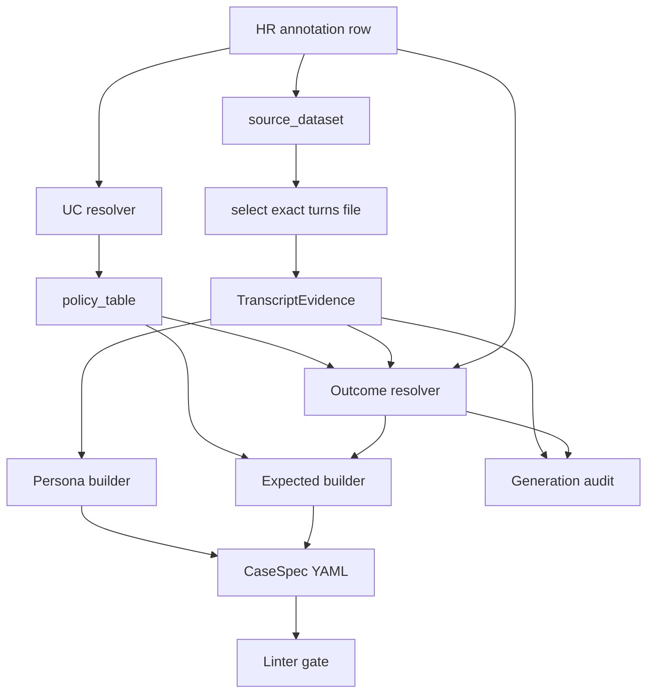
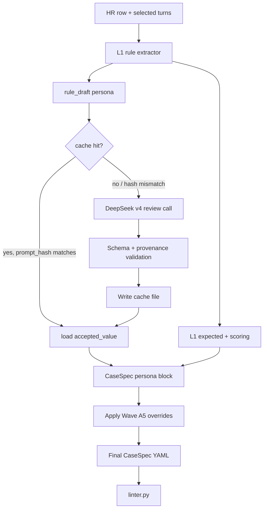

> This document is not the current runtime contract unless a docs/current/* contract or live code path confirms it.

# Interactive CaseSpec Generation Plan

Status: design contract for the next implementation waves. Code changes must follow this plan after `docs/phase5_evaluation_design.md` is updated.

## Problem

The current generator has adopted the Phase 2 policy overlay, but it still underuses transcript data. It loads turns by `conversation_id` across all `*_turns.csv` files, which can merge duplicated sessions from multiple datasets. It also resolves expected outcome mostly from policy defaults and HR hints, so a case such as `cs_interactive_001` can become `resolve` even when the selected human transcript contains unresolved account confusion and investigation/handover language.

Wave A4 addressed the first class of issue by adding selected-source transcript evidence. A second class remains: deterministic evidence rules can still misread semantics. `cs_interactive_004` is the current example. The HR row and transcript describe a contained UC-D account/login issue: the user cannot see a recently posted ad because they are signed into the wrong email/account; the human agent verifies the ad/account association and gives sign-in guidance. The generated spec incorrectly escalated because a weak regex signal treated instructional wording about the email to sign in with as async follow-up/investigation.

## Target Design

CaseSpec generation must use three inputs with explicit precedence:

1. **Phase 2 policy**: default UC behaviour, tool allocation, grounding mode, human-only tool split.
2. **Human review row**: corrected UC, secondary UCs, risk, escalation trigger hints, source dataset.
3. **Selected source transcript evidence**: the exact turns file indicated by `source_dataset`, reduced to structured evidence.

The generator must not replay raw human transcript behaviour. It must extract bounded evidence and use it only for persona construction, outcome resolution, and auditability.

For smoke and selected anchor cases, generation also needs a semantic QA layer. The QA layer may use an LLM/coding-agent reviewer, but it must produce auditable recommendations rather than directly editing generated YAML.

Persona-side free-text fields (`seed_messages`, `user_goal_summary`, `hidden_facts`) are produced by deterministic rules but reviewed by a bounded LLM layer (Wave A6, see below). The LLM layer is never permitted to influence `expected.*` or `scoring.*` fields; that scope guardrail is what keeps LLM judgement out of policy/agent-design signals.



## Wave A5 Hybrid Review Design

The full corpus stays deterministic and reproducible. High-value subsets get a structured review pass:

1. Generate CaseSpecs deterministically from policy, HR row, selected turns, and transcript evidence.
2. For every smoke case, and later selected anchor cases, assemble a review packet:
   - HR annotation row
   - selected source transcript turns
   - generated CaseSpec YAML
   - generation audit entry
   - relevant Phase 2 policy excerpt
3. Ask a reviewer to produce strict structured output:

```yaml
case_id:
source_session_id:
review_status: ok | generator_bug | policy_ambiguity | needs_override | needs_human_decision
recommended_primary_uc:
recommended_secondary_ucs:
recommended_outcome_class:
recommended_should_escalate:
recommended_escalation_trigger:
recommended_expected_tool_sequence:
recommended_bot_handling_pattern:
supporting_turn_numbers:
rationale:
confidence:
requires_policy_change:
```

4. Triage the recommendation:
   - `ok`: no change.
   - `generator_bug`: fix deterministic code and add regression coverage.
   - `policy_ambiguity`: update Phase 2 / Phase 5 docs before changing code.
   - `needs_override`: promote the recommendation into an approved entry in `case_spec_overrides.yaml` (schema v2, see Wave A6.6 below). The reviewed entry uses `status: approved` with `reviewer / date / rationale / confidence / supporting_turn_numbers` metadata.
   - `needs_human_decision`: leave the entry as `status: pending_review` in the same file with a rationale; the override is loaded into the audit log but does NOT apply to spec generation. Under `--strict-overrides` the extractor hard-fails on any spec whose `source_session_id` matches a `pending_review` entry.

Approved overrides live in `eval_interactive/case_spec_overrides.yaml` (schema v2, Wave A6.6). The override file is keyed by `source_session_id` only; `case_id_hint` is informational. Each entry declares zero or more of three blocks — `classification`, `expected`, `persona` — corresponding to the three pipeline stages at which L3 may apply. The generator records every applied override in `case-spec-generation-audit.md` and then runs linter/schema validation. The review layer must never silently mutate generated YAML.

First Wave A5 override target: `cs_interactive_012` (`source_session_id=570Q5000008hx9tIAA`). The deterministic transcript evidence sees a late request for phone/human contact and currently resolves the case as escalation. Human semantic review says this should be a resolve-first UC-FP case: the bot should retrieve safe account/listing/moderation context, explain why the kitten ad was deleted, provide policy-grounded next steps, and escalate only as a contingency if the explanation cannot be produced or is rejected. This reviewed decision is preserved as a `status: approved` entry that declares both a `classification` block (`primary_uc=UC-FP, secondary_ucs=[UC-K]`) and an `expected` block (`outcome_class=resolve, should_escalate=false, …`).

## Wave A6 LLM Persona Review Design

Wave A5 fixed `expected.*` drift via approved overrides, but persona-side free-text fields are still rule-extracted and still leak greetings/closings into `seed_messages` (see `cs_interactive_012`: `Hi Jason`, `Thank you and happy new year`, `Ok pls look in to this as soon as possible pls`). Tightening regex heuristics further is brittle; the missing capability is *issue-relevance judgement*, not pattern matching.

Wave A6 introduces a bounded LLM review layer that improves persona free-text without mutating any `expected.*` / `scoring.*` field, and without making regeneration non-deterministic.

### Trust boundary

| Layer | Owner | Fields it may write | Stability mechanism |
|-------|-------|---------------------|---------------------|
| L1 rules + policy table | deterministic Python | `expected.*`, `scoring.*`, `form_context.*`, primary/secondary UC, tools, all derived flags | reproducible from inputs |
| L2 LLM persona review (Wave A6) | DeepSeek v4 Pro (`deepseek-v4-pro`) | `persona.seed_messages`, `persona.user_goal_summary`, `persona.hidden_facts`, `persona.verbosity` (recomputed from new seeds) | cached per `source_session_id`, cache file committed |
| L3 approved overrides (Wave A5/A6.6) | human reviewer | any `classification.*`, any `expected.*`, any `persona.*` (allow-listed) | applied at three stages: `classification` BEFORE policy lookup, `expected` AFTER L1 derivation, `persona` AFTER L2 cache. Always wins regardless of stage. |

The LLM is **forbidden** from proposing values for: `outcome_class`, `should_escalate`, `escalation_trigger`, `primary_uc`, `secondary_ucs`, `expected_tool_sequence`, `forbidden_tools`, `grounding_mode`, `bot_handling_pattern`, `allow_bot_resolution`, `risk_level`, `max_turns`, `answer_must_not_contain`, anything under `scoring`, anything under `form_context`. Validation rejects any LLM response that includes those keys.

This guardrail is the entire reason the LLM layer cannot mislead agent-design or scoring decisions: those signals never flow through it.

### L3 override stages

L3 overrides (Wave A6.6 unified registry) declare zero or more of three blocks. Each block corresponds to a pipeline stage where the override is applied:

1. **`classification` block** — applied **before** the per-UC policy lookup, inside `_build_case_spec` step (1). Allowed keys: `primary_uc`, `secondary_ucs`. Replaces the HR-derived UC pair so every downstream policy-driven derivation (forbidden tools, expected tool sequence, allow_bot_resolution, max_turns, bot_handling_pattern, …) sees the corrected UC. This is the home for the eleven Wave A2.1 UC-B reclassification entries that previously lived inline in `extractor.py:UC_B_RECLASSIFICATION_OVERRIDES`.
2. **`expected` block** — applied **after** L1 derivation, at the same point as the Wave A5 override (extractor step 7). Allowed keys: any subset of `outcome_class`, `should_escalate`, `escalation_trigger`, `allow_bot_resolution`, `bot_handling_pattern`, `risk_level`, `expected_tool_sequence`, `forbidden_tools`, `grounding_mode`, `answer_must_not_contain`, `max_turns`. Writing `primary_uc` or `secondary_ucs` here is a hard validation error — those belong in the `classification` block.
3. **`persona` block** — applied **after** L2 cache application and after rule-based persona construction. Allowed keys: `seed_messages`, `user_goal_summary`, `hidden_facts`. Verbosity is recomputed from the final `seed_messages` (mirrors `_derive_verbosity`). The `_filter_redundant_hidden_facts` filter is reapplied against `form_context` so a persona override cannot reintroduce duplicate identifiers.

A single entry MAY declare more than one block. Example: the merged `cs_interactive_012` entry declares both `classification` (UC-FP / [UC-K]) and `expected` (resolve / no escalation / explicit tool sequence). Each block is applied at its own stage; the entry is not "atomic" beyond carrying shared metadata.

Lookup is by `source_session_id` only. `case_id_hint` is recorded in the audit for human cross-reference but is not part of the match key, so subset extractions and HR-row reorderings do not silently drop reviewed overrides.

Entries with `status: pending_review` are loaded into the audit log but never apply to spec generation. The default behaviour is a warn line; under `--strict-overrides` the extractor hard-fails on any spec whose `source_session_id` matches a `pending_review` entry, so partial-review states cannot ship into a regeneration run.

### Provider and credentials

- Model: DeepSeek v4 Pro (`deepseek-v4-pro`).
- API key: `DEEPSEEK_API_KEY` from the developer's environment (already configured in the maintainer's shell). The extractor MUST NOT read or log the key.
- Endpoint: DeepSeek's OpenAI-compatible chat completions endpoint.
- Temperature: `0`. Top-p: `1`. Seed: `0` where supported.
- Per-call cost ceiling: hard fail if a single response exceeds 4 KB or 90 s wall time.

### Cache contract

Cache directory: `eval_interactive/case_spec_llm_cache/`. One file per session, committed to the repo so regeneration on a clean checkout is fully reproducible.

```
eval_interactive/case_spec_llm_cache/<source_session_id>.yaml
```

Schema:

```yaml
source_session_id: string                # primary key, mirrors CaseSpec
case_id_hint: string                     # most recent case_id observed (for human readability only)
llm_model: string                        # e.g. deepseek-v4-pro
prompt_hash: string                      # sha256 of prompt + rule_draft + transcript turns used
generated_at: ISO 8601 timestamp
llm_confidence: low | medium | high
llm_rationale: string                    # one-paragraph LLM justification
rule_draft:                              # exact rule output snapshot
  seed_messages: [string]
  user_goal_summary: string
  hidden_facts: [{fact, disclose_when}]
  verbosity: terse | normal | verbose
llm_proposal:                            # LLM-suggested values, schema-checked
  seed_messages: [string]
  user_goal_summary: string
  hidden_facts: [{fact, disclose_when}]
accepted_value:                          # what the extractor will use
  seed_messages: [string]
  user_goal_summary: string
  hidden_facts: [{fact, disclose_when}]
  verbosity: terse | normal | verbose
acceptance_reason: string                # auto_accept_high_confidence | rule_fallback_low_confidence | rule_fallback_validation_failed | reviewer_pin
```

Validation rules applied to every LLM response before it is written into `accepted_value`:

1. Each proposed `seed_messages[i]` must appear (case-insensitive, after whitespace normalisation) as a substring of at least one visitor turn in the selected transcript. Fabricated quotes are rejected; the layer falls back to `rule_draft`.
2. `seed_messages` length is bounded to `1..3`.
3. `user_goal_summary` is plain English, ≤ 280 characters, contains no phrases such as "expects bot to escalate", "expects bot to resolve", "the bot should", "the agent should". Persona must remain user-only.
4. `hidden_facts` may add facts but must not duplicate any value already in `form_context` (existing duplicate filter is reapplied).
5. No keys outside the persona allow-list may appear; presence of any forbidden key fails validation.

### Acceptance gate

- `llm_confidence == high` AND validation passes → `accepted_value = llm_proposal` (auto-accept). `acceptance_reason = auto_accept_high_confidence`.
- `llm_confidence in {low, medium}` OR validation fails → `accepted_value = rule_draft`. `acceptance_reason` records the fallback reason. The reviewer sees the proposal in the cache file and may pin it manually by editing `accepted_value` and setting `acceptance_reason: reviewer_pin`.
- The cache file is committed under code review like any other source change. Diff review is the human gate.
- `case_spec_overrides.yaml` (Wave A5) is applied AFTER L2 in the pipeline and may overwrite any persona field the LLM wrote.

**Length-failure retry (Option A).** If the only validation failure is `user_goal_summary too long` (>280 chars), the reviewer sends ONE follow-up turn that quotes the prior length and asks the model to shorten it: `messages=[system, user, assistant_prev, retry_user]`. The retry response is re-validated; if it still fails (length, verbatim, or any other rule), the reviewer falls back to `rule_draft` with `acceptance_reason: rule_fallback_validation_failed` and the cache file's `validation_notes` records both the first attempt's notes (prefixed `first_attempt:`) and the retry's notes (prefixed `retry_attempt:`). System prompt rule 6 explicitly tells the model the 280-char cap so the retry path is rare.

### Pipeline integration



The extractor calls DeepSeek only on cache miss or `prompt_hash` mismatch. A `--refresh-llm <session_id>` flag forces a re-call for a single session. A `--no-llm` flag skips L2 entirely and uses `rule_draft` (used in unit tests and offline CI lanes that must not hit the network).

CLI flags exposed by `eval_interactive.scripts.regenerate_case_specs` and the `eval-interactive extract` click command:

- `--no-llm` — bypass L2 (offline/CI mode).
- `--refresh-llm-session SESSION_ID` (repeatable) — force a re-call for the listed `source_session_id`s.
- `--llm-model MODEL` (default `deepseek-v4-pro`).
- `--llm-cache-dir PATH` — committed cache directory (default `eval_interactive/case_spec_llm_cache/`).

Shared module location: the prompt template, validators, and DeepSeek client live in `eval_interactive/eval_interactive/case_spec/llm_persona_reviewer.py`. The shadow-audit script (`eval_interactive/scripts/llm_review_specs.py`) imports the same constants so there is exactly one definition of the prompt and one set of validators.

### Phasing

1. **Wave A6.1 — Shadow audit, no extractor change.**
   - Add `eval_interactive/scripts/llm_review_specs.py`. Loads every generated CaseSpec and its source turns; calls DeepSeek for a proposal; writes a side-by-side report to `qa-reports/llm-persona-review.md` (and a YAML companion `qa-reports/llm-persona-review.yaml`).
   - Production extractor and overrides are untouched. Used to pick the prompt, measure proposal-vs-rule diff distribution, and decide which sessions have material persona problems.
2. **Wave A6.2 — Cache contract + reproducibility tests.**
   - Land the cache directory and schema. Add `tests/regression/test_case_spec_llm_cache.py` that asserts: (a) two consecutive extractor runs on the same inputs and same cache produce byte-identical specs; (b) deleting a cache file then re-running with `--no-llm` falls back cleanly to `rule_draft`.
3. **Wave A6.3 — Wire L2 into `extractor.py`.**
   - Add an `llm_persona_reviewer.py` module that owns the DeepSeek client, prompt assembly, validation, and cache I/O. The extractor calls it after rule-based persona construction and before override application.
   - The DeepSeek client is import-guarded so missing credentials raise a clear error in offline lanes.
4. **Wave A6.4 — Promote `cs_interactive_012`-style fixes.**
   - Re-run the extractor with L2 enabled. For sessions where the cached high-confidence proposal matches the existing manual override (e.g. better seed_messages on `cs_interactive_012`), retire the manual persona portion of the override and rely on L2.
   - For sessions where L2 disagrees with reviewer judgement, keep the override; treat the override as the authority on the disputed fields only.
5. **Wave A6.5 — Snapshot regression tests.**
   - Pin `seed_messages` and `user_goal_summary` for at least one anchor case per UC. Tests fail loudly if a future DeepSeek behaviour change mutates the cached `accepted_value`.

## Implementation Steps

1. **Source-turn selection**
   - Add a source dataset to turns-file mapping in the extractor.
   - Load only the mapped file for each HR row.
   - Skip or hard-error when the mapped file does not contain the session.
   - Record `turns_file` and `turn_count` in the generation audit.

2. **TranscriptEvidence module**
   - Add `eval_interactive/eval_interactive/case_spec/transcript_evidence.py`.
   - Extract:
     - representative user messages
     - unresolved/confusion signals
     - human investigation signals
     - handover/case signals
     - identifier/account/ad/moderation context signals
     - user-requested-human signal
     - transcript-indicated outcome with reason

3. **Outcome resolver**
   - Add `eval_interactive/eval_interactive/case_spec/case_outcome_resolver.py`.
   - Inputs: `UcPolicy`, HR row fields, `TranscriptEvidence`.
   - Outputs: `outcome_class`, `should_escalate`, `escalation_trigger`, decision reason.
   - Preserve mandatory policy escalations for UC-G/H/I/J and out-of-scope handover classes.
   - For UC-K, choose resolve vs escalate from transcript evidence instead of hardcoded session overrides where possible.
   - For FAQ UCs, permit escalation when evidence shows strong escalation evidence: clarification exhaustion, case/handover language, human investigation/follow-up, user-requested human, or unresolved issue/account confusion paired with those signals. Do not escalate from a lone ambiguous unresolved phrase.
   - Preserve `transcript_indicated_outcome=resolve` unless there is explicit hard escalation evidence. Weak investigation-like regex hits must not override a resolved transcript.

4. **Persona builder**
   - Replace first-1-to-3 visitor-turn sampling with `TranscriptEvidence.representative_user_messages`.
   - Ensure `user_goal_summary` remains user-only and never includes bot expectations.
   - Keep duplicate identifier facts out of `hidden_facts` when they are already present in `form_context`.

5. **Audit and lint**
   - Extend `case-spec-generation-audit.md` with selected file, evidence flags, and final outcome rationale.
   - Extend linter rules for:
     - source-dataset turn provenance
     - missing selected turns
     - policy-forced resolve despite strong escalation evidence
     - escalation outcome without handover/case sequence

6. **Regression tests**
   - Pin `cs_interactive_001`: source file must be `badcase_turns.csv`; transcript evidence must detect unresolved/account-confusion/investigation signals; final outcome must be justified by evidence.
   - Pin `cs_interactive_004`: source file must be `badcase_turns.csv`; transcript evidence must indicate resolve; final spec must be UC-D resolve with no `request_handover`.
   - Pin `cs_interactive_012`: approved override must force resolve-first UC-FP behaviour despite the late human/phone request in the source transcript.
   - Pin `cs_interactive_015`: UC-B reclassification remains stable.
   - Pin `cs_interactive_040`: UC-K technical defect escalates with `intake_complete_for_uc_k`.
   - Add one clean UC-C resolution case to prevent over-escalation.

7. **Smoke/anchor review artifacts**
   - Add a smoke review report at `qa-reports/smoke-case-review.md`.
   - Add a machine-readable companion, if useful, at `qa-reports/smoke-case-review.yaml`.
   - Review every current smoke case using the packet described above.
   - Categorize each case as `ok`, `generator_bug`, `policy_ambiguity`, `needs_override`, or `needs_human_decision`.

8. **Approved overrides**
   - Add `eval_interactive/case_spec_overrides.yaml` only for case-specific corrections that cannot be generalized safely.
   - Each override must include changed fields, rationale, supporting turn numbers, reviewer/source, date, and confidence.
   - The extractor must apply overrides after deterministic generation and include them in audit output.
   - Add the initial `cs_interactive_012` override:
     - `primary_uc: UC-FP`
     - `secondary_ucs: [UC-K]`
     - `outcome_class: resolve`
     - `should_escalate: false`
     - `escalation_trigger: null`
     - `expected_tool_sequence: [get_customer_context, search_knowledge, resolve_article, record_outcome]`
     - rationale: resolve-first ad deletion explanation is possible if context retrieval returns a safe deletion/moderation reason; late human request is a failure-path signal, not the desired first outcome.

9. **Regeneration**
   - Run clean CaseSpec regeneration.
   - Run linter over generated anchor/promotion/exploration specs.
   - Update regeneration diff or review report with before/after counts and the decision rationale for the pinned cases.

10. **Wave A6 LLM persona reviewer**
    - Add `eval_interactive/scripts/llm_review_specs.py` (Wave A6.1 shadow audit). Output: `qa-reports/llm-persona-review.md` and `qa-reports/llm-persona-review.yaml`.
    - Add `eval_interactive/eval_interactive/case_spec/llm_persona_reviewer.py`. Owns DeepSeek v4 client, prompt template, schema/provenance validation, and cache file I/O. Reads the API key from `DEEPSEEK_API_KEY`.
    - Add cache directory `eval_interactive/case_spec_llm_cache/` with one YAML file per `source_session_id`. Files are committed to the repo and reviewed as part of normal PRs.
    - Wire L2 into `extractor.py`: rule-based persona → cache lookup by `(source_session_id, prompt_hash)` → on miss, DeepSeek call + validation + cache write → `accepted_value` flows into `Persona`. Override application (Wave A5) runs AFTER L2.
    - Hard scope guardrail: validation rejects any LLM response containing keys outside the persona allow-list (`seed_messages`, `user_goal_summary`, `hidden_facts`, `verbosity`). Forbidden keys include all of `expected.*`, `scoring.*`, `form_context.*`, `primary_uc`, `secondary_ucs`.
    - Add CLI flags `--no-llm` (force rule_draft, used in offline tests) and `--refresh-llm <session_id>` (force a single re-call).
    - Tests: reproducibility (`tests/regression/test_case_spec_llm_cache.py`), forbidden-key rejection, fabricated-quote rejection, snapshot tests for at least one anchor case per UC.

11. **Wave A6.6 unified override registry — schema v2, classification stage, source_session_id-only keys, --strict-overrides flag.**
    - Migrate `eval_interactive/case_spec_overrides.yaml` to schema v2 (`version: 2`). Reading a v1 file fails loudly with a one-line migration message. Each entry is keyed by `source_session_id`; `case_id_hint` is informational. `status` is `approved` or `pending_review`. Approved entries require `reviewer / date / rationale / confidence / source` and a non-empty `supporting_turn_numbers` UNLESS `migrated_from_legacy: true`. Each entry may declare zero or more of three blocks: `classification` (`primary_uc`, `secondary_ucs`), `expected` (any subset of the L1-derived expected fields except `primary_uc` / `secondary_ucs`), and `persona` (`seed_messages`, `user_goal_summary`, `hidden_facts`).
    - Touch `eval_interactive/eval_interactive/case_spec/extractor.py`:
      - Delete `UC_B_RECLASSIFICATION_OVERRIDES` and `_apply_uc_override`. The eleven legacy entries migrate into v2 with `migrated_from_legacy: true`.
      - Replace `_load_case_spec_overrides` with a v2 loader that returns `applied: dict[str, OverrideEntry]` keyed by `source_session_id` plus `pending: list[OverrideEntry]`. Hard-fail on duplicate session, unknown UC, `expected.primary_uc / expected.secondary_ucs`, or disallowed `persona` keys.
      - Apply classification overrides BEFORE policy lookup; apply expected overrides at the existing Wave A5 timing; apply persona overrides AFTER L2 cache and after the rule-based persona is finalised, then recompute verbosity and re-apply the redundancy filter.
      - Add audit fields `override_classification_applied`, `override_expected_applied`, `override_persona_applied`, `pending_overrides_for_session`.
      - Add `strict_overrides: bool = False` parameter; when true, raise on any spec whose `source_session_id` matches a `pending_review` entry.
    - Touch `eval_interactive/eval_interactive/case_spec/llm_persona_reviewer.py`:
      - Drop `case_id` from the rendered user prompt body (and from the renderer's signature). The cache-key invariance under HR row reordering is the explicit goal of this change.
      - Recompute `PROMPT_TEMPLATE_SHA256` accordingly. The locked snapshot test moves to the new constant.
    - Touch `eval_interactive/scripts/llm_review_specs.py`: drop `case_id` from the call site that renders the user prompt. Markdown reports may continue to show `case_id` for human readability.
    - Touch `eval_interactive/eval_interactive/cli.py` and `eval_interactive/scripts/regenerate_case_specs.py`: add `--strict-overrides` flag; thread through to `extract_case_specs(..., strict_overrides=...)`.
    - Regenerate the three smoke cache files (`570Q5000008hx9tIAA`, `570Q5000008TMmvIAG`, `570Q5000008l7flIAA`) so their `prompt_hash` reflects the case-id-less prompt body.
    - Update `tests/regression/test_case_spec_overrides.py` (v2-aware tests covering schema, validation, classification stage, expected stage, persona stage, pending semantics, strict mode), `test_case_spec_llm_cache.py` (drop case_id assumptions), and `test_case_spec_persona_snapshots.py` (new prompt sha256 + new cache contents).

## Acceptance Criteria

- No CaseSpec generation path merges turns from multiple datasets for a single HR row.
- Every generated CaseSpec has an audit record with source turns file and evidence summary.
- `cs_interactive_001` can no longer silently become policy-default `resolve`; if generated as `resolve`, the audit must explicitly justify why escalation evidence was rejected.
- `cs_interactive_004` must generate as a contained UC-D resolve case: `outcome_class=resolve`, `should_escalate=false`, `escalation_trigger=null`, and no `request_handover`.
- `cs_interactive_012` must regenerate through the approved override as a resolve-first UC-FP case: `outcome_class=resolve`, `should_escalate=false`, `escalation_trigger=null`, and no `request_handover`.
- Weak false-positive transcript signals must not override `transcript_indicated_outcome=resolve`.
- All smoke cases have structured review records before their specs are treated as high-confidence regression fixtures.
- Approved manual/LLM/coding-agent corrections are applied through an override file and audit trail, not by silent direct edits to generated YAML.
- Human-only tools remain absent from per-case `forbidden_tools` and covered by global L1 checks.
- Linter and regression tests fail on the old shallow-turn behaviour.
- Wave A6 LLM persona reviewer never proposes or writes any `expected.*`, `scoring.*`, `form_context.*`, `primary_uc`, or `secondary_ucs` value; validation hard-fails on any response that includes those keys.
- Every persona field used in a final CaseSpec is traceable: either it equals `rule_draft` (when L2 was skipped, low-confidence, or validation failed), the cached `llm_proposal` (auto-accepted at high confidence), or the value applied by an approved override.
- Two consecutive `extract_case_specs` runs on identical inputs (HR CSV, turns, override file, cache directory) produce byte-identical YAML for every spec.
- Re-running the extractor with `--no-llm` produces specs whose persona blocks equal `rule_draft` and never call DeepSeek.
- The cache file for `cs_interactive_012` shows `seed_messages` that reflect the actual issue (the kitten ad deletion) rather than greetings/closings, with `acceptance_reason: auto_accept_high_confidence` or `reviewer_pin`.
- Snapshot tests pin persona seed_messages / user_goal_summary for at least one anchor case per UC and fail on silent LLM behaviour drift.

### Wave A6.6 acceptance criteria

- `UC_B_RECLASSIFICATION_OVERRIDES` is removed from `eval_interactive/eval_interactive/case_spec/extractor.py`. The eleven legacy entries are reachable only through `case_spec_overrides.yaml`.
- All case-specific corrections — UC reclassification, expected-field overrides, and persona pins — live in a single file `eval_interactive/case_spec_overrides.yaml` (schema v2, `version: 2`). Reading a v1 file raises `ValueError` with a migration hint pointing at this section.
- The override file is keyed by `source_session_id` alone; `case_id_hint` is recorded for human cross-reference but is not part of the match key.
- `prompt_hash` on the L2 cache files is invariant under HR-row reordering (no positional `case_id` in the prompt body). The new locked `PROMPT_TEMPLATE_SHA256` is verified by `test_snapshot_prompt_sha256_locked`.
- An `approved` override that lacks any of `reviewer`, `date`, `rationale`, `confidence`, `source` fails loader validation. An `approved` override with empty `supporting_turn_numbers` fails UNLESS `migrated_from_legacy: true`.
- A `pending_review` override is loaded into the audit (`pending_overrides_for_session: [...]`) but does not modify the spec. The default behaviour is a warn line; `--strict-overrides` raises a `ValueError` on any spec whose session matches a `pending_review` entry.
- L3 may write any `expected.*` OR `persona.*` field within the documented allow-lists (scope widened from Wave A5). Writing `primary_uc` or `secondary_ucs` inside an `expected` block is a hard validation error with a hint to use `classification` instead.
