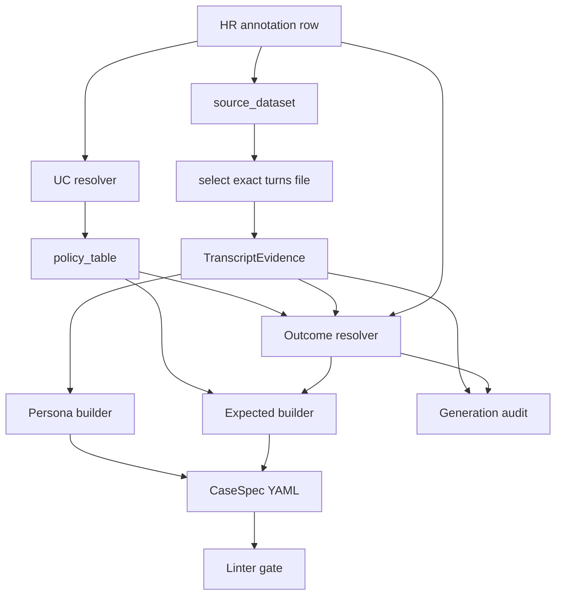

# Interactive CaseSpec Generation Plan

Status: design contract for the next implementation waves. Code changes must follow this plan after `docs/phase5_evaluation_design.md` is updated.

## Problem

The current generator has adopted the Phase 2 policy overlay, but it still underuses transcript data. It loads turns by `conversation_id` across all `*_turns.csv` files, which can merge duplicated sessions from multiple datasets. It also resolves expected outcome mostly from policy defaults and HR hints, so a case such as `cs_interactive_001` can become `resolve` even when the selected human transcript contains unresolved account confusion and investigation/handover language.

Wave A4 addressed the first class of issue by adding selected-source transcript evidence. A second class remains: deterministic evidence rules can still misread semantics. `cs_interactive_004` is the current example. The HR row and transcript describe a contained UC-D account/login issue: the user cannot see a recently posted ad because they are signed into the wrong email/account; the human agent verifies the ad/account association and gives sign-in guidance. The generated spec incorrectly escalated because a weak regex signal treated instructional wording about the email to sign in with as async follow-up/investigation.

## Target Design

CaseSpec generation must use three inputs with explicit precedence:

1. **Phase 2 policy**: default UC behaviour, tool allocation, grounding mode, human-only tool split.
2. **Human review row**: corrected UC, secondary UCs, risk, escalation trigger hints, source dataset.
3. **Selected source transcript evidence**: the exact turns file indicated by `source_dataset`, reduced to structured evidence.

The generator must not replay raw human transcript behaviour. It must extract bounded evidence and use it only for persona construction, outcome resolution, and auditability.

For smoke and selected anchor cases, generation also needs a semantic QA layer. The QA layer may use an LLM/coding-agent reviewer, but it must produce auditable recommendations rather than directly editing generated YAML.



## Wave A5 Hybrid Review Design

The full corpus stays deterministic and reproducible. High-value subsets get a structured review pass:

1. Generate CaseSpecs deterministically from policy, HR row, selected turns, and transcript evidence.
2. For every smoke case, and later selected anchor cases, assemble a review packet:
   - HR annotation row
   - selected source transcript turns
   - generated CaseSpec YAML
   - generation audit entry
   - relevant Phase 2 policy excerpt
3. Ask a reviewer to produce strict structured output:

```yaml
case_id:
source_session_id:
review_status: ok | generator_bug | policy_ambiguity | needs_override | needs_human_decision
recommended_primary_uc:
recommended_secondary_ucs:
recommended_outcome_class:
recommended_should_escalate:
recommended_escalation_trigger:
recommended_expected_tool_sequence:
recommended_bot_handling_pattern:
supporting_turn_numbers:
rationale:
confidence:
requires_policy_change:
```

4. Triage the recommendation:
   - `ok`: no change.
   - `generator_bug`: fix deterministic code and add regression coverage.
   - `policy_ambiguity`: update Phase 2 / Phase 5 docs before changing code.
   - `needs_override`: add an approved case-level override with rationale and supporting turn numbers.
   - `needs_human_decision`: leave generated YAML unchanged until reviewed.

Approved overrides must live in a small machine-readable file such as `eval_interactive/case_spec_overrides.yaml`. The generator applies them after deterministic generation, records them in `case-spec-generation-audit.md`, and then runs linter/schema validation. The review layer must never silently mutate generated YAML.

## Implementation Steps

1. **Source-turn selection**
   - Add a source dataset to turns-file mapping in the extractor.
   - Load only the mapped file for each HR row.
   - Skip or hard-error when the mapped file does not contain the session.
   - Record `turns_file` and `turn_count` in the generation audit.

2. **TranscriptEvidence module**
   - Add `eval_interactive/eval_interactive/case_spec/transcript_evidence.py`.
   - Extract:
     - representative user messages
     - unresolved/confusion signals
     - human investigation signals
     - handover/case signals
     - identifier/account/ad/moderation context signals
     - user-requested-human signal
     - transcript-indicated outcome with reason

3. **Outcome resolver**
   - Add `eval_interactive/eval_interactive/case_spec/case_outcome_resolver.py`.
   - Inputs: `UcPolicy`, HR row fields, `TranscriptEvidence`.
   - Outputs: `outcome_class`, `should_escalate`, `escalation_trigger`, decision reason.
   - Preserve mandatory policy escalations for UC-G/H/I/J and out-of-scope handover classes.
   - For UC-K, choose resolve vs escalate from transcript evidence instead of hardcoded session overrides where possible.
   - For FAQ UCs, permit escalation when evidence shows strong escalation evidence: clarification exhaustion, case/handover language, human investigation/follow-up, user-requested human, or unresolved issue/account confusion paired with those signals. Do not escalate from a lone ambiguous unresolved phrase.
   - Preserve `transcript_indicated_outcome=resolve` unless there is explicit hard escalation evidence. Weak investigation-like regex hits must not override a resolved transcript.

4. **Persona builder**
   - Replace first-1-to-3 visitor-turn sampling with `TranscriptEvidence.representative_user_messages`.
   - Ensure `user_goal_summary` remains user-only and never includes bot expectations.
   - Keep duplicate identifier facts out of `hidden_facts` when they are already present in `form_context`.

5. **Audit and lint**
   - Extend `case-spec-generation-audit.md` with selected file, evidence flags, and final outcome rationale.
   - Extend linter rules for:
     - source-dataset turn provenance
     - missing selected turns
     - policy-forced resolve despite strong escalation evidence
     - escalation outcome without handover/case sequence

6. **Regression tests**
   - Pin `cs_interactive_001`: source file must be `badcase_turns.csv`; transcript evidence must detect unresolved/account-confusion/investigation signals; final outcome must be justified by evidence.
   - Pin `cs_interactive_004`: source file must be `badcase_turns.csv`; transcript evidence must indicate resolve; final spec must be UC-D resolve with no `request_handover`.
   - Pin `cs_interactive_015`: UC-B reclassification remains stable.
   - Pin `cs_interactive_040`: UC-K technical defect escalates with `intake_complete_for_uc_k`.
   - Add one clean UC-C resolution case to prevent over-escalation.

7. **Smoke/anchor review artifacts**
   - Add a smoke review report at `qa-reports/smoke-case-review.md`.
   - Add a machine-readable companion, if useful, at `qa-reports/smoke-case-review.yaml`.
   - Review every current smoke case using the packet described above.
   - Categorize each case as `ok`, `generator_bug`, `policy_ambiguity`, `needs_override`, or `needs_human_decision`.

8. **Approved overrides**
   - Add `eval_interactive/case_spec_overrides.yaml` only for case-specific corrections that cannot be generalized safely.
   - Each override must include changed fields, rationale, supporting turn numbers, reviewer/source, date, and confidence.
   - The extractor must apply overrides after deterministic generation and include them in audit output.

9. **Regeneration**
   - Run clean CaseSpec regeneration.
   - Run linter over generated anchor/promotion/exploration specs.
   - Update regeneration diff or review report with before/after counts and the decision rationale for the pinned cases.

## Acceptance Criteria

- No CaseSpec generation path merges turns from multiple datasets for a single HR row.
- Every generated CaseSpec has an audit record with source turns file and evidence summary.
- `cs_interactive_001` can no longer silently become policy-default `resolve`; if generated as `resolve`, the audit must explicitly justify why escalation evidence was rejected.
- `cs_interactive_004` must generate as a contained UC-D resolve case: `outcome_class=resolve`, `should_escalate=false`, `escalation_trigger=null`, and no `request_handover`.
- Weak false-positive transcript signals must not override `transcript_indicated_outcome=resolve`.
- All smoke cases have structured review records before their specs are treated as high-confidence regression fixtures.
- Approved manual/LLM/coding-agent corrections are applied through an override file and audit trail, not by silent direct edits to generated YAML.
- Human-only tools remain absent from per-case `forbidden_tools` and covered by global L1 checks.
- Linter and regression tests fail on the old shallow-turn behaviour.
