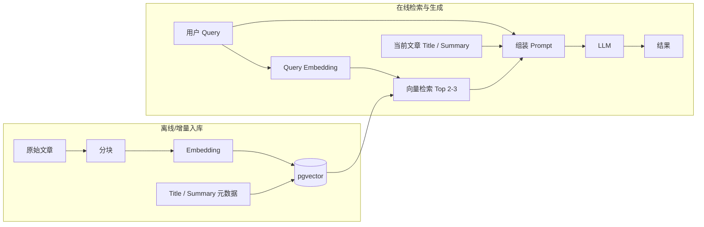

# 问题检索方案计划（pgvector）

本文档描述基于 **PostgreSQL + pgvector** 的「文章分块向量入库 → 语义召回 → 大模型综合生成」检索方案，用于客服/知识场景下的问题理解与答案生成。

---

## 1. 目标与范围

| 维度 | 说明 |
|------|------|
| **目标** | 用户自然语言问题经语义检索命中相关知识片段，再结合文章元信息，由模型输出结构化、可溯源的回答或下一步动作建议。 |
| **向量库** | **pgvector**（与现有 Cloud SQL PostgreSQL 同栈，运维成本低；规模增大时可评估索引与分表策略）。 |
| **不在本文展开** | Salesforce Knowledge 权威元数据同步、Omni 转人工、具体 Embedding 型号与供应商锁定（仅列选型要点）。 |

---

## 2. 总体架构

- **入库链路**：文章内容分块 → 向量化 → 写入 pgvector（块级一行或多行，关联 `article_id`、块序号等）。
- **在线链路**：Query 向量化 → 在 pgvector 中 **召回 2～3 条** 最相近块 → 将 **Query + Title + Summary + 召回文本** 一并喂给模型 → 得到最终输出。

---

## 3. 阶段一：文章内容分块与向量存储（pgvector）

### 3.1 数据对象

建议在逻辑上区分两层（可同库不同表）：

| 层级 | 内容 | 用途 |
|------|------|------|
| **文章级** | `article_id`、`title`、`summary`（可由规则/小模型预生成）、版本、发布状态、来源 URL 等 | 在线组装 Prompt 的元信息；过滤未发布/过期文档 |
| **块级** | `chunk_id`、`article_id`、`chunk_index`、`chunk_text`、`embedding`、`token_count`、可选 `section_heading` | 向量检索主表 |

### 3.2 分块策略（建议）

| 项 | 建议 |
|----|------|
| **粒度** | 按语义段落或固定 token 窗口滑动重叠（如 256～512 tokens，重叠 10%～20%），避免切断表格/步骤列表 |
| **元数据** | 每块保留所属标题路径（breadcrumb），便于模型引用与日志排查 |
| **去重** | 同一 URL/版本变更时按 `article_id + version` 失效旧块或软删除，避免召回过期内容 |

### 3.3 Embedding

- 入库与在线 Query **必须使用同一模型与同一向量维度**，并固定归一化策略（若模型输出已归一化则检索侧一致即可）。
- 调用方式：自建微服务封装 Vertex / 其他 API，或批处理离线打向量后 bulk insert。

### 3.4 pgvector 表结构与索引（示意）

- 列：`embedding vector(1536)`（维度按所选模型调整）。
- 索引：数据量较小时可先 **IVFFlat** 或 **HNSW**（PostgreSQL/pgvector 版本需满足）；`lists` / `m` / `ef_construction` 需结合数据量与 QPS 压测调参。
- 约束：对 `(article_id, chunk_index)` 建唯一约束，便于幂等更新。

### 3.5 写入与更新流程

1. 拉取/同步文章正文与 `title`、`summary`。
2. 分块 → 批量请求 Embedding API（注意速率与重试）。
3. 事务内：更新文章级元数据 → 删除或标记旧块 → 插入新块向量。
4. 记录批次号与错误明细，支持部分失败重跑。

---

## 4. 阶段二：在线检索与模型生成

### 4.1 输入构成（按需求固定）

向模型提供的上下文应至少包含：

| 输入 | 说明 |
|------|------|
| **Query** | 用户当前问题（可含多轮需拼接简短对话摘要，本文不展开对话状态机） |
| **Title** | 当前聚焦知识文章的标题；若无单一文章上下文，可为「检索范围内得分最高的文章标题」或留空并说明 |
| **Summary** | 该文章的摘要，用于压缩全局语义、减少仅依赖碎片的偏差 |
| **Vector 结果（2～3 条）** | 从 pgvector 按相似度取 Top **2 或 3** 条 **chunk 文本**（可附带 `article_id`、相似度分数、块序号供模型引用，禁止杜撰未出现内容） |

### 4.2 检索步骤

1. 对 **Query**（必要时加业务前缀，如「客服知识库检索：」）做 Embedding。
2. SQL：`ORDER BY embedding <=> query_embedding LIMIT 3`（或 `<#>` 余弦，取决于距离算子与索引配置）。
3. **可选**：按 `article_id` 去重（同一文章只保留最高分块），或先做文章级粗排再块级精排（数据量大时）。
4. **过滤**：仅召回 `published = true` 且在有效期内的块。

### 4.3 Prompt 设计要点

- 明确要求：答案须基于给定 chunk，**无法从材料支持时须说明并建议转人工或给自助链接占位符**。
- 要求输出中标注引用（如 `[chunk_index]` 或 `article_id`），便于审计与前端展示。
- 控制总 token：Summary + 2～3 块 + Query 不超过模型上下文上限，必要时对 Summary/块做截断策略（尾部优先保留 Query 相关句）。

### 4.4 输出形态

- **直接回答**：面向用户的自然语言答复。
- **结构化附加字段**（若与 Bot 工具链对接）：`confidence`、`used_chunk_ids`、`suggested_handover` 等，由产品协议定义。

---

## 5. 质量、观测与安全

| 类别 | 项 |
|------|-----|
| **评估** | 离线集：命中率（Top-3 是否含标准答案文档）、答案忠实度（是否幻觉）、CSAT  proxy |
| **日志** | 记录 `query_hash`、召回 id 列表、相似度、模型版本、延迟 |
| **安全** | Prompt 注入防护；知识库内容 ACL（若有多租户/分区）在 SQL 层过滤 |

---

## 6. 里程碑建议

| 阶段 | 交付物 |
|------|--------|
| M1 | pgvector 扩展启用、块表与索引、最小写入脚本跑通 |
| M2 | 批量入库流水线 + 监控与失败重试 |
| M3 | 在线检索 API + 固定 Prompt 模板 + LLM 联调 |
| M4 | 压测调参（索引、连接池、批嵌入）与离线评估集第一轮 |

---

## 7. 待决策项（TBD）

- Embedding 具体型号与是否 GCP 托管统一。
- Top-K 固定为 2 还是 3，是否引入轻量 reranker（交叉编码器）再截断到 2～3 条。
- 与 Salesforce Knowledge 的 **URL 权威展示** 对齐方式（见 PRD 中 Knowledge 双通道描述）。

---

*文档版本：v0.1 | 存储路径：`docs/Data/problem_retrieval_solution_plan_pgvector.md`*
