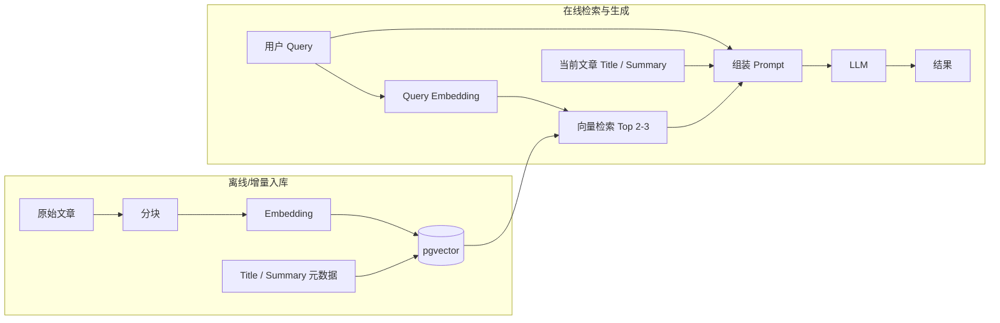

# 问题检索方案计划（pgvector）

本文档描述基于 **PostgreSQL + pgvector** 的「文章分块向量入库 → 语义召回 → 大模型综合生成」检索方案，用于客服/知识场景下的问题理解与答案生成。

---

## 1. 目标与范围

| 维度 | 说明 |
|------|------|
| **目标** | 用户自然语言问题经语义检索命中相关知识片段，再结合文章元信息，由模型输出结构化、可溯源的回答或下一步动作建议。 |
| **向量库** | **pgvector**（与现有 Cloud SQL PostgreSQL 同栈，运维成本低；规模增大时可评估索引与分表策略）。 |
| **不在本文展开** | Salesforce Knowledge 权威元数据同步、Omni 转人工、具体 Embedding 型号与供应商锁定（仅列选型要点）。 |

---

## 2. 总体架构



- **入库链路**：文章内容分块 → 向量化 → 写入 pgvector（块级一行或多行，关联 `article_id`、块序号等）。
- **在线链路**：Query 向量化 → 在 pgvector 中 **召回 2～3 条** 最相近块 → 将 **Query + Title + Summary + 召回文本** 一并喂给模型 → 得到最终输出。

---

## 3. 阶段一：文章内容分块与向量存储（pgvector）

### 3.1 数据对象

建议在逻辑上区分两层（可同库不同表）：

| 层级 | 内容 | 用途 |
|------|------|------|
| **文章级** | `article_id`、`title`、`summary`（可由规则/小模型预生成）、版本、发布状态、来源 URL 等 | 在线组装 Prompt 的元信息；过滤未发布/过期文档 |
| **块级** | `chunk_id`、`article_id`、`chunk_index`、`chunk_text`、`embedding`、`token_count`、可选 `section_heading` | 向量检索主表 |

### 3.2 分块策略（建议）

| 项 | 建议 |
|----|------|
| **粒度** | 按语义段落或固定 token 窗口滑动重叠（如 256～512 tokens，重叠 10%～20%），避免切断表格/步骤列表 |
| **元数据** | 每块保留所属标题路径（breadcrumb），便于模型引用与日志排查 |
| **去重** | 同一 URL/版本变更时按 `article_id + version` 失效旧块或软删除，避免召回过期内容 |

### 3.3 Embedding

- 入库与在线 Query **必须使用同一模型与同一向量维度**，并固定归一化策略（若模型输出已归一化则检索侧一致即可）。
- 调用方式：自建微服务封装 Vertex / 其他 API，或批处理离线打向量后 bulk insert。

### 3.4 pgvector 表结构与索引（示意）

- 列：`embedding vector(1536)`（维度按所选模型调整）。
- 索引：数据量较小时可先 **IVFFlat** 或 **HNSW**（PostgreSQL/pgvector 版本需满足）；`lists` / `m` / `ef_construction` 需结合数据量与 QPS 压测调参。
- 约束：对 `(article_id, chunk_index)` 建唯一约束，便于幂等更新。

### 3.5 写入与更新流程

1. 拉取/同步文章正文与 `title`、`summary`。
2. 分块 → 批量请求 Embedding API（注意速率与重试）。
3. 事务内：更新文章级元数据 → 删除或标记旧块 → 插入新块向量。
4. 记录批次号与错误明细，支持部分失败重跑。

---

## 4. 阶段二：在线检索与模型生成

### 4.1 输入构成（按需求固定）

向模型提供的上下文应至少包含：

| 输入 | 说明 |
|------|------|
| **Query** | 用户当前问题（可含多轮需拼接简短对话摘要，本文不展开对话状态机） |
| **Title** | 当前聚焦知识文章的标题；若无单一文章上下文，可为「检索范围内得分最高的文章标题」或留空并说明 |
| **Summary** | 该文章的摘要，用于压缩全局语义、减少仅依赖碎片的偏差 |
| **Vector 结果（2～3 条）** | 从 pgvector 按相似度取 Top **2 或 3** 条 **chunk 文本**（可附带 `article_id`、相似度分数、块序号供模型引用，禁止杜撰未出现内容） |

### 4.2 检索步骤

1. 对 **Query**（必要时加业务前缀，如「客服知识库检索：」）做 Embedding。
2. SQL：`ORDER BY embedding <=> query_embedding LIMIT 3`（或 `<#>` 余弦，取决于距离算子与索引配置）。
3. **可选**：按 `article_id` 去重（同一文章只保留最高分块），或先做文章级粗排再块级精排（数据量大时）。
4. **过滤**：仅召回 `published = true` 且在有效期内的块。

### 4.3 Prompt 设计要点

- 明确要求：答案须基于给定 chunk，**无法从材料支持时须说明并建议转人工或给自助链接占位符**。
- 要求输出中标注引用（如 `[chunk_index]` 或 `article_id`），便于审计与前端展示。
- 控制总 token：Summary + 2～3 块 + Query 不超过模型上下文上限，必要时对 Summary/块做截断策略（尾部优先保留 Query 相关句）。

### 4.4 输出形态

- **直接回答**：面向用户的自然语言答复。
- **结构化附加字段**（若与 Bot 工具链对接）：`confidence`、`used_chunk_ids`、`suggested_handover` 等，由产品协议定义。

---

## 5. 质量、观测与安全

| 类别 | 项 |
|------|-----|
| **评估** | 离线集：命中率（Top-3 是否含标准答案文档）、答案忠实度（是否幻觉）、CSAT  proxy |
| **日志** | 记录 `query_hash`、召回 id 列表、相似度、模型版本、延迟 |
| **安全** | Prompt 注入防护；知识库内容 ACL（若有多租户/分区）在 SQL 层过滤 |

---

## 6. 里程碑建议

| 阶段 | 交付物 |
|------|--------|
| M1 | pgvector 扩展启用、块表与索引、最小写入脚本跑通 |
| M2 | 批量入库流水线 + 监控与失败重试 |
| M3 | 在线检索 API + 固定 Prompt 模板 + LLM 联调 |
| M4 | 压测调参（索引、连接池、批嵌入）与离线评估集第一轮 |

---

# 7. pgvector 索引策略补充

这块我会分成两件事来定：

1. **pgvector 索引策略：IVFFlat 还是 HNSW**
2. **`faq_miss score_threshold=3.5` 该不该直接作为 Retrieval 的判定阈值**

先给结论：

## 结论

对于你这个**客服 agent 知识库检索**场景，我建议：

* **默认选 HNSW**
* **距离度量优先用 cosine**
* **不要把 `score_threshold=3.5` 直接当 pgvector 检索阈值**
* 改成 **两段式 miss 判定**：

  * **Retrieval miss**：基于向量相似度 / 候选分布 / metadata 命中情况
  * **Answer miss**：基于 reranker / LLM grounding score，例如 5 分制的 `3.5`

原因是：

* pgvector 官方明确说明：**HNSW 的 speed-recall tradeoff 优于 IVFFlat**，但建索引更慢、吃更多内存；IVFFlat 建得更快、更省内存，但检索效果和速度-召回折中不如 HNSW。([GitHub][1])
* 你的文档本身就是客服/知识场景，并且在线链路要把召回结果喂给模型生成，这类场景通常更怕**漏召回**而不是纯索引构建时间。
* pgvector 的 cosine 相关分数里，**cosine distance** 用 `<=>`，而 **cosine similarity = 1 - cosine distance**。因此 `3.5` 这种值**不可能**是 cosine similarity，也不适合作为 pgvector 的原生距离阈值。([GitHub][1])

---

# 1. IVFFlat vs HNSW：怎么选

## 1.1 默认建议：客服知识库检索优先 HNSW

pgvector 官方的描述很直接：

* **HNSW**

  * 更好的 query performance / speed-recall tradeoff
  * 建索引更慢
  * 更占内存
  * 不需要像 IVFFlat 那样先靠已有数据训练聚类结构([GitHub][1])

* **IVFFlat**

  * 建索引更快
  * 更省内存
  * 但 recall / latency 折中不如 HNSW
  * 要先有数据，再建索引；并且 `lists`、`probes` 选不好，效果会明显波动([GitHub][1])

对客服 agent 来说，通常优先级是：

**漏召回代价 > 建索引慢一点的代价**

因为漏召回会直接导致：

* 回答不到点子上
* 错引政策
* 本可自助解决却误转人工
* FAQ miss 假阳性增多

所以第一版生产我建议：

## 生产默认

**HNSW + cosine**

---

## 1.2 什么情况下才优先 IVFFlat

只有下面几种情况，我才会建议先上 IVFFlat：

### 情况 A：内存预算很紧

HNSW 更吃内存，官方明确写了这一点。([GitHub][1])

### 情况 B：数据装载/重建频繁，且可接受 recall 略差

比如你每天都要大批量重建，且更关心 build speed。

### 情况 C：你只是做 very-early MVP

想快速把系统先跑起来，再后续换 HNSW。

---

# 2. 结合你的场景，该怎么判断

你现在的方案特征是：

* 客服/知识库场景
* chunk 级向量检索
* 在线召回后喂给 LLM
* 还要做 FAQ miss / handover 决策

这意味着你更在意：

* Recall@K
* Top 结果是否稳定
* filter 后还能拿到足够候选
* miss 判定别太激进

这套目标天然更偏 **HNSW**。

所以我的建议不是“看情况两边都行”，而是更明确一点：

## 你的场景建议

* **首选：HNSW**
* **备选：IVFFlat 只作为资源受限或快速 MVP 方案**

---

# 3. 具体索引怎么建

## 3.1 距离函数

如果你的 embedding 是文本 embedding，默认用：

```sql
vector_cosine_ops
```

因为 pgvector 官方把 cosine distance 作为标准支持方式之一；而 cosine similarity 可由 `1 - distance` 得到。([GitHub][1])

---

## 3.2 HNSW 推荐配置

先别一上来就过度调参，第一版建议用接近官方默认值：

```sql
CREATE INDEX CONCURRENTLY idx_kb_chunks_embedding_hnsw
ON kb_chunks USING hnsw (embedding vector_cosine_ops)
WITH (m = 16, ef_construction = 64);
```

这是 pgvector 官方给出的默认推荐起点；更高 `ef_construction` 会提升 recall，但会增加建索引时间和写入成本。([GitHub][1])

### 在线查询参数

```sql
SET LOCAL hnsw.ef_search = 100;
```

官方说明默认 `ef_search=40`，更高会带来更好的 recall，但更慢。([GitHub][1])

### 我给你的落地起点

* 普通查询：`ef_search = 80~100`
* 高风险客服问题 / 严格 filter 后查询：`ef_search = 120~200`

---

## 3.3 IVFFlat 推荐配置

如果你最终因为资源原因要上 IVFFlat，按 pgvector 官方起点来：

* `lists`

  * <= 1M rows：`rows / 1000`
  * > 1M rows：`sqrt(rows)`
* `probes`

  * 从 `sqrt(lists)` 开始([GitHub][1])

例如 300k chunks：

* `lists ≈ 300`
* `probes ≈ 17`

```sql
CREATE INDEX CONCURRENTLY idx_kb_chunks_embedding_ivf
ON kb_chunks USING ivfflat (embedding vector_cosine_ops)
WITH (lists = 300);
```

查询时：

```sql
SET LOCAL ivfflat.probes = 17;
```

但要记住：官方也明确说了，IVFFlat 要想 recall 好，有三个关键：

* 表里先要有足够数据再建索引
* `lists` 要合理
* `probes` 要合理([GitHub][1])

这意味着它更“依赖调参”，没有 HNSW 那么稳。

---

# 4. 你这个场景里，真正的坑在 filter，不在索引名字

这点非常关键。

客服知识库几乎一定会带过滤：

* locale
* market
* audience
* published
* valid_from / valid_to
* product/domain

pgvector 官方明确提醒：

对于 approximate index，**过滤是在 index scan 之后才应用的**。
如果过滤条件只匹配 10% 的行，而 `hnsw.ef_search=40`，那平均只会留下约 4 行。([GitHub][1])

这会直接造成你看到的现象：

* 明明知识库里有答案
* 但 filter 后候选不够
* 系统误判成 faq_miss

所以真正的策略应该是：

## 过滤场景下的建议

1. 给过滤列建普通索引（B-tree 等）
2. 对高频固定过滤条件做 partial index
3. 必要时按市场/语言分区
4. 对 HNSW / IVFFlat 打开 iterative scan
5. 提高 `ef_search` 或 `probes`

官方从 0.8.0 开始支持 **iterative index scans**，会在过滤后结果不够时自动继续扫描。([GitHub][1])

### 推荐打开

HNSW：

```sql
SET LOCAL hnsw.iterative_scan = strict_order;
```

如果更看重 recall：

```sql
SET LOCAL hnsw.iterative_scan = relaxed_order;
```

IVFFlat 也有类似能力。([GitHub][1])

---

# 5. `faq_miss score_threshold = 3.5` 该怎么理解

这里我先明确说：

## 不建议把 `3.5` 直接作为 pgvector retrieval 阈值

因为如果你用的是 pgvector cosine：

* distance 是 `<=>`
* similarity = `1 - distance`([GitHub][1])

那这个数值空间根本不是 3.5 这种量级。

所以 `3.5` 更像是下面两类之一：

### 可能性 A：5 分制 reranker / LLM grading 分数

例如：

* 1 = 完全不相关
* 3 = 有点相关但不够支撑回答
* 5 = 高度相关且可直接回答

那 `3.5` 可以作为一个 **answerability / grounding** 阈值。

### 可能性 B：你们内部业务打分

比如 FAQ 命中置信度、策略分、综合评分。

无论哪种，它都不应该和 pgvector 原始距离阈值混为一谈。

---

# 6. 正确的 faq_miss 策略：两段式

我建议改成下面这样：

## 阶段一：Retrieval Gate

判断“有没有检索到足够靠谱的知识候选”

输入：

* top1 similarity
* topK similarity 分布
* 是否命中过滤条件
* 是否命中标题 / exact anchors（错误码、政策号、SKU）
* 候选是否集中在同一 article / domain

输出：

* `retrieval_hit`
* `retrieval_weak_hit`
* `retrieval_miss`

## 阶段二：Grounding / Answer Gate

判断“这些候选是否足够支撑回答”

输入：

* reranker score
* LLM grounding judge score
* evidence coverage
* contradiction / ambiguity

这里如果你们内部已经有 **5 分制 score_threshold = 3.5**，那它更适合放在这一层。

也就是：

**`3.5` 用于“能不能回答”**
而不是用于“向量检索是不是命中”。

---

# 7. 建议配置

## 7.1 索引层

### 推荐

* **HNSW**
* `vector_cosine_ops`
* `m = 16`
* `ef_construction = 64`

### 查询层

* 默认 `hnsw.ef_search = 100`
* 严格 filter / 高价值问题 `hnsw.ef_search = 160`
* 开 `hnsw.iterative_scan = relaxed_order`

---

## 7.2 Retrieval 策略

不要只取 top 2-3 就直接定生死。你原文档里写的 top 2–3 更适合 very-early MVP。
客服 agent 更稳妥的方式是：

* ANN 先取 `top_k = 20`
* 过滤 publish / locale / market / audience
* article 去重
* rerank
* 最终给 LLM `4~6` 条
* 再做 faq_miss 判定

---

## 7.3 faq_miss 判定

### 推荐规则

* **retrieval_miss**

  * 过滤后候选不足
  * top 结果相关性整体弱
  * 关键 metadata 不匹配
* **answer_miss**

  * reranker / grounding score < 3.5
  * 或虽然有候选，但证据不足以支撑具体回答

所以：

```text
faq_miss = retrieval_miss OR answer_miss
```

而不是：

```text
faq_miss = similarity < 3.5
```

---

# 8. 一个很实用的起始版本

如果你现在要尽快拍板，我会建议直接定成：

## 推荐起始配置

### 索引

```sql
CREATE INDEX CONCURRENTLY idx_kb_chunks_embedding_hnsw
ON kb_chunks USING hnsw (embedding vector_cosine_ops)
WITH (m = 16, ef_construction = 64);
```

### 查询会话参数

```sql
SET LOCAL hnsw.ef_search = 100;
SET LOCAL hnsw.iterative_scan = relaxed_order;
```

### 检索流程

* ANN top 20
* metadata filter
* article-level dedupe
* rerank top 8
* final context top 4~6

### miss 判定

* retrieval gate：看向量候选质量
* answer gate：`grounding_score < 3.5` 判弱命中/不可答

---

# 9. 最终建议

一句话总结：

**客服 agent 的 pgvector 检索，优先选 HNSW；`3.5` 不要拿来做向量距离阈值，而要作为 reranker / grounding 的可答性阈值。**

这会比“IVFFlat vs HNSW 二选一 + 一个神奇的 3.5 阈值”更稳，也更符合你现在这个客服知识库方案的目标。 ([GitHub][1])

下一步我可以直接帮你把这块写成一段 **spec 可落地文案**，包括：

* `Postgres DDL`
* `查询 SQL 模板`
* `faq_miss 判定伪代码`
* `HNSW / IVFFlat 的切换策略`

[1]: https://github.com/pgvector/pgvector "GitHub - pgvector/pgvector: Open-source vector similarity search for Postgres · GitHub"

